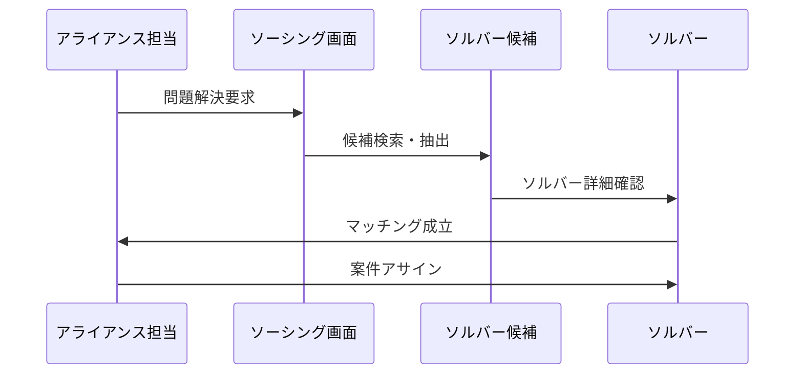

# ソルバー機能詳細仕様書

## 概要

SSAP Partner Portalシステムにおけるソルバー（Solver）機能の詳細仕様をまとめます。ソルバーは問題解決の専門家として位置づけられる重要なユーザー種別です。

## システム構成

### プロジェクト構造
```
ssap-partner-portal-fo/
├── ssap-partner-portal-fo-backend/    # バックエンドAPI
└── ssap-partner-portal-fo-frontend/   # フロントエンド（Nuxt3）
```

## ユーザー種別の位置づけ

### システム内ユーザー種別
1. 共通
2. 顧客ユーザー
3. 支援者
4. 支援者責任者
5. 営業担当者
6. 営業責任者
7. 事業者責任者
8. アライアンス担当
9. アライアンス
10. **ソルバー** ← 本機能

## ソルバー専用機能

### 1. ログイン機能
- **機能名**: 【ソルバー】ログイン
- **概要**: ソルバー専用の認証システム
- **特徴**:
  - 他ユーザー種別とは独立したログイン処理
  - ソルバー専用の権限制御
  - セキュアな認証フロー

### 2. ナビゲーション
- **機能名**: 【ソルバー】ヘッダー・フッター
- **概要**: ソルバー専用のUI要素
- **特徴**:
  - ソルバーの権限に応じたメニュー表示
  - 他ユーザー機能への不正アクセス防止
  - 直感的なナビゲーション設計

### 3. ダッシュボード
- **機能名**: 【ソルバー】ホーム
- **概要**: ソルバー専用のメイン画面
- **特徴**:
  - 担当案件の一覧表示
  - 進捗状況の可視化
  - 重要な通知・アラート表示
  - パフォーマンス指標

### 4. プロフィール管理
- **機能名**: 【ソルバー】ソルバー候補詳細
- **概要**: ソルバーの詳細情報管理画面
- **特徴**:
  - スキル・専門分野の登録
  - 過去の実績・ポートフォリオ
  - 評価・レーティング情報
  - 可用性・稼働状況

## 業務フロー

### ソルバーマッチングプロセス


### ソルバーの主要業務
1. **案件受注**
   - アライアンス担当からの案件確認
   - 要件・条件の詳細把握
   - 受注可否の判断

2. **問題解決**
   - 専門知識・スキルの活用
   - 効率的なソリューション提供
   - 進捗レポート・コミュニケーション

3. **成果物納品**
   - 高品質な解決策の提供
   - ドキュメント・報告書作成
   - フォローアップサポート

## 技術仕様

### フロントエンド
- **フレームワーク**: Nuxt3
- **認証**: JWT ベース
- **状態管理**: Pinia
- **UI**: レスポンシブデザイン

### バックエンド
- **API**: RESTful設計
- **認可**: ロールベースアクセス制御
- **データ永続化**: セキュアなストレージ

## セキュリティ要件

### アクセス制御
- ソルバー専用リソースへの厳格な権限管理
- セッション管理・タイムアウト制御
- 機密情報の適切な保護

### データ保護
- 個人情報の暗号化
- ログ・監査証跡の保持
- GDPR・個人情報保護法への準拠

## テスト観点

### 機能テスト
1. **ログイン機能**
   - 正常認証
   - 異常認証（不正ID・PW）
   - セッション管理

2. **ナビゲーション**
   - メニュー表示
   - 権限制御
   - 画面遷移

3. **ホーム画面**
   - ダッシュボード表示
   - データ取得・更新
   - パフォーマンス

4. **ソルバー候補詳細**
   - 情報表示・編集
   - バリデーション
   - データ保存

### 非機能テスト
- **パフォーマンス**: レスポンス時間・スループット
- **セキュリティ**: 脆弱性・権限昇格テスト
- **ユーザビリティ**: 操作性・直感性評価

## 品質保証

### テスト管理体制
- 標準テストフォーマット（16項目）使用
- トレーサビリティ管理（バックログNO）
- 進捗・品質メトリクス収集

### テスト分類
- **大項目・中項目・小項目**: 階層的テスト分類
- **正常系・異常系・境界値**: パターン網羅
- **ユーザーロール別**: 権限テスト徹底

## 今後の拡張予定

### 機能拡張
- AI推薦システムとの連携
- リアルタイム協業ツール統合
- モバイルアプリ対応

### システム改善
- パフォーマンス最適化
- UIUXの継続改善
- セキュリティ強化

## 関連ドキュメント

- システム全体設計書
- API仕様書
- データベース設計書
- セキュリティガイドライン
- 運用手順書

---

**作成日**: 2025-06-25  
**バージョン**: 1.0  
**作成者**: Claude Code  
**承認者**: [TBD]