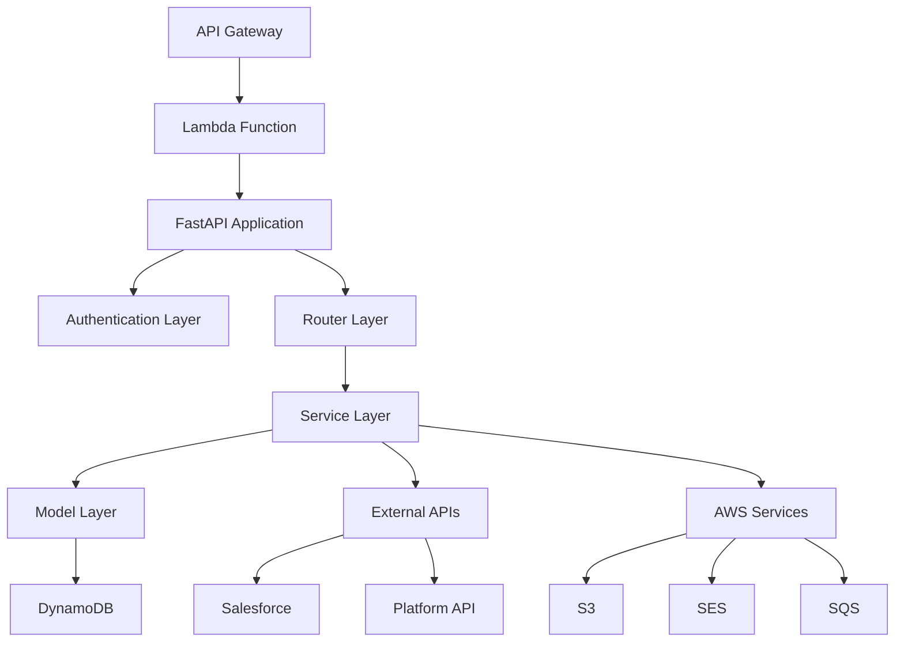

# SSAP Partner Portal Front Office System バックエンド機能説明書

## 目次

1. [システム概要](#1-システム概要)
2. [技術アーキテクチャ](#2-技術アーキテクチャ)
3. [プロジェクト構成](#3-プロジェクト構成)
4. [API設計](#4-api設計)
5. [データモデル](#5-データモデル)
6. [認証・認可システム](#6-認証認可システム)
7. [ビジネスロジック層](#7-ビジネスロジック層)
8. [データアクセス層](#8-データアクセス層)
9. [外部システム連携](#9-外部システム連携)
10. [バッチ処理・非同期処理](#10-バッチ処理非同期処理)
11. [エラーハンドリング・ログ](#11-エラーハンドリングログ)
12. [設定管理](#12-設定管理)
13. [テスト](#13-テスト)
14. [デプロイ・運用](#14-デプロイ運用)
15. [パフォーマンス・セキュリティ](#15-パフォーマンスセキュリティ)

---

## 1. システム概要

### 1.1 プロジェクト概要
- **システム名**: SSAP Partner Portal Front Office Backend
- **アーキテクチャ**: サーバーレス（AWS Lambda）
- **フレームワーク**: FastAPI 0.111.0
- **言語**: Python 3.12

### 1.2 主要機能
- **ソルバー管理**: 個人・法人ソルバーの管理
- **案件管理**: プロジェクト・カルテの管理
- **アンケート機能**: 満足度調査・匿名アンケート
- **工数管理**: 作業時間の記録・集計
- **顧客管理**: 取引先企業の情報管理
- **通知システム**: お知らせ・リマインダー配信
- **マスター管理**: システム設定・コードマスター

### 1.3 システム特徴
- **完全サーバーレス**: AWS Lambda + API Gateway
- **NoSQL データベース**: DynamoDB + PynamoDB ORM
- **マイクロサービス**: 機能別サービス分離
- **多環境対応**: 6つの環境（local, dev, sqa, evs, sup, prd）

---

## 2. 技術アーキテクチャ

### 2.1 アーキテクチャ概要



### 2.2 技術スタック

#### コア技術
```python
# 主要依存関係
fastapi==0.111.0          # Web APIフレームワーク
mangum==0.17.0            # ASGI-Lambda アダプター
pynamodb==5.5.1           # DynamoDB ORM
pydantic==1.10.17         # データバリデーション
python-jose==3.3.0        # JWT認証
requests==2.32.2          # HTTP クライアント
PyYAML==6.0.1            # 設定ファイル処理
```

#### AWS統合
```python
# AWS関連ライブラリ
boto3                     # AWS SDK
cachetools==5.3.3         # キャッシュ機能
email-validator==2.0.0    # メールバリデーション
```

#### 開発・テスト
```python
# 開発ツール
pytest                    # テストフレームワーク
black                     # コードフォーマッター
flake8                    # リンター
mypy                      # 型チェッカー
```

### 2.3 デプロイメント

#### Serverless Framework
```yaml
# serverless.yml
service: partner-portal-frontoffice
frameworkVersion: ">=3.0.0"
provider:
  name: aws
  runtime: python3.12
  region: ap-northeast-1
```

#### Lambda Functions
- **app**: メインAPI処理
- **batch_remind**: リマインダーバッチ
- **mail_sender**: メール送信処理

---

## 3. プロジェクト構成

### 3.1 ディレクトリ構造

```
ssap-partner-portal-fo-backend/
├── app/                       # メインアプリケーション
│   ├── auth/                  # 認証・認可
│   │   ├── auth.py           # 認証ロジック
│   │   └── jwt.py            # JWT処理
│   ├── core/                  # コア機能
│   │   ├── config.py         # 設定管理
│   │   ├── common_logging.py # ログ機能
│   │   └── settings/         # 環境別設定
│   ├── middleware/            # ミドルウェア
│   │   └── logging.py        # ログミドルウェア
│   ├── models/                # データモデル
│   │   ├── solver.py         # ソルバーモデル
│   │   ├── project.py        # プロジェクトモデル
│   │   ├── user.py           # ユーザーモデル
│   │   └── [その他モデル]/
│   ├── routers/               # APIルーター
│   │   ├── __init__.py       # ルーター統合
│   │   ├── solver.py         # ソルバーAPI
│   │   ├── project.py        # プロジェクトAPI
│   │   └── [その他ルーター]/
│   ├── schemas/               # リクエスト・レスポンススキーマ
│   │   ├── base.py           # ベーススキーマ
│   │   ├── solver.py         # ソルバースキーマ
│   │   └── [その他スキーマ]/
│   ├── service/               # ビジネスロジック
│   │   ├── common_service/   # 共通サービス
│   │   ├── solver_service.py # ソルバーサービス
│   │   └── [その他サービス]/
│   ├── utils/                 # ユーティリティ
│   │   ├── aws/              # AWS関連
│   │   ├── format.py         # フォーマット処理
│   │   └── platform.py       # プラットフォーム連携
│   ├── resources/             # リソース定義
│   │   ├── const.py          # 定数
│   │   └── message.py        # メッセージ
│   ├── main.py                # FastAPIアプリケーション
│   └── generate_openapi.py    # OpenAPI生成
├── functions/                 # Lambda関数
│   ├── batch_remind.py       # リマインダーバッチ
│   └── mail_sender.py        # メール送信
├── conf/                      # 環境別設定
│   ├── local/                # ローカル環境
│   ├── dev/                  # 開発環境
│   ├── sqa/                  # SQA環境
│   ├── evs/                  # 脆弱性試験環境
│   ├── sup/                  # サポート環境
│   └── prd/                  # 本番環境
├── tests/                     # テストコード
│   ├── feature/              # 機能テスト
│   └── unit/                 # 単体テスト
├── mock/                      # モックデータ
├── docs/                      # ドキュメント
├── requirements.txt           # 本番依存関係
├── requirements-dev.txt       # 開発依存関係
└── serverless.yml             # サーバーレス設定
```

### 3.2 モジュール設計

#### レイヤー分離
```
┌─────────────────┐
│   Router Layer  │ ← API エンドポイント
├─────────────────┤
│  Service Layer  │ ← ビジネスロジック
├─────────────────┤
│   Model Layer   │ ← データアクセス
├─────────────────┤
│ Database Layer  │ ← DynamoDB
└─────────────────┘
```

---

## 4. API設計

### 4.1 FastAPI アプリケーション

#### メインアプリケーション
```python
# app/main.py
from fastapi import FastAPI
from mangum import Mangum
from starlette.middleware.cors import CORSMiddleware

def get_application() -> FastAPI:
    settings = get_app_settings()
    application = FastAPI(**settings.fastapi_kwargs)
    
    # CORS設定
    application.add_middleware(
        CORSMiddleware,
        allow_origins=settings.host.split(","),
        allow_credentials=True,
        allow_methods=["*"],
        allow_headers=["*"],
    )
    
    # ルーター登録
    application.include_router(router)
    return application

app = get_application()

# Lambda ハンドラー
@logger.inject_aws_context
def handler(event, context):
    asgi_handler = Mangum(app)
    return asgi_handler(event, context)
```

### 4.2 ルーター設計

#### ルーター統合
```python
# app/routers/__init__.py
from fastapi import APIRouter

router = APIRouter(prefix="/api")

# 各機能のルーターを統合
router.include_router(auth_router, tags=["認証"])
router.include_router(solver_router, prefix="/solvers", tags=["ソルバー"])
router.include_router(project_router, prefix="/projects", tags=["プロジェクト"])
router.include_router(customer_router, prefix="/customers", tags=["顧客"])
router.include_router(survey_router, prefix="/surveys", tags=["アンケート"])
router.include_router(user_router, prefix="/users", tags=["ユーザー"])
router.include_router(notification_router, prefix="/notifications", tags=["通知"])
router.include_router(master_router, prefix="/masters", tags=["マスター"])
```

#### ソルバーAPI例
```python
# app/routers/solver.py
from fastapi import APIRouter, Depends, HTTPException
from app.auth.auth import get_current_user_factory
from app.service.solver_service import SolverService

router = APIRouter()

@router.post("/", response_model=SolverResponse)
async def create_solver(
    request: CreateSolverRequest,
    current_user: User = Depends(get_current_user_factory({'APT'}))
) -> SolverResponse:
    """ソルバー作成"""
    service = SolverService()
    return await service.create_solver(request, current_user)

@router.get("/", response_model=List[SolverResponse])
async def get_solvers(
    page: int = 1,
    size: int = 20,
    current_user: User = Depends(get_current_user_factory({'APT', 'SOLVER_STAFF'}))
) -> List[SolverResponse]:
    """ソルバー一覧取得"""
    service = SolverService()
    return await service.get_solvers(page, size, current_user)

@router.get("/{solver_id}", response_model=SolverResponse)
async def get_solver_by_id(
    solver_id: str,
    current_user: User = Depends(get_current_user_factory({'APT', 'SOLVER_STAFF'}))
) -> SolverResponse:
    """ソルバー詳細取得"""
    service = SolverService()
    solver = await service.get_solver_by_id(solver_id, current_user)
    if not solver:
        raise HTTPException(status_code=404, detail="ソルバーが見つかりません")
    return solver

@router.put("/{solver_id}", response_model=SolverResponse)
async def update_solver(
    solver_id: str,
    request: UpdateSolverRequest,
    current_user: User = Depends(get_current_user_factory({'APT'}))
) -> SolverResponse:
    """ソルバー更新"""
    service = SolverService()
    return await service.update_solver(solver_id, request, current_user)

@router.delete("/{solver_id}")
async def delete_solver(
    solver_id: str,
    current_user: User = Depends(get_current_user_factory({'APT'}))
) -> dict:
    """ソルバー削除"""
    service = SolverService()
    await service.delete_solver(solver_id, current_user)
    return {"message": "ソルバーを削除しました"}

@router.patch("/{solver_id}/certification")
async def update_certification_status(
    solver_id: str,
    request: UpdateCertificationRequest,
    current_user: User = Depends(get_current_user_factory({'APT'}))
) -> SolverResponse:
    """ソルバー認定状態変更"""
    service = SolverService()
    return await service.update_certification_status(solver_id, request, current_user)
```

### 4.3 APIエンドポイント一覧

#### 認証API
| メソッド | エンドポイント | 説明 | 必要権限 |
|---------|---------------|------|----------|
| POST | `/api/auth/login` | ログイン | なし |

#### ソルバーAPI
| メソッド | エンドポイント | 説明 | 必要権限 |
|---------|---------------|------|----------|
| POST | `/api/solvers` | ソルバー作成 | APT |
| GET | `/api/solvers` | ソルバー一覧取得 | APT, SOLVER_STAFF |
| GET | `/api/solvers/{id}` | ソルバー詳細取得 | APT, SOLVER_STAFF |
| PUT | `/api/solvers/{id}` | ソルバー更新 | APT |
| DELETE | `/api/solvers/{id}` | ソルバー削除 | APT |
| PATCH | `/api/solvers/{id}/certification` | 認定状態変更 | APT |
| PUT | `/api/solvers/utilization-rate/{corp_id}` | 稼働率一括更新 | APT |

#### プロジェクトAPI
| メソッド | エンドポイント | 説明 | 必要権限 |
|---------|---------------|------|----------|
| GET | `/api/projects` | プロジェクト一覧取得 | APT, PROJECT_MANAGER |
| GET | `/api/projects/{id}` | プロジェクト詳細取得 | APT, PROJECT_MANAGER |
| POST | `/api/projects` | プロジェクト作成 | APT |
| PUT | `/api/projects/{id}` | プロジェクト更新 | APT, PROJECT_MANAGER |

#### その他API
- **顧客API**: `/api/customers/*`
- **アンケートAPI**: `/api/surveys/*`
- **ユーザーAPI**: `/api/users/*`
- **通知API**: `/api/notifications/*`
- **マスターAPI**: `/api/masters/*`
- **工数API**: `/api/man-hours/*`
- **スケジュールAPI**: `/api/schedules/*`

---

## 5. データモデル

### 5.1 DynamoDB設計

#### テーブル構成
SSAP Partner Portalでは**シングルテーブル設計**を採用し、エンティティを`data_type`で区分。

```python
# 共通属性
class BaseModel(Model):
    id = UnicodeAttribute(hash_key=True)           # パーティションキー
    data_type = UnicodeAttribute(range_key=True)   # ソートキー（エンティティ種別）
    created_at = UTCDateTimeAttribute()
    updated_at = UTCDateTimeAttribute()
    version = VersionAttribute()                   # 楽観的排他制御
```

### 5.2 主要データモデル

#### ソルバーモデル
```python
# app/models/solver.py
class SolverModel(Model):
    """個人ソルバーTBLモデル定義"""
    
    class Meta:
        table_name = os.environ.get('DYNAMODB_TABLE_NAME', 'partnerportal-dev-Solver')
        region = 'ap-northeast-1'
        
    # 基本キー
    id = UnicodeAttribute(hash_key=True)
    data_type = UnicodeAttribute(range_key=True, default='solver')
    
    # 基本情報
    name = UnicodeAttribute()
    name_kana = UnicodeAttribute(null=True)
    email = UnicodeAttribute()
    birth_date = UTCDateTimeAttribute(null=True)
    birth_date_unknown = BooleanAttribute(default=False)  # 生年月日不明フラグ
    
    # 認定情報
    certification_status = UnicodeAttribute()  # 候補者/正式認定
    certification_date = UTCDateTimeAttribute(null=True)
    
    # 業務情報
    specialization_areas = ListAttribute(default=list)
    utilization_rate = NumberAttribute(null=True)
    unit_price = NumberAttribute(null=True)
    
    # 組織情報
    solver_corporation_id = UnicodeAttribute(null=True)
    
    # タイムスタンプ
    created_at = UTCDateTimeAttribute(default=datetime.utcnow)
    updated_at = UTCDateTimeAttribute()
    version = VersionAttribute()
    
    # GSI（Global Secondary Index）
    data_type_index = DataTypeIndex()
    data_type_create_at_index = DataTypeCreateAtIndex()
    data_type_solver_corporation_id_index = DataTypeSolverCorporationIdIndex()
    email_index = EmailIndex()
    
    def save(self, **kwargs):
        self.updated_at = datetime.utcnow()
        super().save(**kwargs)

# GSI定義
class DataTypeIndex(GlobalSecondaryIndex):
    """data_type による検索用インデックス"""
    class Meta:
        index_name = 'data-type-index'
        projection = AllProjection()
    
    data_type = UnicodeAttribute(hash_key=True)

class DataTypeCreateAtIndex(GlobalSecondaryIndex):
    """data_type + created_at による時系列検索用インデックス"""
    class Meta:
        index_name = 'data-type-create-at-index'
        projection = AllProjection()
    
    data_type = UnicodeAttribute(hash_key=True)
    created_at = UTCDateTimeAttribute(range_key=True)
```

#### プロジェクトモデル
```python
# app/models/project.py
class ProjectModel(Model):
    """プロジェクトTBLモデル定義"""
    
    class Meta:
        table_name = os.environ.get('DYNAMODB_TABLE_NAME', 'partnerportal-dev-Project')
        region = 'ap-northeast-1'
    
    # 基本キー
    id = UnicodeAttribute(hash_key=True)
    data_type = UnicodeAttribute(range_key=True, default='project')
    
    # プロジェクト情報
    name = UnicodeAttribute()
    description = UnicodeAttribute(null=True)
    status = UnicodeAttribute()
    start_date = UTCDateTimeAttribute(null=True)
    end_date = UTCDateTimeAttribute(null=True)
    
    # 顧客情報
    customer_id = UnicodeAttribute()
    customer_name = UnicodeAttribute()
    
    # 担当者情報
    assigned_solvers = ListAttribute(default=list)
    project_manager_id = UnicodeAttribute(null=True)
    
    # タイムスタンプ
    created_at = UTCDateTimeAttribute(default=datetime.utcnow)
    updated_at = UTCDateTimeAttribute()
    version = VersionAttribute()
```

#### ユーザーモデル
```python
# app/models/user.py
class UserModel(Model):
    """ユーザーTBLモデル定義"""
    
    class Meta:
        table_name = os.environ.get('DYNAMODB_TABLE_NAME', 'partnerportal-dev-User')
        region = 'ap-northeast-1'
    
    # 基本キー
    id = UnicodeAttribute(hash_key=True)
    data_type = UnicodeAttribute(range_key=True, default='user')
    
    # ユーザー情報
    cognito_user_id = UnicodeAttribute()
    username = UnicodeAttribute()
    email = UnicodeAttribute()
    
    # 権限情報
    role = UnicodeAttribute()
    permissions = ListAttribute(default=list)
    
    # 組織情報
    organization_id = UnicodeAttribute(null=True)
    
    # 状態情報
    is_active = BooleanAttribute(default=True)
    last_login = UTCDateTimeAttribute(null=True)
    
    # タイムスタンプ
    created_at = UTCDateTimeAttribute(default=datetime.utcnow)
    updated_at = UTCDateTimeAttribute()
    version = VersionAttribute()
```

### 5.3 カスタム属性

#### JST DateTimeAttribute
```python
# app/models/custom_attribute/jst_datetime.py
class JSTDateTimeAttribute(Attribute):
    """JST（日本標準時）対応のDateTime属性"""
    
    def serialize(self, value):
        if value is None:
            return None
        if isinstance(value, datetime):
            # UTCからJSTに変換
            jst = timezone(timedelta(hours=9))
            return value.replace(tzinfo=timezone.utc).astimezone(jst).isoformat()
        return value
    
    def deserialize(self, value):
        if value is None:
            return None
        return datetime.fromisoformat(value)
```

---

## 6. 認証・認可システム

### 6.1 JWT認証

#### JWT Bearer実装
```python
# app/auth/jwt.py
from fastapi import HTTPException, status
from fastapi.security import HTTPBearer, HTTPAuthorizationCredentials
import jwt
from jwt import PyJWKClient

class JWTBearer(HTTPBearer):
    """JWT Bearer認証クラス"""
    
    def __init__(self, auto_error: bool = True):
        super().__init__(auto_error=auto_error)
        self.jwks_client = PyJWKClient(
            uri="https://ssap.sony.com/.well-known/jwks.json"
        )
    
    async def __call__(self, request: Request) -> str:
        credentials: HTTPAuthorizationCredentials = await super().__call__(request)
        
        if not credentials:
            raise HTTPException(
                status_code=status.HTTP_403_FORBIDDEN,
                detail="認証情報が無効です"
            )
        
        if not credentials.scheme == "Bearer":
            raise HTTPException(
                status_code=status.HTTP_403_FORBIDDEN,
                detail="認証スキームが無効です"
            )
        
        token = credentials.credentials
        if not self.verify_jwt(token):
            raise HTTPException(
                status_code=status.HTTP_403_FORBIDDEN,
                detail="トークンが無効です"
            )
        
        return token
    
    def verify_jwt(self, token: str) -> bool:
        """JWTトークンの検証"""
        try:
            # JWKを取得してトークンを検証
            signing_key = self.jwks_client.get_signing_key_from_jwt(token)
            decoded_token = jwt.decode(
                token,
                signing_key.key,
                algorithms=["RS256"],
                audience="ssap-partner-portal",
                issuer="https://ssap.sony.com"
            )
            return True
        except jwt.InvalidTokenError:
            return False
```

### 6.2 ユーザー認証

#### 認証ファクトリー
```python
# app/auth/auth.py
from typing import Set, Optional
from fastapi import Depends, HTTPException, status

def get_current_user_factory(accessible_roles: Set[str] = None):
    """権限チェック付きユーザー取得ファクトリー"""
    
    async def get_current_user(token: str = Depends(JWTBearer())) -> User:
        try:
            # JWTからユーザー情報を取得
            payload = jwt.decode(
                token, 
                options={"verify_signature": False}  # 署名検証は JWTBearer で済み
            )
            
            user_id = payload.get("sub")
            if not user_id:
                raise HTTPException(
                    status_code=status.HTTP_401_UNAUTHORIZED,
                    detail="ユーザーIDが見つかりません"
                )
            
            # データベースからユーザー情報を取得
            user = await get_user_by_id(user_id)
            if not user:
                raise HTTPException(
                    status_code=status.HTTP_401_UNAUTHORIZED,
                    detail="ユーザーが見つかりません"
                )
            
            # 権限チェック
            if accessible_roles and user.role not in accessible_roles:
                raise HTTPException(
                    status_code=status.HTTP_403_FORBIDDEN,
                    detail="アクセス権限がありません"
                )
            
            return user
            
        except jwt.InvalidTokenError:
            raise HTTPException(
                status_code=status.HTTP_401_UNAUTHORIZED,
                detail="トークンが無効です"
            )
    
    return get_current_user
```

### 6.3 ロールベースアクセス制御

#### ユーザーロール定義
```python
# app/resources/const.py
class UserRole:
    """ユーザーロール定数"""
    APT = "apt"                          # アライアンス担当
    SOLVER_STAFF = "solver_staff"        # ソルバー担当
    CUSTOMER_STAFF = "customer_staff"    # カスタマー担当
    PROJECT_MANAGER = "project_manager"  # プロジェクト管理者
    SUPPORTER_MGR = "supporter_mgr"      # サポーター管理者
    SUPPORTER = "supporter"              # サポーター
    GENERAL = "general"                  # 一般ユーザー

class Permission:
    """権限定数"""
    SOLVER_READ = "solver:read"
    SOLVER_WRITE = "solver:write"
    PROJECT_READ = "project:read"
    PROJECT_WRITE = "project:write"
    # ... 他の権限
```

#### 権限チェックサービス
```python
# app/service/common_service/check_permission.py
class PermissionChecker:
    """権限チェッククラス"""
    
    @staticmethod
    def check_solver_access(user: User, solver_id: str) -> bool:
        """ソルバーアクセス権限チェック"""
        if user.role == UserRole.APT:
            return True  # APTは全ソルバーにアクセス可能
        
        if user.role == UserRole.SOLVER_STAFF:
            # ソルバー担当者は担当ソルバーのみアクセス可能
            return user.id in get_assigned_solver_staff(solver_id)
        
        return False
    
    @staticmethod
    def check_project_access(user: User, project_id: str) -> bool:
        """プロジェクトアクセス権限チェック"""
        if user.role in [UserRole.APT, UserRole.PROJECT_MANAGER]:
            return True
        
        # 担当ソルバーは自分が関与するプロジェクトにアクセス可能
        project = get_project_by_id(project_id)
        return user.id in project.assigned_solvers
```

---

## 7. ビジネスロジック層

### 7.1 サービス層設計

#### ベースサービス
```python
# app/service/base_service.py
from abc import ABC, abstractmethod
from typing import TypeVar, Generic, List, Optional

T = TypeVar('T')

class BaseService(Generic[T], ABC):
    """ベースサービスクラス"""
    
    def __init__(self):
        self.logger = CustomLogger.get_logger()
    
    @abstractmethod
    async def create(self, data: dict, user: User) -> T:
        """作成"""
        pass
    
    @abstractmethod
    async def get_by_id(self, id: str, user: User) -> Optional[T]:
        """ID指定取得"""
        pass
    
    @abstractmethod
    async def update(self, id: str, data: dict, user: User) -> T:
        """更新"""
        pass
    
    @abstractmethod
    async def delete(self, id: str, user: User) -> bool:
        """削除"""
        pass
    
    async def list(self, filters: dict, user: User) -> List[T]:
        """一覧取得"""
        pass
```

### 7.2 ソルバーサービス

#### ソルバー管理サービス
```python
# app/service/solver_service.py
class SolverService(BaseService[SolverResponse]):
    """ソルバー管理サービス"""
    
    def __init__(self):
        super().__init__()
        self.permission_checker = PermissionChecker()
    
    async def create_solver(self, request: CreateSolverRequest, user: User) -> SolverResponse:
        """ソルバー作成"""
        self.logger.info(f"ソルバー作成開始: {request.name}")
        
        # 権限チェック
        if user.role != UserRole.APT:
            raise PermissionDeniedError("ソルバー作成権限がありません")
        
        # バリデーション
        await self._validate_solver_data(request)
        
        # 重複チェック
        existing_solver = await self._check_duplicate_email(request.email)
        if existing_solver:
            raise DuplicateEmailError("同じメールアドレスのソルバーが既に存在します")
        
        # ソルバー作成
        solver_id = generate_uuid()
        solver_data = {
            'id': solver_id,
            'name': request.name,
            'email': request.email,
            'birth_date': request.birth_date,
            'birth_date_unknown': request.birth_date_unknown,
            'certification_status': 'candidate',  # 初期は候補者
            'specialization_areas': request.specialization_areas or [],
        }
        
        solver_model = SolverModel(**solver_data)
        solver_model.save()
        
        self.logger.info(f"ソルバー作成完了: {solver_id}")
        
        # Salesforce連携
        await self._sync_to_salesforce(solver_model)
        
        return SolverResponse.from_model(solver_model)
    
    async def get_solver_by_id(self, solver_id: str, user: User) -> Optional[SolverResponse]:
        """ソルバー詳細取得"""
        # 権限チェック
        if not self.permission_checker.check_solver_access(user, solver_id):
            raise PermissionDeniedError("ソルバーアクセス権限がありません")
        
        try:
            solver_model = SolverModel.get(solver_id, 'solver')
            return SolverResponse.from_model(solver_model)
        except SolverModel.DoesNotExist:
            return None
    
    async def update_solver(self, solver_id: str, request: UpdateSolverRequest, user: User) -> SolverResponse:
        """ソルバー更新"""
        self.logger.info(f"ソルバー更新開始: {solver_id}")
        
        # 権限チェック
        if not self.permission_checker.check_solver_access(user, solver_id):
            raise PermissionDeniedError("ソルバー更新権限がありません")
        
        # 既存データ取得
        try:
            solver_model = SolverModel.get(solver_id, 'solver')
        except SolverModel.DoesNotExist:
            raise NotFoundError("ソルバーが見つかりません")
        
        # 更新データ適用
        if request.name is not None:
            solver_model.name = request.name
        if request.email is not None:
            # メール重複チェック
            if request.email != solver_model.email:
                existing = await self._check_duplicate_email(request.email)
                if existing and existing.id != solver_id:
                    raise DuplicateEmailError("同じメールアドレスのソルバーが既に存在します")
            solver_model.email = request.email
        if request.birth_date is not None:
            solver_model.birth_date = request.birth_date
        if request.birth_date_unknown is not None:
            solver_model.birth_date_unknown = request.birth_date_unknown
            if request.birth_date_unknown:
                solver_model.birth_date = None  # 不明の場合は生年月日をクリア
        
        solver_model.save()
        
        self.logger.info(f"ソルバー更新完了: {solver_id}")
        
        # Salesforce連携
        await self._sync_to_salesforce(solver_model)
        
        return SolverResponse.from_model(solver_model)
    
    async def update_certification_status(self, solver_id: str, request: UpdateCertificationRequest, user: User) -> SolverResponse:
        """ソルバー認定状態変更"""
        self.logger.info(f"認定状態変更開始: {solver_id} -> {request.status}")
        
        # 権限チェック（APTのみ）
        if user.role != UserRole.APT:
            raise PermissionDeniedError("認定状態変更権限がありません")
        
        try:
            solver_model = SolverModel.get(solver_id, 'solver')
        except SolverModel.DoesNotExist:
            raise NotFoundError("ソルバーが見つかりません")
        
        # 認定状態更新
        old_status = solver_model.certification_status
        solver_model.certification_status = request.status
        
        if request.status == 'certified' and old_status != 'certified':
            solver_model.certification_date = datetime.utcnow()
        
        solver_model.save()
        
        self.logger.info(f"認定状態変更完了: {solver_id}")
        
        # 認定通知メール送信
        if request.status == 'certified':
            await self._send_certification_notification(solver_model)
        
        return SolverResponse.from_model(solver_model)
    
    async def _validate_solver_data(self, request: CreateSolverRequest) -> None:
        """ソルバーデータバリデーション"""
        if not request.name or len(request.name.strip()) == 0:
            raise ValidationError("ソルバー名は必須です")
        
        if not request.email:
            raise ValidationError("メールアドレスは必須です")
        
        # メールアドレス形式チェック
        email_pattern = r'^[a-zA-Z0-9._%+-]+@[a-zA-Z0-9.-]+\.[a-zA-Z]{2,}$'
        if not re.match(email_pattern, request.email):
            raise ValidationError("メールアドレスの形式が正しくありません")
    
    async def _check_duplicate_email(self, email: str) -> Optional[SolverModel]:
        """メールアドレス重複チェック"""
        try:
            for solver in SolverModel.email_index.query(email):
                return solver
        except SolverModel.DoesNotExist:
            pass
        return None
    
    async def _sync_to_salesforce(self, solver_model: SolverModel) -> None:
        """Salesforce同期"""
        try:
            salesforce_data = {
                'Id': solver_model.id,
                'Name': solver_model.name,
                'Email': solver_model.email,
                'BirthDate': solver_model.birth_date.isoformat() if solver_model.birth_date else None,
                'BirthDateUnknown__c': solver_model.birth_date_unknown,
                'CertificationStatus__c': solver_model.certification_status,
            }
            
            # Salesforce API呼び出し
            await SalesforceClient().upsert_solver(salesforce_data)
            
        except Exception as e:
            self.logger.error(f"Salesforce同期エラー: {e}")
            # 同期エラーは業務に影響しないため、ログ出力のみ
    
    async def _send_certification_notification(self, solver_model: SolverModel) -> None:
        """認定通知メール送信"""
        try:
            email_data = {
                'to': solver_model.email,
                'subject': 'ソルバー認定のお知らせ',
                'template': 'solver_certification',
                'data': {
                    'solver_name': solver_model.name,
                    'certification_date': solver_model.certification_date
                }
            }
            
            # SQS経由でメール送信
            await SQSClient().send_email_request(email_data)
            
        except Exception as e:
            self.logger.error(f"認定通知メール送信エラー: {e}")
```

### 7.3 共通サービス

#### ページネーションサービス
```python
# app/service/common_service/pagination.py
from typing import List, TypeVar, Generic

T = TypeVar('T')

class PaginationService(Generic[T]):
    """ページネーション処理サービス"""
    
    @staticmethod
    def paginate(items: List[T], page: int, size: int) -> 'PaginationResult[T]':
        """ページネーション処理"""
        if page < 1:
            page = 1
        if size < 1 or size > 100:
            size = 20
        
        total = len(items)
        start_index = (page - 1) * size
        end_index = start_index + size
        
        paginated_items = items[start_index:end_index]
        
        return PaginationResult(
            items=paginated_items,
            page=page,
            size=size,
            total=total,
            total_pages=(total + size - 1) // size
        )

class PaginationResult(Generic[T]):
    """ページネーション結果"""
    
    def __init__(self, items: List[T], page: int, size: int, total: int, total_pages: int):
        self.items = items
        self.page = page
        self.size = size
        self.total = total
        self.total_pages = total_pages
```

---

## 8. データアクセス層

### 8.1 DynamoDB アクセス

#### モデルベースクラス
```python
# app/models/__init__.py
from pynamodb.models import Model
from pynamodb.attributes import *
from datetime import datetime
import os

class BaseModel(Model):
    """DynamoDBモデルベースクラス"""
    
    class Meta:
        region = 'ap-northeast-1'
        
    id = UnicodeAttribute(hash_key=True)
    data_type = UnicodeAttribute(range_key=True)
    created_at = UTCDateTimeAttribute(default=datetime.utcnow)
    updated_at = UTCDateTimeAttribute()
    version = VersionAttribute()  # 楽観的排他制御
    
    def save(self, **kwargs):
        """保存時にupdated_atを自動更新"""
        self.updated_at = datetime.utcnow()
        super().save(**kwargs)
    
    @classmethod
    def get_table_name(cls):
        """環境別テーブル名取得"""
        stage = os.environ.get('STAGE', 'dev')
        base_name = cls.Meta.table_name.split('-')[-1]  # 末尾のテーブル名部分を取得
        return f"partnerportal-{stage}-{base_name}"
```

#### クエリヘルパー
```python
# app/utils/dynamodb_helper.py
from typing import List, Optional, Dict, Any
from pynamodb.models import Model

class DynamoDBQueryHelper:
    """DynamoDBクエリヘルパー"""
    
    @staticmethod
    def query_by_data_type(model_class: Model, data_type: str, 
                          filters: Dict[str, Any] = None) -> List[Model]:
        """data_typeでのクエリ"""
        query = model_class.data_type_index.query(data_type)
        
        if filters:
            # フィルター適用
            for attr, value in filters.items():
                if hasattr(model_class, attr):
                    query = query.filter(getattr(model_class, attr) == value)
        
        return list(query)
    
    @staticmethod
    def scan_with_filter(model_class: Model, filters: Dict[str, Any]) -> List[Model]:
        """フィルター付きスキャン"""
        scan = model_class.scan()
        
        for attr, value in filters.items():
            if hasattr(model_class, attr):
                scan = scan.filter(getattr(model_class, attr) == value)
        
        return list(scan)
    
    @staticmethod
    def get_or_none(model_class: Model, hash_key: str, range_key: str = None) -> Optional[Model]:
        """存在チェック付き取得"""
        try:
            if range_key:
                return model_class.get(hash_key, range_key)
            else:
                return model_class.get(hash_key)
        except model_class.DoesNotExist:
            return None
```

### 8.2 データアクセスパターン

#### リポジトリパターン
```python
# app/repository/solver_repository.py
from typing import List, Optional
from app.models.solver import SolverModel

class SolverRepository:
    """ソルバーリポジトリ"""
    
    async def create(self, solver_data: dict) -> SolverModel:
        """ソルバー作成"""
        solver = SolverModel(**solver_data)
        solver.save()
        return solver
    
    async def get_by_id(self, solver_id: str) -> Optional[SolverModel]:
        """ID指定取得"""
        try:
            return SolverModel.get(solver_id, 'solver')
        except SolverModel.DoesNotExist:
            return None
    
    async def get_by_email(self, email: str) -> Optional[SolverModel]:
        """メールアドレス指定取得"""
        try:
            for solver in SolverModel.email_index.query(email):
                return solver
        except SolverModel.DoesNotExist:
            pass
        return None
    
    async def list_by_certification_status(self, status: str) -> List[SolverModel]:
        """認定状態で一覧取得"""
        return DynamoDBQueryHelper.query_by_data_type(
            SolverModel, 
            'solver', 
            {'certification_status': status}
        )
    
    async def list_by_corporation(self, corporation_id: str) -> List[SolverModel]:
        """法人所属ソルバー一覧取得"""
        return list(SolverModel.data_type_solver_corporation_id_index.query(
            'solver', 
            SolverModel.solver_corporation_id == corporation_id
        ))
    
    async def update(self, solver_id: str, update_data: dict) -> SolverModel:
        """ソルバー更新"""
        solver = await self.get_by_id(solver_id)
        if not solver:
            raise ValueError("ソルバーが見つかりません")
        
        for key, value in update_data.items():
            if hasattr(solver, key):
                setattr(solver, key, value)
        
        solver.save()
        return solver
    
    async def delete(self, solver_id: str) -> bool:
        """ソルバー削除"""
        solver = await self.get_by_id(solver_id)
        if not solver:
            return False
        
        solver.delete()
        return True
```

---

## 9. 外部システム連携

### 9.1 Salesforce連携

#### Salesforce API クライアント
```python
# app/utils/salesforce_client.py
import requests
from typing import Dict, Any, Optional

class SalesforceClient:
    """Salesforce API クライアント"""
    
    def __init__(self):
        self.base_url = self._get_base_url()
        self.access_token = self._get_access_token()
    
    def _get_base_url(self) -> str:
        """環境別ベースURL取得"""
        stage = os.environ.get('STAGE', 'dev')
        if stage == 'prd':
            return 'https://sony.my.salesforce.com'
        else:
            return 'https://sony--dev.sandbox.my.salesforce.com'
    
    def _get_access_token(self) -> str:
        """OAuth2 アクセストークン取得"""
        # Salesforce OAuth2 フロー実装
        auth_url = f"{self.base_url}/services/oauth2/token"
        auth_data = {
            'grant_type': 'client_credentials',
            'client_id': os.environ.get('SALESFORCE_CLIENT_ID'),
            'client_secret': os.environ.get('SALESFORCE_CLIENT_SECRET'),
        }
        
        response = requests.post(auth_url, data=auth_data)
        response.raise_for_status()
        
        return response.json()['access_token']
    
    async def upsert_solver(self, solver_data: Dict[str, Any]) -> Dict[str, Any]:
        """ソルバー情報のUpsert"""
        url = f"{self.base_url}/services/data/v58.0/sobjects/Solver__c/External_Id__c/{solver_data['Id']}"
        
        headers = {
            'Authorization': f'Bearer {self.access_token}',
            'Content-Type': 'application/json'
        }
        
        # 生年月日不明フラグの処理
        if solver_data.get('BirthDateUnknown__c'):
            solver_data['BirthDate'] = None
        
        response = requests.patch(url, json=solver_data, headers=headers)
        
        if response.status_code == 404:
            # レコードが存在しない場合は新規作成
            create_url = f"{self.base_url}/services/data/v58.0/sobjects/Solver__c"
            response = requests.post(create_url, json=solver_data, headers=headers)
        
        response.raise_for_status()
        return response.json()
    
    async def get_solver(self, solver_id: str) -> Optional[Dict[str, Any]]:
        """Salesforceからソルバー情報取得"""
        url = f"{self.base_url}/services/data/v58.0/sobjects/Solver__c/External_Id__c/{solver_id}"
        
        headers = {
            'Authorization': f'Bearer {self.access_token}',
        }
        
        response = requests.get(url, headers=headers)
        
        if response.status_code == 404:
            return None
        
        response.raise_for_status()
        return response.json()
```

### 9.2 AWS Services連携

#### S3クライアント
```python
# app/utils/aws/s3.py
import boto3
from botocore.exceptions import ClientError
from typing import Optional, BinaryIO

class S3Client:
    """S3クライアント"""
    
    def __init__(self):
        self.s3_client = boto3.client('s3')
        self.bucket_name = os.environ.get('S3_BUCKET_NAME')
    
    async def upload_file(self, file: BinaryIO, key: str, 
                         content_type: str = None) -> str:
        """ファイルアップロード"""
        try:
            extra_args = {}
            if content_type:
                extra_args['ContentType'] = content_type
            
            self.s3_client.upload_fileobj(file, self.bucket_name, key, ExtraArgs=extra_args)
            
            # 署名付きURLを生成
            url = self.s3_client.generate_presigned_url(
                'get_object',
                Params={'Bucket': self.bucket_name, 'Key': key},
                ExpiresIn=3600  # 1時間有効
            )
            
            return url
            
        except ClientError as e:
            raise Exception(f"S3アップロードエラー: {e}")
    
    async def download_file(self, key: str) -> bytes:
        """ファイルダウンロード"""
        try:
            response = self.s3_client.get_object(Bucket=self.bucket_name, Key=key)
            return response['Body'].read()
            
        except ClientError as e:
            if e.response['Error']['Code'] == 'NoSuchKey':
                raise FileNotFoundError(f"ファイルが見つかりません: {key}")
            raise Exception(f"S3ダウンロードエラー: {e}")
    
    async def delete_file(self, key: str) -> bool:
        """ファイル削除"""
        try:
            self.s3_client.delete_object(Bucket=self.bucket_name, Key=key)
            return True
            
        except ClientError as e:
            raise Exception(f"S3削除エラー: {e}")
    
    async def generate_presigned_upload_url(self, key: str, 
                                          content_type: str = None) -> str:
        """アップロード用署名付きURL生成"""
        fields = {'Content-Type': content_type} if content_type else None
        conditions = [{'Content-Type': content_type}] if content_type else None
        
        return self.s3_client.generate_presigned_post(
            Bucket=self.bucket_name,
            Key=key,
            Fields=fields,
            Conditions=conditions,
            ExpiresIn=3600
        )
```

#### SQSクライアント
```python
# app/utils/aws/sqs.py
import boto3
import json
from typing import Dict, Any

class SQSClient:
    """SQSクライアント"""
    
    def __init__(self):
        self.sqs_client = boto3.client('sqs')
        self.email_queue_url = os.environ.get('EMAIL_QUEUE_URL')
    
    async def send_email_request(self, email_data: Dict[str, Any]) -> str:
        """メール送信リクエストをSQSに送信"""
        message_body = {
            'type': 'email',
            'data': email_data,
            'timestamp': datetime.utcnow().isoformat()
        }
        
        response = self.sqs_client.send_message(
            QueueUrl=self.email_queue_url,
            MessageBody=json.dumps(message_body),
            MessageAttributes={
                'Type': {
                    'StringValue': 'email',
                    'DataType': 'String'
                }
            }
        )
        
        return response['MessageId']
    
    async def send_batch_request(self, batch_data: Dict[str, Any]) -> str:
        """バッチ処理リクエストをSQSに送信"""
        message_body = {
            'type': 'batch',
            'data': batch_data,
            'timestamp': datetime.utcnow().isoformat()
        }
        
        response = self.sqs_client.send_message(
            QueueUrl=self.email_queue_url,  # 同じキューを使用
            MessageBody=json.dumps(message_body),
            MessageAttributes={
                'Type': {
                    'StringValue': 'batch',
                    'DataType': 'String'
                }
            }
        )
        
        return response['MessageId']
```

### 9.3 Platform API連携

#### Platform API Operator
```python
# app/utils/platform.py
import requests
from typing import Dict, Any, Optional

class PlatformApiOperator:
    """Platform API連携クラス"""
    
    def __init__(self):
        self.base_url = os.environ.get('PLATFORM_API_BASE_URL')
        self.api_key = os.environ.get('PLATFORM_API_KEY')
    
    async def get_project_info(self, project_id: str) -> Optional[Dict[str, Any]]:
        """プラットフォームからプロジェクト情報取得"""
        url = f"{self.base_url}/projects/{project_id}"
        
        headers = {
            'Authorization': f'Bearer {self.api_key}',
            'Content-Type': 'application/json'
        }
        
        response = requests.get(url, headers=headers)
        
        if response.status_code == 404:
            return None
        
        response.raise_for_status()
        return response.json()
    
    async def update_solver_status(self, solver_id: str, status: str) -> Dict[str, Any]:
        """プラットフォームでソルバー状態更新"""
        url = f"{self.base_url}/solvers/{solver_id}/status"
        
        headers = {
            'Authorization': f'Bearer {self.api_key}',
            'Content-Type': 'application/json'
        }
        
        data = {'status': status}
        
        response = requests.put(url, json=data, headers=headers)
        response.raise_for_status()
        
        return response.json()
```

---

## 10. バッチ処理・非同期処理

### 10.1 バッチ処理アーキテクチャ

#### バッチリマインダー
```python
# functions/batch_remind.py
import json
from datetime import datetime, timedelta
from app.core.common_logging import CustomLogger
from app.service.notification_service import NotificationService

logger = CustomLogger.get_logger()

@logger.inject_aws_context
def handler(event, context):
    """バッチリマインダーハンドラー"""
    
    try:
        mode = event.get('mode')
        stage_params = event.get('stageParams', {})
        
        logger.info(f"バッチ処理開始: mode={mode}")
        
        if mode == 'remind_karte':
            return remind_karte_entry()
        elif mode == 'schedule_survey':
            return schedule_survey()
        elif mode == 'remind_survey':
            return remind_survey()
        elif mode == 'remind_manhour':
            return remind_manhour()
        elif mode == 'remind_current_program':
            return remind_current_program()
        elif mode == 'remind_next_program':
            return remind_next_program()
        else:
            raise ValueError(f"不明なモード: {mode}")
            
    except Exception as e:
        logger.error(f"バッチ処理エラー: {e}")
        raise

def remind_karte_entry():
    """カルテ記入リマインダー"""
    logger.info("カルテ記入リマインダー開始")
    
    notification_service = NotificationService()
    
    # 記入期限が近いカルテを取得
    due_date = datetime.utcnow() + timedelta(days=3)
    pending_kartes = notification_service.get_pending_kartes(due_date)
    
    for karte in pending_kartes:
        # リマインダーメール送信
        notification_service.send_karte_reminder(karte)
    
    logger.info(f"カルテ記入リマインダー完了: {len(pending_kartes)}件")
    
    return {
        'statusCode': 200,
        'body': json.dumps({
            'message': 'カルテ記入リマインダー完了',
            'count': len(pending_kartes)
        })
    }

def schedule_survey():
    """アンケート配信スケジュール"""
    logger.info("アンケート配信スケジュール開始")
    
    notification_service = NotificationService()
    
    # 配信予定のアンケートを取得
    today = datetime.utcnow().date()
    scheduled_surveys = notification_service.get_scheduled_surveys(today)
    
    for survey in scheduled_surveys:
        # アンケート配信
        notification_service.distribute_survey(survey)
    
    logger.info(f"アンケート配信スケジュール完了: {len(scheduled_surveys)}件")
    
    return {
        'statusCode': 200,
        'body': json.dumps({
            'message': 'アンケート配信スケジュール完了',
            'count': len(scheduled_surveys)
        })
    }

def remind_survey():
    """アンケート回答リマインダー"""
    logger.info("アンケート回答リマインダー開始")
    
    notification_service = NotificationService()
    
    # 回答期限が近いアンケートを取得
    due_date = datetime.utcnow() + timedelta(days=2)
    pending_surveys = notification_service.get_pending_survey_responses(due_date)
    
    for survey_response in pending_surveys:
        # リマインダーメール送信
        notification_service.send_survey_reminder(survey_response)
    
    logger.info(f"アンケート回答リマインダー完了: {len(pending_surveys)}件")
    
    return {
        'statusCode': 200,
        'body': json.dumps({
            'message': 'アンケート回答リマインダー完了',
            'count': len(pending_surveys)
        })
    }
```

### 10.2 メール送信処理

#### メール送信Lambda
```python
# functions/mail_sender.py
import json
import boto3
from botocore.exceptions import ClientError
from app.core.common_logging import CustomLogger
from app.utils.email_template import EmailTemplateEngine

logger = CustomLogger.get_logger()
ses_client = boto3.client('ses')

@logger.inject_aws_context
def handler(event, context):
    """メール送信ハンドラー"""
    
    try:
        # SQSメッセージ処理
        for record in event['Records']:
            message_body = json.loads(record['body'])
            
            if message_body['type'] == 'email':
                send_email(message_body['data'])
            else:
                logger.warning(f"不明なメッセージタイプ: {message_body['type']}")
                
    except Exception as e:
        logger.error(f"メール送信エラー: {e}")
        raise

def send_email(email_data):
    """メール送信処理"""
    logger.info(f"メール送信開始: {email_data['to']}")
    
    try:
        # テンプレートエンジンでメール本文生成
        template_engine = EmailTemplateEngine()
        subject, body = template_engine.render(
            email_data['template'],
            email_data['data']
        )
        
        # SESでメール送信
        response = ses_client.send_email(
            Source=os.environ.get('FROM_EMAIL_ADDRESS'),
            Destination={'ToAddresses': [email_data['to']]},
            Message={
                'Subject': {'Data': subject, 'Charset': 'UTF-8'},
                'Body': {
                    'Html': {'Data': body, 'Charset': 'UTF-8'}
                }
            }
        )
        
        logger.info(f"メール送信完了: MessageId={response['MessageId']}")
        
    except ClientError as e:
        logger.error(f"SESメール送信エラー: {e}")
        raise
    except Exception as e:
        logger.error(f"メール送信処理エラー: {e}")
        raise
```

### 10.3 スケジュール設定

#### CloudWatch Events設定
```yaml
# serverless.yml - バッチスケジュール
functions:
  batch_remind:
    timeout: 900
    events:
      - schedule:
          name: partnerportal-frontoffice-${self:provider.stage}-eb-remind_karte
          rate: cron(0 0 * * ? *)  # 毎日 JST 9:00
          input:
            mode: "remind_karte"
            stageParams:
              stage: ${self:provider.stage}
      - schedule:
          name: partnerportal-frontoffice-${self:provider.stage}-eb-schedule_survey
          rate: cron(0 0 * * ? *)  # 毎日 JST 9:00
          input:
            mode: "schedule_survey"
            stageParams:
              stage: ${self:provider.stage}
      - schedule:
          name: partnerportal-frontoffice-${self:provider.stage}-eb-remind_survey
          rate: cron(0 0 * * ? *)  # 毎日 JST 9:00
          input:
            mode: "remind_survey"
            stageParams:
              stage: ${self:provider.stage}
```

---

## 11. エラーハンドリング・ログ

### 11.1 カスタムログシステム

#### ログ機能実装
```python
# app/core/common_logging.py
import logging
import json
import functools
from datetime import datetime
from typing import Any, Dict

class CustomLogger:
    """カスタムログクラス"""
    
    _logger = None
    
    @classmethod
    def get_logger(cls):
        """ロガーインスタンス取得"""
        if cls._logger is None:
            cls._logger = cls._setup_logger()
        return cls._logger
    
    @classmethod
    def _setup_logger(cls):
        """ロガー設定"""
        logger = logging.getLogger('ssap-partner-portal')
        logger.setLevel(logging.INFO)
        
        # コンソールハンドラー設定
        handler = logging.StreamHandler()
        formatter = CustomFormatter()
        handler.setFormatter(formatter)
        logger.addHandler(handler)
        
        return logger
    
    @staticmethod
    def inject_aws_context(func):
        """AWS Lambda コンテキスト注入デコレータ"""
        @functools.wraps(func)
        def wrapper(event, context):
            # コンテキスト情報をログに含める
            CustomLogger._inject_context(context)
            return func(event, context)
        return wrapper
    
    @staticmethod
    def _inject_context(context):
        """コンテキスト情報注入"""
        context_info = {
            'aws_request_id': context.aws_request_id,
            'function_name': context.function_name,
            'function_version': context.function_version,
            'memory_limit': context.memory_limit_in_mb,
            'remaining_time': context.get_remaining_time_in_millis()
        }
        
        logger = CustomLogger.get_logger()
        logger.info(f"Lambda Context: {json.dumps(context_info)}")

class CustomFormatter(logging.Formatter):
    """カスタムログフォーマッター"""
    
    def format(self, record):
        log_entry = {
            'timestamp': datetime.utcnow().isoformat(),
            'level': record.levelname,
            'logger': record.name,
            'message': record.getMessage(),
            'module': record.module,
            'function': record.funcName,
            'line': record.lineno
        }
        
        # 例外情報があれば追加
        if record.exc_info:
            log_entry['exception'] = self.formatException(record.exc_info)
        
        return json.dumps(log_entry, ensure_ascii=False)
```

### 11.2 例外ハンドリング

#### カスタム例外クラス
```python
# app/core/exceptions.py
class SSAPException(Exception):
    """SSAP Partner Portal 基底例外クラス"""
    
    def __init__(self, message: str, error_code: str = None):
        self.message = message
        self.error_code = error_code
        super().__init__(self.message)

class ValidationError(SSAPException):
    """バリデーションエラー"""
    
    def __init__(self, message: str, field: str = None):
        self.field = field
        super().__init__(message, "VALIDATION_ERROR")

class NotFoundError(SSAPException):
    """リソース未発見エラー"""
    
    def __init__(self, message: str, resource_type: str = None):
        self.resource_type = resource_type
        super().__init__(message, "NOT_FOUND")

class PermissionDeniedError(SSAPException):
    """権限拒否エラー"""
    
    def __init__(self, message: str):
        super().__init__(message, "PERMISSION_DENIED")

class DuplicateEmailError(SSAPException):
    """メールアドレス重複エラー"""
    
    def __init__(self, message: str):
        super().__init__(message, "DUPLICATE_EMAIL")

class ExternalServiceError(SSAPException):
    """外部サービスエラー"""
    
    def __init__(self, message: str, service_name: str = None):
        self.service_name = service_name
        super().__init__(message, "EXTERNAL_SERVICE_ERROR")
```

#### グローバル例外ハンドラー
```python
# app/main.py - 例外ハンドラー追加
from app.core.exceptions import SSAPException

@app.exception_handler(SSAPException)
async def ssap_exception_handler(request: Request, exc: SSAPException) -> JSONResponse:
    """SSAP例外ハンドラー"""
    logger.error(
        f"SSAP Exception: {exc.message}",
        extra={
            'error_code': exc.error_code,
            'request_url': str(request.url),
            'request_method': request.method
        }
    )
    
    status_code = 400
    if isinstance(exc, NotFoundError):
        status_code = 404
    elif isinstance(exc, PermissionDeniedError):
        status_code = 403
    
    return JSONResponse(
        status_code=status_code,
        content={
            'error': {
                'code': exc.error_code,
                'message': exc.message
            }
        }
    )

@app.exception_handler(ValidationError)
async def validation_exception_handler(request: Request, exc: ValidationError) -> JSONResponse:
    """バリデーション例外ハンドラー"""
    logger.warning(f"Validation Error: {exc.message}")
    
    return JSONResponse(
        status_code=422,
        content={
            'error': {
                'code': 'VALIDATION_ERROR',
                'message': exc.message,
                'field': exc.field
            }
        }
    )
```

### 11.3 ログミドルウェア

#### リクエスト・レスポンスログ
```python
# app/middleware/logging.py
import time
import json
from fastapi import Request, Response
from app.core.common_logging import CustomLogger

logger = CustomLogger.get_logger()

class Logging:
    """ログミドルウェア"""
    
    def __init__(self, request: Request, call_next):
        self.request = request
        self.call_next = call_next
    
    async def log_operation(self) -> Response:
        """リクエスト・レスポンスログ出力"""
        start_time = time.time()
        
        # リクエストログ
        await self._log_request()
        
        try:
            # 処理実行
            response = await self.call_next(self.request)
            
            # レスポンスログ
            await self._log_response(response, start_time)
            
            return response
            
        except Exception as e:
            # エラーログ
            await self._log_error(e, start_time)
            raise
    
    async def _log_request(self):
        """リクエストログ出力"""
        request_log = {
            'type': 'request',
            'method': self.request.method,
            'url': str(self.request.url),
            'headers': dict(self.request.headers),
            'client_ip': self.request.client.host if self.request.client else None
        }
        
        # 機密情報をマスク
        if 'authorization' in request_log['headers']:
            request_log['headers']['authorization'] = '***MASKED***'
        
        logger.info(f"Request: {json.dumps(request_log)}")
    
    async def _log_response(self, response: Response, start_time: float):
        """レスポンスログ出力"""
        process_time = time.time() - start_time
        
        response_log = {
            'type': 'response',
            'status_code': response.status_code,
            'process_time': round(process_time * 1000, 2),  # ミリ秒
            'response_headers': dict(response.headers)
        }
        
        logger.info(f"Response: {json.dumps(response_log)}")
    
    async def _log_error(self, error: Exception, start_time: float):
        """エラーログ出力"""
        process_time = time.time() - start_time
        
        error_log = {
            'type': 'error',
            'error_type': type(error).__name__,
            'error_message': str(error),
            'process_time': round(process_time * 1000, 2)
        }
        
        logger.error(f"Error: {json.dumps(error_log)}")
```

---

## 12. 設定管理

### 12.1 環境別設定

#### 設定ベースクラス
```python
# app/core/settings/base.py
from typing import List, Dict, Any
import os

class BaseSettings:
    """設定ベースクラス"""
    
    def __init__(self):
        self.debug = False
        self.log_level = "INFO"
        self.cors_origins = ["*"]
        
    @property
    def fastapi_kwargs(self) -> Dict[str, Any]:
        """FastAPI初期化パラメータ"""
        return {
            "debug": self.debug,
            "title": "SSAP Partner Portal Front Office API",
            "description": "ソニー スタートアップ アクセラレーション プラットフォーム パートナーポータル API",
            "version": "1.0.0",
        }
    
    @property
    def openapi_kwargs(self) -> Dict[str, Any]:
        """OpenAPI生成パラメータ"""
        return {
            "title": self.fastapi_kwargs["title"],
            "version": self.fastapi_kwargs["version"],
            "description": self.fastapi_kwargs["description"],
        }
```

#### 環境別設定実装
```python
# app/core/settings/environments/local.py
from app.core.settings.base import BaseSettings

class LocalSettings(BaseSettings):
    """ローカル環境設定"""
    
    def __init__(self):
        super().__init__()
        self.debug = True
        self.log_level = "DEBUG"
        self.cors_origins = ["http://localhost:3000"]
        
        # データベース設定
        self.dynamodb_table_prefix = "partnerportal-local"
        
        # AWS設定
        self.aws_region = "ap-northeast-1"
        self.s3_bucket = "partnerportal-local-files"
        
        # 外部API設定
        self.salesforce_base_url = "https://sony--dev.sandbox.my.salesforce.com"
        self.platform_api_base_url = "http://localhost:8080/api"

# app/core/settings/environments/dev.py
class DevSettings(BaseSettings):
    """開発環境設定"""
    
    def __init__(self):
        super().__init__()
        self.debug = True
        self.cors_origins = ["https://dev.partner-portal.ssap.sony.com"]
        
        # データベース設定
        self.dynamodb_table_prefix = "partnerportal-dev"
        
        # AWS設定
        self.aws_region = "ap-northeast-1"
        self.s3_bucket = "partnerportal-dev-files"
        
        # 外部API設定
        self.salesforce_base_url = "https://sony--dev.sandbox.my.salesforce.com"
        self.platform_api_base_url = "https://dev-api.ssap.sony.com"

# app/core/settings/environments/prd.py
class PrdSettings(BaseSettings):
    """本番環境設定"""
    
    def __init__(self):
        super().__init__()
        self.debug = False
        self.cors_origins = ["https://partner-portal.ssap.sony.com"]
        
        # データベース設定
        self.dynamodb_table_prefix = "partnerportal-prd"
        
        # AWS設定
        self.aws_region = "ap-northeast-1"
        self.s3_bucket = "partnerportal-prd-files"
        
        # 外部API設定
        self.salesforce_base_url = "https://sony.my.salesforce.com"
        self.platform_api_base_url = "https://api.ssap.sony.com"
```

#### 設定ファクトリー
```python
# app/core/config.py
from functools import lru_cache
import os
from app.core.settings.base import BaseSettings
from app.core.settings.environments.local import LocalSettings
from app.core.settings.environments.dev import DevSettings
from app.core.settings.environments.sqa import SqaSettings
from app.core.settings.environments.evs import EvsSettings
from app.core.settings.environments.sup import SupSettings
from app.core.settings.environments.prd import PrdSettings

@lru_cache()
def get_app_settings() -> BaseSettings:
    """環境別設定取得"""
    stage = os.environ.get('STAGE', 'local')
    
    settings_map = {
        'local': LocalSettings,
        'dev': DevSettings,
        'sqa': SqaSettings,
        'evs': EvsSettings,
        'sup': SupSettings,
        'prd': PrdSettings,
    }
    
    settings_class = settings_map.get(stage, LocalSettings)
    return settings_class()
```

### 12.2 Serverless設定

#### 環境別Serverless設定
```yaml
# conf/dev/serverless.config.yml
lambda:
  memorySize: 512
  logRetentionInDays: 14

customDomain:
  domainName: dev-api.partner-portal.ssap.sony.com
  certificateName: "*.partner-portal.ssap.sony.com"

events:
  enabled: true

environment:
  STAGE: dev
  DYNAMODB_TABLE_PREFIX: partnerportal-dev
  S3_BUCKET_NAME: partnerportal-dev-files
  SALESFORCE_BASE_URL: https://sony--dev.sandbox.my.salesforce.com
  PLATFORM_API_BASE_URL: https://dev-api.ssap.sony.com
```

```yaml
# conf/prd/serverless.config.yml
lambda:
  memorySize: 1024
  logRetentionInDays: 30

customDomain:
  domainName: api.partner-portal.ssap.sony.com
  certificateName: "*.partner-portal.ssap.sony.com"

events:
  enabled: true

environment:
  STAGE: prd
  DYNAMODB_TABLE_PREFIX: partnerportal-prd
  S3_BUCKET_NAME: partnerportal-prd-files
  SALESFORCE_BASE_URL: https://sony.my.salesforce.com
  PLATFORM_API_BASE_URL: https://api.ssap.sony.com
```

---

## 13. テスト

### 13.1 テスト構成

#### テスト設定
```python
# pytest.ini
[tool:pytest]
asyncio_mode = auto
testpaths = tests
python_files = test_*.py
python_functions = test_*
addopts = --verbose --tb=short --cov=app --cov-report=html --cov-report=term
```

#### テストベースクラス
```python
# tests/base.py
import pytest
from unittest.mock import Mock
from app.main import app
from fastapi.testclient import TestClient

class BaseTestCase:
    """テストベースクラス"""
    
    @pytest.fixture
    def client(self):
        """テストクライアント"""
        return TestClient(app)
    
    @pytest.fixture
    def mock_user(self):
        """モックユーザー"""
        return Mock(
            id="test-user-id",
            email="test@example.com",
            role="APT",
            organization_id="test-org"
        )
    
    @pytest.fixture
    def auth_headers(self, mock_jwt_token):
        """認証ヘッダー"""
        return {"Authorization": f"Bearer {mock_jwt_token}"}
```

### 13.2 単体テスト

#### サービス層テスト
```python
# tests/unit/service/test_solver_service.py
import pytest
from unittest.mock import Mock, patch
from app.service.solver_service import SolverService
from app.schemas.solver import CreateSolverRequest
from app.core.exceptions import ValidationError, DuplicateEmailError

class TestSolverService:
    """ソルバーサービステスト"""
    
    @pytest.fixture
    def solver_service(self):
        return SolverService()
    
    @pytest.fixture
    def create_request(self):
        return CreateSolverRequest(
            name="テストソルバー",
            email="test-solver@example.com",
            birth_date="1990-01-01",
            birth_date_unknown=False,
            specialization_areas=["AI", "機械学習"]
        )
    
    @patch('app.service.solver_service.SolverModel')
    async def test_create_solver_success(self, mock_solver_model, solver_service, create_request, mock_user):
        """ソルバー作成成功テスト"""
        # モック設定
        mock_solver_model.return_value.save.return_value = None
        
        # テスト実行
        result = await solver_service.create_solver(create_request, mock_user)
        
        # 検証
        assert result.name == create_request.name
        assert result.email == create_request.email
        mock_solver_model.assert_called_once()
    
    async def test_create_solver_validation_error(self, solver_service, mock_user):
        """ソルバー作成バリデーションエラーテスト"""
        # 不正なリクエスト
        invalid_request = CreateSolverRequest(
            name="",  # 空の名前
            email="invalid-email",  # 不正なメール
            birth_date_unknown=False
        )
        
        # テスト実行・検証
        with pytest.raises(ValidationError):
            await solver_service.create_solver(invalid_request, mock_user)
    
    @patch('app.service.solver_service.SolverModel.email_index.query')
    async def test_create_solver_duplicate_email(self, mock_query, solver_service, create_request, mock_user):
        """ソルバー作成メール重複エラーテスト"""
        # 既存ソルバーのモック
        mock_existing_solver = Mock()
        mock_query.return_value = [mock_existing_solver]
        
        # テスト実行・検証
        with pytest.raises(DuplicateEmailError):
            await solver_service.create_solver(create_request, mock_user)
```

#### モデル層テスト
```python
# tests/unit/model/test_solver_model.py
import pytest
from datetime import datetime
from app.models.solver import SolverModel

class TestSolverModel:
    """ソルバーモデルテスト"""
    
    def test_solver_model_creation(self):
        """ソルバーモデル作成テスト"""
        # テストデータ
        solver_data = {
            'id': 'test-solver-id',
            'name': 'テストソルバー',
            'email': 'test@example.com',
            'birth_date': datetime(1990, 1, 1),
            'birth_date_unknown': False,
            'certification_status': 'candidate'
        }
        
        # モデル作成
        solver = SolverModel(**solver_data)
        
        # 検証
        assert solver.id == 'test-solver-id'
        assert solver.name == 'テストソルバー'
        assert solver.email == 'test@example.com'
        assert solver.certification_status == 'candidate'
    
    def test_birth_date_unknown_flag(self):
        """生年月日不明フラグテスト"""
        # 生年月日不明のソルバー
        solver = SolverModel(
            id='test-solver-id',
            name='テストソルバー',
            email='test@example.com',
            birth_date_unknown=True
        )
        
        # 検証
        assert solver.birth_date_unknown is True
        assert solver.birth_date is None
```

### 13.3 統合テスト

#### API統合テスト
```python
# tests/feature/api/test_solver_api.py
import pytest
import json
from tests.base import BaseTestCase

class TestSolverAPI(BaseTestCase):
    """ソルバーAPI統合テスト"""
    
    @patch('app.auth.jwt.JWTBearer.__call__')
    @patch('app.service.solver_service.SolverService.create_solver')
    def test_create_solver_api(self, mock_create_solver, mock_jwt, client, auth_headers):
        """ソルバー作成API統合テスト"""
        # モック設定
        mock_jwt.return_value = "valid-token"
        mock_create_solver.return_value = Mock(
            id="created-solver-id",
            name="テストソルバー",
            email="test@example.com"
        )
        
        # リクエストデータ
        request_data = {
            "name": "テストソルバー",
            "email": "test@example.com",
            "birth_date": "1990-01-01",
            "birth_date_unknown": False
        }
        
        # API呼び出し
        response = client.post(
            "/api/solvers",
            json=request_data,
            headers=auth_headers
        )
        
        # 検証
        assert response.status_code == 200
        response_data = response.json()
        assert response_data["name"] == "テストソルバー"
        assert response_data["email"] == "test@example.com"
    
    def test_create_solver_unauthorized(self, client):
        """ソルバー作成API認証エラーテスト"""
        # 認証なしでリクエスト
        request_data = {
            "name": "テストソルバー",
            "email": "test@example.com"
        }
        
        response = client.post("/api/solvers", json=request_data)
        
        # 検証
        assert response.status_code == 403
```

### 13.4 バッチ処理テスト

#### バッチテスト
```python
# tests/feature/batch/test_batch_remind.py
import pytest
from unittest.mock import Mock, patch
from functions.batch_remind import handler, remind_karte_entry

class TestBatchRemind:
    """バッチリマインダーテスト"""
    
    @patch('functions.batch_remind.remind_karte_entry')
    def test_handler_remind_karte(self, mock_remind_karte):
        """カルテリマインダーハンドラーテスト"""
        # イベントデータ
        event = {
            'mode': 'remind_karte',
            'stageParams': {'stage': 'dev'}
        }
        context = Mock()
        
        # モック設定
        mock_remind_karte.return_value = {'statusCode': 200, 'body': '{}'}
        
        # テスト実行
        result = handler(event, context)
        
        # 検証
        assert result['statusCode'] == 200
        mock_remind_karte.assert_called_once()
    
    @patch('functions.batch_remind.NotificationService')
    def test_remind_karte_entry(self, mock_notification_service):
        """カルテ記入リマインダーテスト"""
        # モック設定
        mock_service = mock_notification_service.return_value
        mock_service.get_pending_kartes.return_value = [Mock(), Mock()]
        
        # テスト実行
        result = remind_karte_entry()
        
        # 検証
        assert result['statusCode'] == 200
        body = json.loads(result['body'])
        assert body['count'] == 2
        assert mock_service.send_karte_reminder.call_count == 2
```

---

## 14. デプロイ・運用

### 14.1 デプロイメントパイプライン

#### GitHub Actions ワークフロー
```yaml
# .github/workflows/deploy.yml
name: Deploy Backend

on:
  push:
    branches: [main, develop]
    paths: ['ssap-partner-portal-fo-backend/**']

jobs:
  test:
    runs-on: ubuntu-latest
    steps:
    - uses: actions/checkout@v3
    
    - name: Setup Python
      uses: actions/setup-python@v4
      with:
        python-version: '3.12'
    
    - name: Install dependencies
      run: |
        cd ssap-partner-portal-fo-backend
        pip install -r requirements-dev.txt
    
    - name: Run tests
      run: |
        cd ssap-partner-portal-fo-backend
        pytest --cov=app tests/
    
    - name: Run linting
      run: |
        cd ssap-partner-portal-fo-backend
        flake8 app/
        black --check app/
        mypy app/

  deploy-dev:
    needs: test
    runs-on: ubuntu-latest
    if: github.ref == 'refs/heads/develop'
    steps:
    - uses: actions/checkout@v3
    
    - name: Setup Node.js
      uses: actions/setup-node@v3
      with:
        node-version: '18'
    
    - name: Install Serverless Framework
      run: npm install -g serverless
    
    - name: Configure AWS credentials
      uses: aws-actions/configure-aws-credentials@v2
      with:
        aws-access-key-id: ${{ secrets.AWS_ACCESS_KEY_ID }}
        aws-secret-access-key: ${{ secrets.AWS_SECRET_ACCESS_KEY }}
        aws-region: ap-northeast-1
    
    - name: Deploy to development
      run: |
        cd ssap-partner-portal-fo-backend
        serverless deploy --stage dev

  deploy-prd:
    needs: test
    runs-on: ubuntu-latest
    if: github.ref == 'refs/heads/main'
    steps:
    - uses: actions/checkout@v3
    
    - name: Setup Node.js
      uses: actions/setup-node@v3
      with:
        node-version: '18'
    
    - name: Deploy to production
      run: |
        cd ssap-partner-portal-fo-backend
        serverless deploy --stage prd
```

### 14.2 環境管理

#### デプロイコマンド
```bash
# 開発環境デプロイ
serverless deploy --stage dev

# SQA環境デプロイ
serverless deploy --stage sqa

# 本番環境デプロイ
serverless deploy --stage prd

# 関数単体デプロイ
serverless deploy function --function app --stage dev

# ログ確認
serverless logs --function app --stage dev --tail
```

#### 設定検証
```bash
# 設定ファイル検証
serverless print --stage dev

# DynamoDBテーブル確認
aws dynamodb list-tables --region ap-northeast-1

# Lambda関数確認
aws lambda list-functions --region ap-northeast-1
```

### 14.3 監視・アラート

#### CloudWatch メトリクス
```yaml
# serverless.yml - カスタムメトリクス
resources:
  Resources:
    ApiGateway4xxAlarm:
      Type: AWS::CloudWatch::Alarm
      Properties:
        AlarmName: ${self:service}-${self:provider.stage}-4xx-errors
        AlarmDescription: API Gateway 4xx errors
        MetricName: 4XXError
        Namespace: AWS/ApiGateway
        Statistic: Sum
        Period: 300
        EvaluationPeriods: 2
        Threshold: 10
        ComparisonOperator: GreaterThanThreshold
        
    LambdaErrorAlarm:
      Type: AWS::CloudWatch::Alarm
      Properties:
        AlarmName: ${self:service}-${self:provider.stage}-lambda-errors
        AlarmDescription: Lambda function errors
        MetricName: Errors
        Namespace: AWS/Lambda
        Statistic: Sum
        Period: 300
        EvaluationPeriods: 1
        Threshold: 1
        ComparisonOperator: GreaterThanOrEqualToThreshold
```

#### ログ監視
```python
# app/core/monitoring.py
import boto3
from datetime import datetime, timedelta

class CloudWatchMonitoring:
    """CloudWatch監視クラス"""
    
    def __init__(self):
        self.cloudwatch = boto3.client('cloudwatch')
    
    def put_custom_metric(self, metric_name: str, value: float, unit: str = 'Count'):
        """カスタムメトリクス送信"""
        self.cloudwatch.put_metric_data(
            Namespace='SSAP/PartnerPortal',
            MetricData=[
                {
                    'MetricName': metric_name,
                    'Value': value,
                    'Unit': unit,
                    'Timestamp': datetime.utcnow()
                }
            ]
        )
    
    def track_solver_creation(self):
        """ソルバー作成メトリクス"""
        self.put_custom_metric('SolverCreated', 1)
    
    def track_api_response_time(self, endpoint: str, response_time: float):
        """API応答時間メトリクス"""
        self.put_custom_metric(
            f'ApiResponseTime_{endpoint}',
            response_time,
            'Milliseconds'
        )
```

### 14.4 バックアップ・災害復旧

#### DynamoDB バックアップ
```python
# app/utils/backup.py
import boto3
from datetime import datetime

class BackupManager:
    """バックアップ管理クラス"""
    
    def __init__(self):
        self.dynamodb = boto3.client('dynamodb')
    
    def create_table_backup(self, table_name: str) -> str:
        """テーブルバックアップ作成"""
        backup_name = f"{table_name}-backup-{datetime.utcnow().strftime('%Y%m%d-%H%M%S')}"
        
        response = self.dynamodb.create_backup(
            TableName=table_name,
            BackupName=backup_name
        )
        
        return response['BackupDetails']['BackupArn']
    
    def restore_table_from_backup(self, backup_arn: str, target_table_name: str):
        """バックアップからテーブル復元"""
        self.dynamodb.restore_table_from_backup(
            TargetTableName=target_table_name,
            BackupArn=backup_arn
        )
```

---

## 15. パフォーマンス・セキュリティ

### 15.1 パフォーマンス最適化

#### DynamoDB最適化
```python
# app/utils/dynamodb_optimizer.py
from pynamodb.models import Model
from typing import List, Dict, Any

class DynamoDBOptimizer:
    """DynamoDB最適化クラス"""
    
    @staticmethod
    def batch_get_items(model_class: Model, keys: List[tuple]) -> List[Model]:
        """バッチ取得によるパフォーマンス向上"""
        items = []
        
        # 25件ずつバッチ処理（DynamoDB制限）
        for i in range(0, len(keys), 25):
            batch_keys = keys[i:i+25]
            
            with model_class.batch(model_class.Meta.table_name) as batch:
                for key in batch_keys:
                    batch.get(*key)
            
            items.extend(batch.results)
        
        return items
    
    @staticmethod
    def batch_write_items(model_class: Model, items: List[Dict[str, Any]]):
        """バッチ書き込みによるパフォーマンス向上"""
        # 25件ずつバッチ処理
        for i in range(0, len(items), 25):
            batch_items = items[i:i+25]
            
            with model_class.batch(model_class.Meta.table_name) as batch:
                for item_data in batch_items:
                    item = model_class(**item_data)
                    batch.save(item)
```

#### キャッシュ戦略
```python
# app/service/common_service/cached_db_items.py
from functools import lru_cache
from typing import List, Optional
import cachetools.func

class CachedDbItems:
    """DBアイテムキャッシュクラス"""
    
    @cachetools.func.ttl_cache(maxsize=100, ttl=300)  # 5分間キャッシュ
    @staticmethod
    def get_master_data(master_type: str) -> List[dict]:
        """マスターデータキャッシュ取得"""
        # マスターデータは変更頻度が低いためキャッシュ
        from app.models.master import MasterModel
        
        masters = list(MasterModel.data_type_index.query(f'master_{master_type}'))
        return [master.to_dict() for master in masters]
    
    @lru_cache(maxsize=50)
    @staticmethod
    def get_user_permissions(user_id: str) -> List[str]:
        """ユーザー権限キャッシュ取得"""
        from app.models.user import UserModel
        
        try:
            user = UserModel.get(user_id, 'user')
            return user.permissions
        except UserModel.DoesNotExist:
            return []
```

### 15.2 セキュリティ実装

#### セキュリティヘッダー
```python
# app/middleware/security.py
from fastapi import Request, Response

class SecurityMiddleware:
    """セキュリティミドルウェア"""
    
    def __init__(self, request: Request, call_next):
        self.request = request
        self.call_next = call_next
    
    async def __call__(self) -> Response:
        response = await self.call_next(self.request)
        
        # セキュリティヘッダー追加
        response.headers["X-Content-Type-Options"] = "nosniff"
        response.headers["X-Frame-Options"] = "DENY"
        response.headers["X-XSS-Protection"] = "1; mode=block"
        response.headers["Strict-Transport-Security"] = "max-age=31536000; includeSubDomains"
        response.headers["Content-Security-Policy"] = "default-src 'self'"
        
        return response
```

#### データ暗号化
```python
# app/utils/encryption.py
from cryptography.fernet import Fernet
import os
import base64

class DataEncryption:
    """データ暗号化クラス"""
    
    def __init__(self):
        key = os.environ.get('ENCRYPTION_KEY')
        if not key:
            raise ValueError("暗号化キーが設定されていません")
        
        self.cipher_suite = Fernet(key.encode())
    
    def encrypt(self, data: str) -> str:
        """データ暗号化"""
        encrypted_data = self.cipher_suite.encrypt(data.encode())
        return base64.b64encode(encrypted_data).decode()
    
    def decrypt(self, encrypted_data: str) -> str:
        """データ復号化"""
        encrypted_bytes = base64.b64decode(encrypted_data.encode())
        decrypted_data = self.cipher_suite.decrypt(encrypted_bytes)
        return decrypted_data.decode()
```

#### 入力サニタイゼーション
```python
# app/utils/sanitizer.py
import re
import html
from typing import Any

class InputSanitizer:
    """入力サニタイゼーションクラス"""
    
    @staticmethod
    def sanitize_string(value: str) -> str:
        """文字列サニタイゼーション"""
        if not value:
            return value
        
        # HTMLエスケープ
        sanitized = html.escape(value)
        
        # 制御文字除去
        sanitized = re.sub(r'[\x00-\x1f\x7f-\x9f]', '', sanitized)
        
        return sanitized.strip()
    
    @staticmethod
    def sanitize_email(email: str) -> str:
        """メールアドレスサニタイゼーション"""
        if not email:
            return email
        
        # 基本的なサニタイゼーション
        sanitized = email.lower().strip()
        
        # メールアドレス形式チェック
        pattern = r'^[a-zA-Z0-9._%+-]+@[a-zA-Z0-9.-]+\.[a-zA-Z]{2,}$'
        if not re.match(pattern, sanitized):
            raise ValueError("不正なメールアドレス形式です")
        
        return sanitized
```

---

## 付録

### A. 環境構成一覧

| 環境 | URL | 用途 | DynamoDB プレフィックス |
|------|-----|------|------------------------|
| local | http://localhost:8000 | ローカル開発 | partnerportal-local |
| dev | https://dev-api.partner-portal.ssap.sony.com | 開発環境 | partnerportal-dev |
| sqa | https://sqa-api.partner-portal.ssap.sony.com | 品質保証 | partnerportal-sqa |
| evs | https://evs-api.partner-portal.ssap.sony.com | 脆弱性試験 | partnerportal-evs |
| sup | https://sup-api.partner-portal.ssap.sony.com | サポート環境 | partnerportal-sup |
| prd | https://api.partner-portal.ssap.sony.com | 本番環境 | partnerportal-prd |

### B. API エンドポイント完全一覧

#### 認証・ユーザー管理
- `POST /api/auth/login` - ログイン
- `GET /api/users` - ユーザー一覧取得
- `GET /api/users/{id}` - ユーザー詳細取得
- `POST /api/users` - ユーザー作成
- `PUT /api/users/{id}` - ユーザー更新
- `DELETE /api/users/{id}` - ユーザー削除

#### ソルバー管理
- `GET /api/solvers` - ソルバー一覧取得
- `GET /api/solvers/{id}` - ソルバー詳細取得
- `POST /api/solvers` - ソルバー作成
- `PUT /api/solvers/{id}` - ソルバー更新
- `DELETE /api/solvers/{id}` - ソルバー削除
- `PATCH /api/solvers/{id}/certification` - 認定状態変更
- `PUT /api/solvers/utilization-rate/{corp_id}` - 稼働率一括更新

#### その他API
- プロジェクト管理: `/api/projects/*`
- 顧客管理: `/api/customers/*`
- アンケート: `/api/surveys/*`
- 通知: `/api/notifications/*`
- マスター管理: `/api/masters/*`

### C. エラーコード一覧

| エラーコード | 説明 | HTTPステータス |
|-------------|------|---------------|
| VALIDATION_ERROR | バリデーションエラー | 422 |
| NOT_FOUND | リソース未発見 | 404 |
| PERMISSION_DENIED | 権限拒否 | 403 |
| DUPLICATE_EMAIL | メールアドレス重複 | 400 |
| EXTERNAL_SERVICE_ERROR | 外部サービスエラー | 500 |

### D. データベーステーブル一覧

| テーブル名 | 用途 | 主要インデックス |
|-----------|------|----------------|
| Solver | 個人ソルバー情報 | data-type-index, email-index |
| SolverCorporation | 法人ソルバー情報 | data-type-index |
| Project | プロジェクト情報 | data-type-index |
| User | ユーザー情報 | data-type-index |
| Customer | 顧客情報 | data-type-index |

---

**文書作成者**: Claude Code  
**最終更新日**: 2025-07-03  
**バージョン**: 1.0