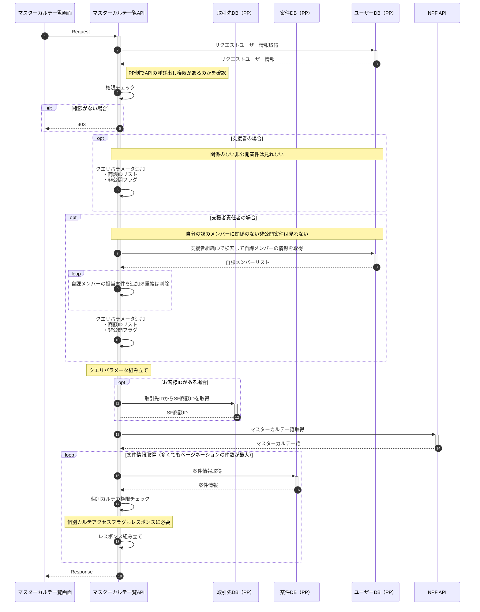

## マスターカルテ一覧

```mermaid
sequenceDiagram
	autonumber

    participant karte_list as マスターカルテ一覧画面
    participant pp_api as マスターカルテ一覧API
    participant pp_customer_db as 取引先DB（PP）
    participant pp_project_db as 案件DB（PP）
    participant pp_user_db as ユーザーDB（PP）
    participant npf_api as NPF API

    karte_list ->>+ pp_api: Request
    pp_api ->>+ pp_user_db: リクエストユーザー情報取得
    pp_user_db -->>- pp_api: リクエストユーザー情報
    note right of pp_api: PP側でAPIの呼び出し権限があるのかを確認
    pp_api ->> pp_api: 権限チェック

    alt 権限がない場合
        pp_api -->> karte_list: 403
    end


    opt 支援者の場合
    note over pp_api, pp_user_db: 関係のない非公開案件は見れない
    pp_api ->> pp_api: クエリパラメータ追加<br>・商談IDリスト<br>・非公開フラグ<br>
    end

    opt 支援者責任者の場合
    note over pp_api, pp_user_db: 自分の課のメンバーに関係のない非公開案件は見れない
    pp_api ->>+ pp_user_db: 支援者組織IDで検索して自課メンバーの情報を取得
    pp_user_db -->>- pp_api: 自課メンバーリスト

    loop
        pp_api ->> pp_api: 自課メンバーの担当案件を追加※重複は削除
    end
    pp_api ->> pp_api: クエリパラメータ追加<br>・商談IDリスト<br>・非公開フラグ<br>
    end

    note over pp_api: クエリパラメータ組み立て

    opt お客様IDがある場合
        pp_api ->>+ pp_customer_db: 取引先IDからSF商談IDを取得
        pp_customer_db -->- pp_api: SF商談ID
    end

    pp_api ->>+ npf_api: マスターカルテ一覧取得
    npf_api -->>- pp_api: マスターカルテ一覧


    loop 案件情報取得（多くてもページネーションの件数が最大）
        pp_api ->>+ pp_project_db: 案件情報取得
        pp_project_db -->>- pp_api: 案件情報
        pp_api ->> pp_api: 個別カルテの権限チェック
        note over pp_api: 個別カルテアクセスフラグもレスポンスに必要
        pp_api ->> pp_api: レスポンス組み立て
    end


    pp_api -->>- karte_list: Response


```