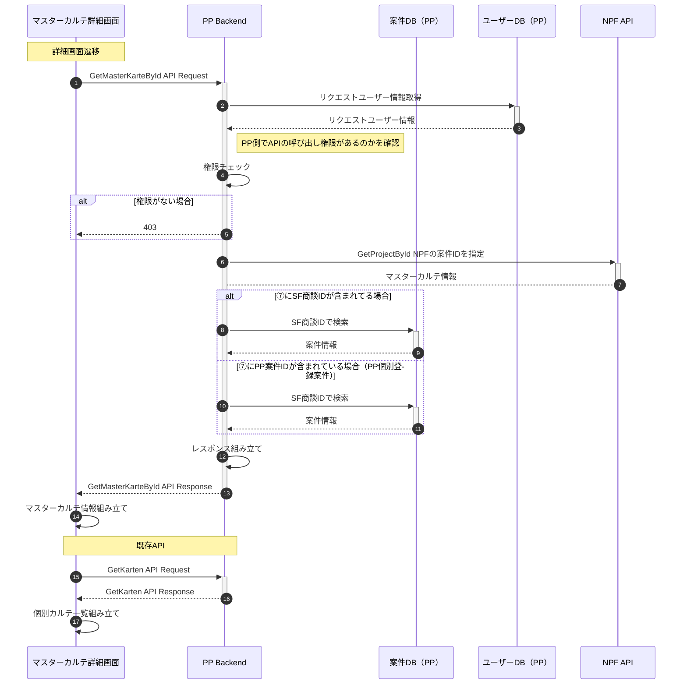

## マスターカルテ詳細ページ

### マスターカルテ詳細ページで使用するAPI
- GetMasterKarteById
- GetKarten

```mermaid
sequenceDiagram
	autonumber

    participant karte_detail as マスターカルテ詳細画面
    participant pp_api as PP Backend
    participant pp_project_db as 案件DB（PP）
    participant pp_user_db as ユーザーDB（PP）
    participant npf_api as NPF API

    note over karte_detail: 詳細画面遷移

    karte_detail ->>+ pp_api: GetMasterKarteById API Request

    pp_api ->>+ pp_user_db: リクエストユーザー情報取得
    pp_user_db -->>- pp_api: リクエストユーザー情報
    note right of pp_api: PP側でAPIの呼び出し権限があるのかを確認
    pp_api ->> pp_api: 権限チェック

    alt 権限がない場合
        pp_api -->> karte_detail: 403
    end

    pp_api ->>+ npf_api: GetProjectById NPFの案件IDを指定
    npf_api -->- pp_api: マスターカルテ情報

    alt ⑦にSF商談IDが含まれてる場合
        pp_api ->>+ pp_project_db: SF商談IDで検索
        pp_project_db -->>- pp_api: 案件情報

    else ⑦にPP案件IDが含まれている場合（PP個別登録案件）
        pp_api ->>+ pp_project_db: SF商談IDで検索
        pp_project_db -->>- pp_api: 案件情報

    end

    pp_api ->> pp_api: レスポンス組み立て
    pp_api -->>- karte_detail: GetMasterKarteById API Response

    karte_detail ->> karte_detail: マスターカルテ情報組み立て

    note over karte_detail, pp_api: 既存API

    karte_detail ->>+ pp_api: GetKarten API Request

    pp_api -->>- karte_detail: GetKarten API Response


    karte_detail ->> karte_detail: 個別カルテ一覧組み立て


```