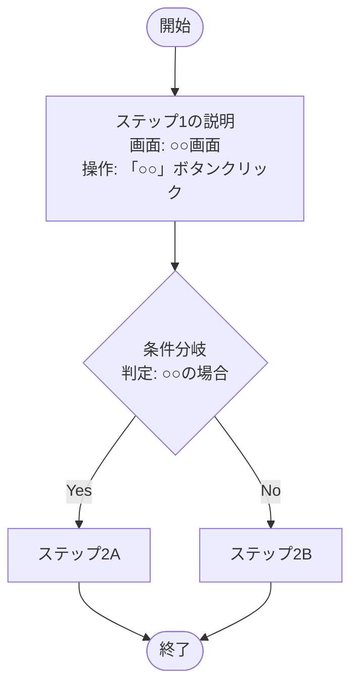
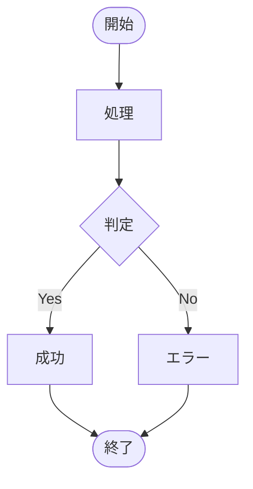
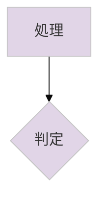
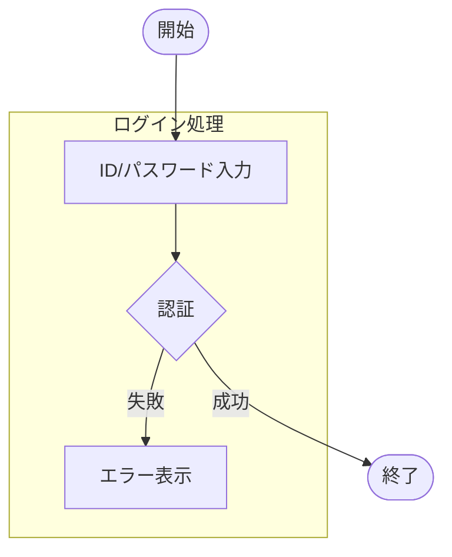
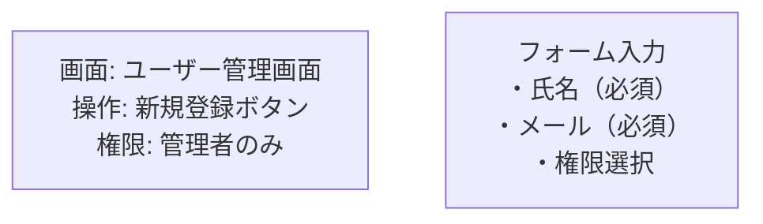
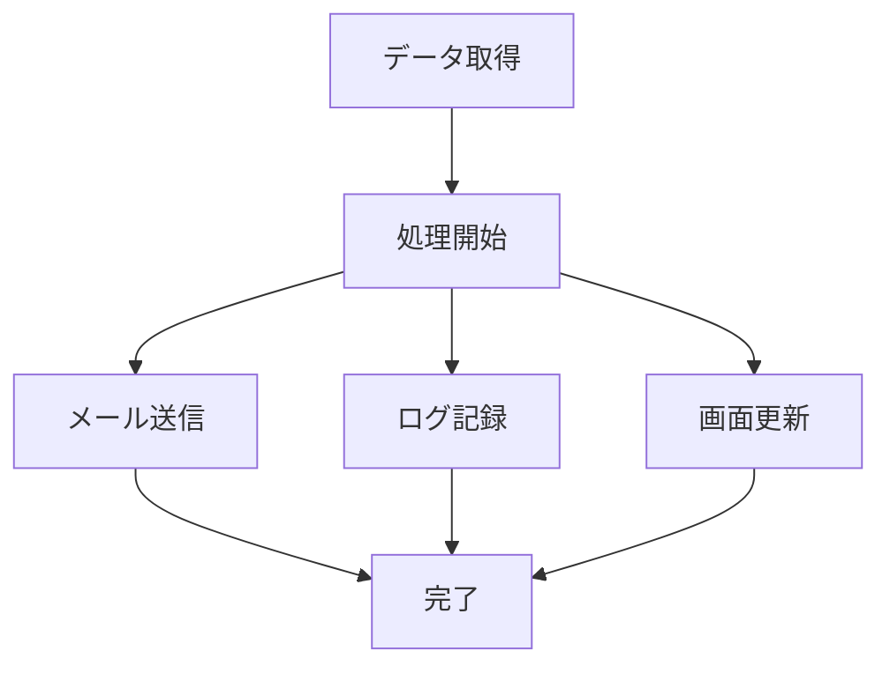

# Claude開発支援ルール

## 📋 概要

このファイルは、Claude Code使用時のフローチャート作成支援における標準ルールとテンプレートを定義します。

---


## 📁 ドキュメント出力ルール

### **出力先の構造**
```
プロジェクトルート/
└── Docs/                        # ドキュメント格納フォルダ
    ├── 01_プロジェクト概要/      # 最初に読むべき
    │   └── プロジェクト構成説明書.md
    ├── 02_環境構築/              # 次に読むべき
    │   └── 環境設定説明書.md
    ├── 03_API仕様/               # 3番目に読むべき
    │   └── API仕様説明書.md
    ├── 04_データベース/          # 4番目に読むべき
    │   └── データベース構造説明書.md
    └── 05_運用保守/              # 最後に読むべき
        └── トラブルシューティング.md
```

### **採番ルール**
1. **フォルダ名**: `[番号]_[カテゴリ名]/`
   - 番号は必ず2桁（01, 02, 03...）
   - アンダースコアで区切る
   - カテゴリ名は日本語でOK

2. **読む順番の基準**
   ```
   01 → プロジェクト全体像（概要、構成）
   02 → 環境構築（セットアップ手順）
   03 → 主要機能（API、コア機能）
   04 → データ関連（DB、ファイル構造）
   05 → 運用関連（保守、トラブル対応）
   ```

3. **採番の見直しタイミング**
   - 新しいドキュメント追加時
   - ドキュメント削除時
   - 読む順番の変更が必要な時

## 🎯 フローチャート作成支援ルール

### 基本原則
1. **新人でも理解可能** - 専門用語の説明、具体的な手順記載
2. **既存資料の活用** - ルートディレクトリのPDF/SVGファイルを読み取り、参考にする
3. **ソースコード準拠** - 画面操作の記載はソースコードのラベル名に従う
4. **実装調査を優先** - フローチャート作成前にソースコードを解析
5. **視覚的にわかりやすく** - Mermaid記法等を使用して見やすいフローチャートを作成

### フローチャート作成手順

#### 1. 既存資料の確認
```
1. ルートディレクトリのPDF/SVGファイルを読み取る
2. 既存のフロー図やシステム構成図を参考にする
3. 業務フローや画面遷移パターンを把握する
```

#### 2. ソースコード解析
```
1. 関連する画面コンポーネントを特定
2. ボタンやリンクのラベル名を確認（ja.jsonから取得）
3. 画面遷移ロジックを解析
4. API呼び出しの流れを確認
```

#### 3. フローチャート作成
```
1. 開始・終了点を明確にする
2. 各ステップで「どの画面の」「どのボタン/操作」かを明記
3. 条件分岐は具体的な判定条件を記載
4. エラー処理も含める
```

---

## 📊 フローチャートテンプレート

### ファイル命名規則
```
[機能名]フローチャート.md
例: ユーザー登録フローチャート.md
    案件作成フローチャート.md
```

### 必須セクション構成

```markdown
# [機能名]フローチャート

## 📋 概要
[機能の概要、業務上の目的、対象ユーザー]

---

## 🔍 参考資料
- 参照したPDF: [ファイル名]
- 参照したSVG: [ファイル名]
- 関連ソースコード: [ファイルパス]

---

## 📊 フローチャート



---

## 🖥️ 画面別操作詳細

### 1. [画面名]（URL: /path/to/screen）
**ソースファイル**: `src/views/[ComponentName].vue`

#### 操作可能な要素:
| ラベル名（表示） | ソース上の名称 | 動作 | 次の遷移先 |
|----------------|--------------|------|-----------|
| [表示ラベル] | [変数名/ID] | [動作説明] | [遷移先] |

#### 入力項目:
| 項目名（表示） | フィールド名 | 必須/任意 | バリデーション |
|--------------|-------------|----------|--------------|
| [表示名] | [field_name] | 必須/任意 | [制約] |

---

## 🔄 処理フロー詳細

### STEP 1: [処理名]
**実行画面**: [画面名]
**トリガー**: [ボタン名]クリック

1. **画面操作**
   - 場所: [画面上の位置]
   - 操作: [具体的な操作方法]
   - ラベル: 「[実際の表示テキスト]」

2. **内部処理**
   - API呼び出し: `[エンドポイント]`
   - データ処理: [処理内容]

3. **結果**
   - 成功時: [次の動作]
   - エラー時: [エラー処理]

---

## ⚠️ 注意事項・エラー処理

### よくあるエラーパターン
| エラー種別 | 発生条件 | 表示メッセージ | 対処法 |
|-----------|---------|--------------|--------|
| [エラー名] | [条件] | [メッセージ] | [対処法] |

---

## 👥 ロール別の違い
| ロール | 利用可能機能 | 制限事項 |
|--------|------------|---------|
| [ロール名] | [機能リスト] | [制限] |

---

## 📝 補足情報
- [その他の重要な情報]
- [新人向けの説明]
- [業務上の注意点]
```

---

## 🛠️ ソースコード解析ガイドライン

### 解析対象
1. **画面コンポーネント**
   - Vue.jsファイル（.vue）
   - 画面表示ラベルの取得元

2. **多言語ファイル**
   - `locales/ja.json` - 日本語ラベル
   - 実際の画面表示テキスト

3. **ルーティング**
   - `router/index.js` - 画面遷移定義
   - URLパスと画面の対応

4. **API定義**
   - APIエンドポイント
   - リクエスト/レスポンス形式

### 解析時の注意点
- **ソースコードは変更しない**
- 実際のラベル名を正確に取得
- コメントやドキュメントも参考にする
- 不明な点は推測せず、調査可能な範囲で記載

---

## 📁 既存資料の読み取り方法

### PDF/SVGファイルの活用
1. **フロー図の確認**
   - 業務フロー全体像の把握
   - 各ステップの関係性理解

2. **画面イメージの確認**
   - 画面レイアウトの理解
   - ボタン配置の確認

3. **業務ルールの抽出**
   - 条件分岐の理由
   - エラーケースの把握

### 読み取り時の注意
- 最新版かどうか確認
- ソースコードとの差異に注意
- 不明瞭な部分は質問形式で記載

---

## 🎯 成果物品質基準

### フローチャートの品質基準
1. **新人が業務フローを理解できる**
2. **画面操作が具体的に分かる**
3. **エラー時の対処が明確**
4. **ソースコードと一致している**
5. **Mermaid記法で見やすく表現**

### チェックリスト
- [ ] 既存PDF/SVGを参照したか
- [ ] ソースコード解析を実施したか
- [ ] ラベル名は正確か（ja.json確認）
- [ ] 全ての分岐を網羅しているか
- [ ] エラーケースを記載したか
- [ ] 新人でも理解できる説明か
- [ ] Mermaidフローチャートが正しく表示されるか

---

## 📝 ドキュメント作成ルール

### 作成場所
- **必ずルートディレクトリに作成**
- マークダウン形式（.md）で保存

### Mermaidフローチャートの基本

#### 基本構文


#### 記号の意味
- `[  ]` : 処理（四角形）
- `{  }` : 判定（ひし形）
- `([ ])` : 開始/終了（角丸）
- `(( ))` : データベース（円筒形）
- `[[ ]]` : サブルーチン（二重線）

#### スタイルとテーマ


### Mermaid記法の応用

#### 1. サブグラフの使用


#### 2. 詳細な説明の記載


#### 3. 並列処理の表現


---

*このルールは開発効率と品質向上を目的として継続的に更新されます*
*フローチャート作成時は、必ず最新のソースコードと既存資料を確認してください*

---

## 🔄 実際の作成フロー

### STEP 1: 資料確認
1. ルートディレクトリのPDF/SVGを確認
2. 業務フローの全体像を把握

### STEP 2: ソース解析
1. 関連する画面コンポーネントを特定
2. ja.jsonから実際のラベル名を取得
3. 画面遷移とAPI呼び出しを確認

### STEP 3: ドキュメント作成
1. マークダウンファイル（.md）作成
   - 概要説明
   - Mermaid記法でのフローチャート
   - 詳細な操作手順
   - エラー処理の記載

### STEP 4: 品質確認
1. Mermaidフローチャートが正しく表示されるか
2. 新人視点でのレビュー
3. ソースコードとの整合性チェック
4. 全ての分岐・エラーケースの網羅確認