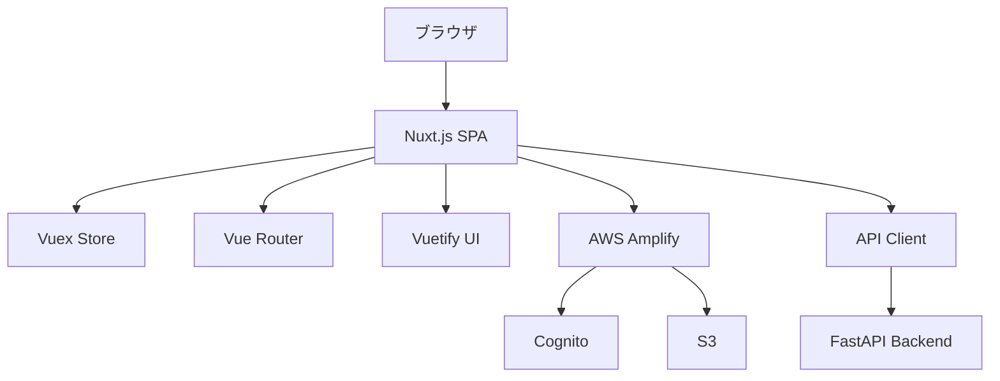

# SSAP Partner Portal Front Office System フロントエンド機能説明書

## 目次

1. [システム概要](#1-システム概要)
2. [技術アーキテクチャ](#2-技術アーキテクチャ)
3. [プロジェクト構成](#3-プロジェクト構成)
4. [コンポーネント設計](#4-コンポーネント設計)
5. [ページ構成とルーティング](#5-ページ構成とルーティング)
6. [状態管理（Vuex）](#6-状態管理vuex)
7. [UI/UXデザインシステム](#7-uiuxデザインシステム)
8. [API通信](#8-api通信)
9. [認証・認可](#9-認証認可)
10. [国際化（i18n）](#10-国際化i18n)
11. [ビルド・デプロイ](#11-ビルドデプロイ)
12. [開発・デバッグ](#12-開発デバッグ)
13. [テスト](#13-テスト)
14. [パフォーマンス最適化](#14-パフォーマンス最適化)

---

## 1. システム概要

### 1.1 プロジェクト概要
- **プロジェクト名**: Sony Acceleration Platform Partner Portal FrontOffice Frontend
- **システム種別**: SPA（Single Page Application）
- **対象ユーザー**: ソニーのパートナー企業、ソルバー、管理者

### 1.2 技術仕様
- **フレームワーク**: Nuxt.js 2.15.7
- **言語**: TypeScript 4.9.4
- **ランタイム**: Node.js 16.14.0（Volta管理）
- **UIフレームワーク**: Vuetify 2.6.10
- **ビルドターゲット**: Static生成

### 1.3 主要機能
- **ソルバー管理**: 個人・法人ソルバーの登録・管理
- **案件管理**: プロジェクトの管理・追跡
- **アンケート機能**: 満足度調査・匿名アンケート
- **工数管理**: 作業時間の記録・分析
- **顧客管理**: 取引先企業の情報管理
- **通知システム**: お知らせ・リマインダー機能

---

## 2. 技術アーキテクチャ

### 2.1 アーキテクチャ概要



### 2.2 技術スタック

#### フロントエンド コア
```json
{
  "nuxt": "^2.15.7",
  "vue": "^2.6.14",
  "typescript": "^4.9.4",
  "vuetify": "^2.6.10"
}
```

#### 状態管理・ルーティング
```json
{
  "vuex": "^3.6.2",
  "vuex-module-decorators": "^1.2.0",
  "vuex-persistedstate": "^4.1.0"
}
```

#### AWS統合
```json
{
  "aws-amplify": "^5.3.3",
  "@aws-sdk/client-s3": "^3.216.0"
}
```

#### UI・UX
```json
{
  "chart.js": "^3.9.1",
  "vue-chartjs": "^4.1.1",
  "dexie": "^3.2.2"
}
```

### 2.3 アーキテクチャの特徴

#### モダンSPA設計
- **CSR（Client Side Rendering）**: 高速なユーザー体験
- **Static生成**: CDN配信による高パフォーマンス
- **Progressive Web App**: PWA対応

#### エンタープライズ対応
- **TypeScript完全対応**: 型安全性の確保
- **多環境対応**: 7つの環境（local, dev, sqa, evs, sup, prd, nuxt）
- **セキュリティ**: SAML SSO + JWT認証

---

## 3. プロジェクト構成

### 3.1 ディレクトリ構造

```
ssap-partner-portal-fo-frontend/
├── .devcontainer/           # DevContainer設定
├── .github/                 # GitHub Actions
├── .nuxt/                   # Nuxtビルド出力
├── .volta/                  # Volta設定
├── dist/                    # 本番ビルド出力
├── src/                     # ソースコード
│   ├── assets/              # 静的アセット
│   ├── common/              # 共通ベースクラス
│   ├── components/          # Vueコンポーネント
│   ├── layouts/             # レイアウト
│   ├── middleware/          # ミドルウェア
│   ├── models/              # データモデル
│   ├── pages/               # ページコンポーネント
│   ├── plugins/             # Nuxtプラグイン
│   ├── static/              # 静的ファイル
│   ├── store/               # Vuexストア
│   ├── types/               # TypeScript型定義
│   └── utils/               # ユーティリティ関数
├── test/                    # テストコード
├── nuxt.config.ts           # Nuxt設定
├── tsconfig.json            # TypeScript設定
└── package.json             # 依存関係
```

### 3.2 設定ファイル

#### Nuxt設定（nuxt.config.ts）
```typescript
export default {
  // レンダリング設定
  mode: 'spa',
  target: 'static',
  srcDir: './src',
  
  // 環境別設定
  privateRuntimeConfig: {
    envKey: process.env.ENV_KEY || 'nuxt',
  },
  
  // モジュール設定
  modules: [
    '@nuxtjs/axios',
    '@nuxtjs/i18n',
    ['@nuxtjs/vuetify', vuetifyOptions],
  ],
}
```

#### TypeScript設定（tsconfig.json）
```json
{
  "compilerOptions": {
    "strict": true,
    "experimentalDecorators": true,
    "emitDecoratorMetadata": true,
    "moduleResolution": "node",
    "allowSyntheticDefaultImports": true
  }
}
```

---

## 4. コンポーネント設計

### 4.1 Atomic Design採用

#### 設計思想
SSAP Partner Portalでは**Atomic Design**を採用し、再利用性と保守性を重視したコンポーネント設計を実現。

```
components/common/
├── atoms/           # 基本要素（25個）
├── molecules/       # 組み合わせ要素（40個以上）
├── organisms/       # セクション要素（15個）
└── templates/       # ページテンプレート
```

#### Atoms（原子）- 基本UIエレメント
```typescript
// Button.vue - 260行の詳細な属性セット定義
<template>
  <v-btn
    :class="computedClass"
    :color="computedColor"
    :disabled="disabled"
    :loading="loading"
    v-bind="$attrs"
    v-on="$listeners"
  >
    <slot />
  </v-btn>
</template>

// 36種類のスタイルセット
const buttonSets = {
  primary: { color: 'btn_primary', class: 'white--text' },
  secondary: { color: 'grey lighten-3', class: 'grey--text text--darken-2' },
  // ... 他34種類
}
```

主要なAtoms:
- **Button**: ボタン要素（36スタイル）
- **TextField**: テキスト入力
- **Select**: 選択ボックス
- **Checkbox**: チェックボックス
- **DataTable**: データテーブル
- **DatePicker**: 日付ピッカー

#### Molecules（分子）- 複合コンポーネント
```vue
<!-- CommonDetailRow.vue -->
<template>
  <v-row no-gutters>
    <v-col cols="3">
      <span class="font-weight-bold">{{ label }}</span>
      <Required v-if="required" />
    </v-col>
    <v-col cols="9">
      <slot />
    </v-col>
  </v-row>
</template>
```

主要なMolecules:
- **CommonDetailRow**: 詳細画面の行表示
- **PageHeader**: ページヘッダー
- **Modal**: モーダルダイアログ
- **Chart**: チャート表示

#### Organisms（有機体）- セクションコンポーネント
```vue
<!-- CommonContainer.vue -->
<template>
  <v-container fluid>
    <CommonInPageHeader :title="title" />
    <v-card>
      <v-card-text>
        <slot />
      </v-card-text>
    </v-card>
  </v-container>
</template>
```

### 4.2 機能別コンポーネント

#### ソルバー機能
```
components/solver/
├── atoms/
├── molecules/
├── organisms/
└── templates/
```

#### アンケート機能
```
components/survey/
├── atoms/
├── molecules/
├── organisms/
└── templates/
```

### 4.3 ベースクラス設計

#### WrapperComponent パターン
```typescript
// common/bases/WrapperComponent.ts
export default class WrapperComponent extends Vue {
  // 共通プロパティ・メソッドの定義
  protected computedClass(): string {
    return this.generateClassString();
  }
}
```

---

## 5. ページ構成とルーティング

### 5.1 ページ構造

#### 自動ルーティング採用
Nuxt.jsのファイルベースルーティングを活用し、`pages/`ディレクトリの構造がそのままURLになる設計。

```
pages/
├── index.vue                    # / (ルート)
├── home.vue                     # /home
├── solver/                      # ソルバー関連
│   ├── _solverId.vue           # /solver/:solverId
│   ├── menu.vue                # /solver/menu
│   ├── application.vue         # /solver/application
│   ├── candidate/              # /solver/candidate/*
│   ├── corporation/            # /solver/corporation/*
│   └── utilization-rate/       # /solver/utilization-rate/*
├── project/                     # プロジェクト関連
│   ├── _projectId.vue          # /project/:projectId
│   └── menu.vue                # /project/menu
├── survey/                      # アンケート関連
├── customer/                    # カスタマー関連
├── man-hour/                    # 工数管理
└── maintenance.vue              # メンテナンス画面
```

#### 特殊ページ
```
pages/
├── error/
│   ├── 403.vue                 # アクセス拒否
│   ├── 500.vue                 # サーバーエラー
│   └── _404.vue                # ページ未発見
├── terms.vue                   # 利用規約
└── user-policy.vue             # プライバシーポリシー
```

### 5.2 レイアウト設計

#### ベースレイアウト
```vue
<!-- layouts/default.vue -->
<template>
  <v-app>
    <v-navigation-drawer app>
      <!-- サイドナビゲーション -->
    </v-navigation-drawer>
    
    <v-app-bar app>
      <!-- ヘッダー -->
    </v-app-bar>
    
    <v-main>
      <ErrorBar />
      <FullScreenLoading />
      <nuxt />
    </v-main>
  </v-app>
</template>
```

#### 特殊レイアウト
- **error.vue**: エラーページ専用
- **maintenance.vue**: メンテナンス画面専用
- **anonymous.vue**: 匿名アンケート専用

### 5.3 ナビゲーション設計

#### 権限ベースナビゲーション
```typescript
// ユーザーロールに応じたメニュー制御
interface NavigationItem {
  title: string;
  path: string;
  roles: UserRole[];
  children?: NavigationItem[];
}

const navigationItems: NavigationItem[] = [
  {
    title: 'ソルバー管理',
    path: '/solver',
    roles: ['APT', 'SOLVER_STAFF'],
    children: [
      { title: '個人ソルバー', path: '/solver/menu', roles: ['APT'] },
      { title: '法人ソルバー', path: '/solver/corporation', roles: ['APT'] }
    ]
  }
];
```

---

## 6. 状態管理（Vuex）

### 6.1 Store設計

#### モジュール構成
```typescript
// store/index.ts - ルートストア
// store-accessor.ts - 型安全なアクセサー

export const accessorType = getAccessorType({
  modules: {
    me: meModule,
    errorBar: errorBarModule,
    fullScreenLoading: fullScreenLoadingModule,
    anonymousSurvey: anonymousSurveyModule,
    satisfactionSurvey: satisfactionSurveyModule,
    redirect: redirectModule,
    currentPageData: currentPageDataModule,
    masterKarteListUrl: masterKarteListUrlModule,
    solverCorporation: solverCorporationModule,
    persistedErrorBar: persistedErrorBarModule,
  }
});
```

### 6.2 主要ストアモジュール

#### ユーザー情報ストア（me.ts）
```typescript
@Module({ name: 'me', namespaced: true, stateFactory: true })
export default class MeModule extends VuexModule {
  // State
  public user: User | null = null;
  public isAuthenticated = false;
  
  // Getters
  get userRole(): UserRole | null {
    return this.user?.role || null;
  }
  
  // Mutations
  @Mutation
  public setUser(user: User): void {
    this.user = user;
    this.isAuthenticated = true;
  }
  
  // Actions
  @Action
  public async fetchUser(): Promise<void> {
    const response = await GetUserById(this.user!.id);
    this.setUser(response.data);
  }
}
```

#### エラーバーストア（error-bar.ts）
```typescript
@Module({ name: 'errorBar', namespaced: true, stateFactory: true })
export default class ErrorBarModule extends VuexModule {
  public message = '';
  public isShow = false;
  public color = 'error';
  
  @Mutation
  public showError(payload: { message: string; color?: string }): void {
    this.message = payload.message;
    this.color = payload.color || 'error';
    this.isShow = true;
  }
  
  @Mutation
  public hide(): void {
    this.isShow = false;
  }
}
```

#### ローディングストア（full-screen-loading.ts）
```typescript
@Module({ name: 'fullScreenLoading', namespaced: true, stateFactory: true })
export default class FullScreenLoadingModule extends VuexModule {
  public isShow = false;
  
  @Mutation
  public show(): void {
    this.isShow = true;
  }
  
  @Mutation
  public hide(): void {
    this.isShow = false;
  }
}
```

### 6.3 永続化設定

#### vuex-persistedstate設定
```typescript
// plugins/persistedstate.client.ts
import createPersistedState from 'vuex-persistedstate';

export default ({ store }: Context) => {
  createPersistedState({
    paths: [
      'me',
      'persistedErrorBar',
      'anonymousSurvey',
      'satisfactionSurvey',
      'redirect',
      'currentPageData',
      'masterKarteListUrl',
      'solverCorporation'
    ]
  })(store);
};
```

---

## 7. UI/UXデザインシステム

### 7.1 Vuetifyカスタマイゼーション

#### テーマ設定
```typescript
// nuxt.config.ts - Vuetify設定
const vuetifyOptions = {
  customVariables: ['~/assets/sass/_vuetify-variables.scss'],
  theme: {
    themes: {
      light: {
        primary: '#1867c0',
        secondary: '#424242',
        accent: '#82B1FF',
        error: '#d53030',
        info: '#2196F3',
        success: '#4CAF50',
        warning: '#FFC107',
        btn_primary: '#008a19',
        btn_secondary: '#e0e0e0',
        btn_danger: '#d53030',
        btn_warning: '#ff9800',
        btn_info: '#2196F3',
        btn_success: '#4CAF50'
      }
    }
  }
};
```

#### カスタムSCSS変数
```scss
// assets/sass/_vuetify-variables.scss
$material-light: (
  'background': #fafafa,
  'surface': #ffffff,
  'cards': #ffffff,
  'text': (
    'primary': rgba(0, 0, 0, 0.87),
    'secondary': rgba(0, 0, 0, 0.60),
    'disabled': rgba(0, 0, 0, 0.38)
  )
);
```

### 7.2 デザインシステム

#### カラーパレット
```scss
// プライマリカラー
$primary: #1867c0;
$secondary: #424242;

// ボタンカラー
$btn-primary: #008a19;
$btn-secondary: #e0e0e0;
$btn-danger: #d53030;

// ステータスカラー
$success: #4CAF50;
$warning: #FFC107;
$error: #d53030;
$info: #2196F3;
```

#### タイポグラフィ
```scss
// フォント設定
$body-font-family: 'Roboto', 'Noto Sans JP', sans-serif;
$heading-font-family: 'Roboto', 'Noto Sans JP', sans-serif;

// フォントサイズ
$font-size-xs: 0.75rem;   // 12px
$font-size-sm: 0.875rem;  // 14px
$font-size-md: 1rem;      // 16px
$font-size-lg: 1.125rem;  // 18px
$font-size-xl: 1.25rem;   // 20px
```

### 7.3 アイコンシステム

#### Material Design Icons
```vue
<template>
  <v-icon>mdi-account</v-icon>
  <v-icon>mdi-home</v-icon>
  <v-icon>mdi-settings</v-icon>
</template>
```

#### カスタムアイコン（IcoMoon）
```scss
// assets/sass/icomoon.scss
@font-face {
  font-family: 'icomoon';
  src: url('~assets/icomoon/icomoon.woff') format('woff');
}

.icon-custom:before {
  font-family: 'icomoon';
  content: '\e900';
}
```

---

## 8. API通信

### 8.1 API Client設計

#### APIクラス実装
```typescript
// plugins/api.ts - 262行の詳細実装
export default class Api {
  private axios: AxiosInstance;
  
  constructor(axios: AxiosInstance) {
    this.axios = axios;
    this.setupInterceptors();
  }
  
  private setupInterceptors(): void {
    // リクエストインターセプター
    this.axios.interceptors.request.use(
      (config) => {
        const token = getJWTToken();
        if (token) {
          config.headers.Authorization = `Bearer ${token}`;
        }
        return config;
      }
    );
    
    // レスポンスインターセプター
    this.axios.interceptors.response.use(
      (response) => this.handleResponse(response),
      (error) => this.handleError(error)
    );
  }
}
```

#### エラーハンドリング
```typescript
// カスタムエラー型
export class UnauthorizedError extends Error {
  constructor(message: string) {
    super(message);
    this.name = 'UnauthorizedError';
  }
}

export class ForbiddenError extends Error {
  constructor(message: string) {
    super(message);
    this.name = 'ForbiddenError';
  }
}

// エラーハンドリング
private handleError(error: AxiosError): Promise<never> {
  switch (error.response?.status) {
    case 401:
      throw new UnauthorizedError('認証が必要です');
    case 403:
      throw new ForbiddenError('アクセス権限がありません');
    case 404:
      throw new NotFoundError('リソースが見つかりません');
    case 500:
      throw new InternalServerError('サーバーエラーが発生しました');
    default:
      throw error;
  }
}
```

### 8.2 API使用パターン

#### コンポーネントでの使用例
```typescript
// ソルバー詳細取得
export default class SolverDetail extends Vue {
  private solver: SolverResponse | null = null;
  
  async created(): Promise<void> {
    await this.fetchSolver();
  }
  
  private async fetchSolver(): Promise<void> {
    try {
      fullScreenLoadingModule.show();
      const response = await GetSolverById(this.$route.params.solverId);
      this.solver = response.data;
    } catch (error) {
      this.apiErrorHandle(error);
    } finally {
      fullScreenLoadingModule.hide();
    }
  }
}
```

#### レスポンス型定義
```typescript
// types/Solver.ts
export interface SolverResponse {
  id: string;
  name: string;
  email: string;
  birthDate?: string;
  birthDateUnknown: boolean;
  certificationStatus: CertificationStatus;
  specializationAreas: string[];
  utilizationRate?: number;
  unitPrice?: number;
}
```

---

## 9. 認証・認可

### 9.1 AWS Amplify Cognito統合

#### 設定
```javascript
// .env.local.js
export default {
  AWS_AMPLIFY_AUTH: {
    region: 'ap-northeast-1',
    userPoolId: 'ap-northeast-1_xBPEWRyR2',
    userPoolWebClientId: '6u4tf11rfpqvaqhq9jvu4oq7fo',
    oauth: {
      domain: 'dev-fo-partner-portal.auth.ap-northeast-1.amazoncognito.com',
      scope: ['openid'],
      redirectSignIn: 'http://localhost:3000/home',
      redirectSignOut: 'http://localhost:3000/',
      responseType: 'code',
    },
    authenticationFlowType: 'USER_SRP_AUTH',
    cookieStorage: {
      domain: 'localhost',
      path: '/',
      expires: 365,
      secure: false,
    }
  }
};
```

#### Amplify初期化
```typescript
// plugins/amplify.client.ts
import { Amplify } from 'aws-amplify';

export default ({ $config }: Context): void => {
  Amplify.configure({
    Auth: $config.AWS_AMPLIFY_AUTH,
    Storage: $config.AWS_AMPLIFY_STORAGE,
  });
};
```

### 9.2 JWT認証

#### トークン管理
```typescript
// utils/auth.ts
export const getJWTToken = (): string | null => {
  try {
    const session = Auth.currentSession();
    return session.getIdToken().getJwtToken();
  } catch (error) {
    return null;
  }
};

export const isTokenValid = (): boolean => {
  const token = getJWTToken();
  if (!token) return false;
  
  try {
    const decoded = jwtDecode(token);
    return decoded.exp! > Date.now() / 1000;
  } catch {
    return false;
  }
};
```

### 9.3 ロールベースアクセス制御

#### ミドルウェア実装
```typescript
// middleware/roleCheck.ts - 118行の詳細実装
export default function({ route, redirect, store }: Context): void {
  const user = store.state.me.user;
  if (!user) {
    redirect('/');
    return;
  }
  
  const requiredRoles = getRequiredRoles(route.path);
  if (!hasRequiredRole(user.role, requiredRoles)) {
    redirect('/error/403');
  }
}

// ページ別権限定義
const pageRoleMap: Record<string, UserRole[]> = {
  '/solver': ['APT', 'SOLVER_STAFF'],
  '/solver/corporation': ['APT'],
  '/customer': ['APT', 'CUSTOMER_STAFF'],
  '/project': ['APT', 'PROJECT_MANAGER'],
};
```

#### ユーザーロール定義
```typescript
// types/User.ts
export enum UserRole {
  APT = 'apt',                    // アライアンス担当
  SOLVER_STAFF = 'solver_staff',  // ソルバー担当
  CUSTOMER_STAFF = 'customer_staff', // カスタマー担当
  PROJECT_MANAGER = 'project_manager', // プロジェクト管理者
  SUPPORTER_MGR = 'supporter_mgr', // サポーター管理者
  SUPPORTER = 'supporter',        // サポーター
  GENERAL = 'general'             // 一般ユーザー
}
```

---

## 10. 国際化（i18n）

### 10.1 多言語対応設定

#### i18n設定
```typescript
// nuxt.config.ts
i18n: {
  locales: [
    { code: 'ja', name: '日本語', file: 'ja.json' },
    // { code: 'en', name: 'English', file: 'en.json' }, // 将来対応
  ],
  defaultLocale: 'ja',
  lazy: true,
  langDir: 'lang/',
  strategy: 'no_prefix'
}
```

### 10.2 言語ファイル

#### 日本語言語ファイル
```json
// lang/ja.json
{
  "common": {
    "save": "保存",
    "cancel": "キャンセル",
    "delete": "削除",
    "edit": "編集",
    "search": "検索",
    "loading": "読み込み中..."
  },
  "solver": {
    "title": "ソルバー管理",
    "individual": "個人ソルバー",
    "corporation": "法人ソルバー",
    "certification": "認定",
    "candidate": "候補者"
  },
  "validation": {
    "required": "必須項目です",
    "email": "正しいメールアドレスを入力してください",
    "maxLength": "文字数が上限を超えています"
  }
}
```

### 10.3 使用方法

#### コンポーネントでの使用
```vue
<template>
  <div>
    <h1>{{ $t('solver.title') }}</h1>
    <v-btn>{{ $t('common.save') }}</v-btn>
  </div>
</template>

<script lang="ts">
export default Vue.extend({
  computed: {
    pageTitle(): string {
      return this.$t('solver.title');
    }
  }
});
</script>
```

---

## 11. ビルド・デプロイ

### 11.1 環境別ビルド

#### NPMスクリプト
```json
{
  "scripts": {
    "local": "cross-env ENV_KEY=\"local\" nuxt",
    "build:local": "cross-env ENV_KEY=\"local\" nuxt build",
    "dev": "cross-env ENV_KEY=\"development\" nuxt",
    "build:dev": "cross-env ENV_KEY=\"development\" nuxt build",
    "sqa": "cross-env ENV_KEY=\"sqa\" nuxt",
    "build:sqa": "cross-env ENV_KEY=\"sqa\" nuxt build",
    "generate:prd": "cross-env ENV_KEY=\"production\" nuxt generate"
  }
}
```

#### 環境設定ファイル
```javascript
// .env.local.js
export default {
  API_BASE_URL: 'http://localhost:8000/api',
  AWS_AMPLIFY_AUTH: { /* Cognito設定 */ },
  AWS_AMPLIFY_STORAGE: { /* S3設定 */ }
};

// .env.production.js
export default {
  API_BASE_URL: 'https://api.partner-portal.ssap.sony.com/api',
  AWS_AMPLIFY_AUTH: { /* 本番Cognito設定 */ },
  AWS_AMPLIFY_STORAGE: { /* 本番S3設定 */ }
};
```

### 11.2 ビルド最適化

#### Webpack設定
```typescript
// nuxt.config.ts
build: {
  // バンドル分析
  analyze: process.env.ANALYZE === 'true',
  
  // ソースマップ
  sourceMap: false,
  
  // CSS抽出
  extractCSS: true,
  
  // 最適化
  optimization: {
    splitChunks: {
      chunks: 'all',
      cacheGroups: {
        vendor: {
          name: 'vendor',
          test: /[\\/]node_modules[\\/]/,
          chunks: 'all'
        }
      }
    }
  }
}
```

### 11.3 GitHub Actions CI/CD

#### ワークフロー設定
```yaml
# .github/workflows/deploy.yml
name: Deploy to S3
on:
  push:
    branches: [main, develop]

jobs:
  build-and-deploy:
    runs-on: ubuntu-latest
    steps:
    - uses: actions/checkout@v2
    
    - name: Setup Node.js
      uses: actions/setup-node@v2
      with:
        node-version: '16'
        
    - name: Install dependencies
      run: npm ci
      
    - name: Build application
      run: npm run generate:prd
      
    - name: Deploy to S3
      uses: aws-actions/configure-aws-credentials@v1
      with:
        aws-access-key-id: ${{ secrets.AWS_ACCESS_KEY_ID }}
        aws-secret-access-key: ${{ secrets.AWS_SECRET_ACCESS_KEY }}
        aws-region: ap-northeast-1
```

---

## 12. 開発・デバッグ

### 12.1 DevContainer環境

#### 設定ファイル
```json
// .devcontainer/devcontainer.json
{
  "name": "Node.js & TypeScript",
  "image": "mcr.microsoft.com/vscode/devcontainers/typescript-node:16",
  "forwardPorts": [3000, 8000],
  "postCreateCommand": "npm install",
  "extensions": [
    "Vue.volar",
    "ms-vscode.vscode-typescript-next",
    "esbenp.prettier-vscode"
  ]
}
```

### 12.2 開発サーバー

#### 起動方法
```bash
# ローカル開発
npm run local

# 開発環境
npm run dev

# SQA環境
npm run sqa
```

#### ホットリロード
Nuxt.jsの標準機能により、ファイル変更時の自動リロードに対応。

### 12.3 デバッグツール

#### Vue Devtools
```typescript
// nuxt.config.ts
export default {
  vue: {
    config: {
      devtools: process.env.NODE_ENV === 'development'
    }
  }
}
```

#### ブラウザデバッグ
```typescript
// デバッグ用コンソール出力
if (process.env.NODE_ENV === 'development') {
  console.log('Debug: API Response', response);
}
```

---

## 13. テスト

### 13.1 テスト構成

#### Jest設定
```javascript
// jest.config.js
module.exports = {
  preset: '@nuxt/test-utils',
  testEnvironment: 'jsdom',
  collectCoverage: true,
  collectCoverageFrom: [
    'src/**/*.{js,ts,vue}',
    '!src/plugins/**',
    '!src/.nuxt/**'
  ],
  coverageDirectory: 'coverage',
  coverageReporters: ['html', 'text', 'lcov']
};
```

### 13.2 テスト種別

#### 単体テスト
```typescript
// test/unit/components/Button.spec.ts
import { mount } from '@vue/test-utils';
import Button from '~/components/common/atoms/Button.vue';

describe('Button.vue', () => {
  test('renders button with text', () => {
    const wrapper = mount(Button, {
      slots: {
        default: 'Click me'
      }
    });
    
    expect(wrapper.text()).toBe('Click me');
  });
});
```

#### 統合テスト
```typescript
// test/integration/pages/solver.spec.ts
import { mount, createLocalVue } from '@vue/test-utils';
import Vuex from 'vuex';
import SolverMenu from '~/pages/solver/menu.vue';

describe('Solver Menu Page', () => {
  test('displays solver list', async () => {
    const wrapper = mount(SolverMenu, {
      store: mockStore,
      mocks: {
        $t: (key: string) => key
      }
    });
    
    expect(wrapper.find('[data-test="solver-list"]').exists()).toBe(true);
  });
});
```

### 13.3 E2Eテスト

#### Playwright設定
```typescript
// playwright.config.ts
import { PlaywrightTestConfig } from '@playwright/test';

const config: PlaywrightTestConfig = {
  testDir: './test/e2e',
  use: {
    baseURL: 'http://localhost:3000',
    screenshot: 'only-on-failure',
    video: 'retain-on-failure'
  },
  projects: [
    { name: 'chromium', use: { ...devices['Desktop Chrome'] } },
    { name: 'firefox', use: { ...devices['Desktop Firefox'] } },
    { name: 'webkit', use: { ...devices['Desktop Safari'] } }
  ]
};
```

---

## 14. パフォーマンス最適化

### 14.1 バンドル最適化

#### 動的インポート
```typescript
// ページレベルでの動的インポート
export default Vue.extend({
  components: {
    HeavyComponent: () => import('~/components/HeavyComponent.vue')
  }
});
```

#### TreeShaking
```typescript
// 必要な機能のみをインポート
import { debounce } from 'lodash-es';
// 非推奨: import _ from 'lodash';
```

### 14.2 画像最適化

#### 画像圧縮
```vue
<template>
  <v-img
    :src="imageSrc"
    :lazy-src="placeholderSrc"
    loading="lazy"
    :aspect-ratio="16/9"
  />
</template>
```

### 14.3 キャッシュ戦略

#### HTTP キャッシュ
```typescript
// nuxt.config.ts
render: {
  static: {
    maxAge: 1000 * 60 * 60 * 24 * 365 // 1年
  }
}
```

#### サービスワーカー
```typescript
// PWA設定
pwa: {
  workbox: {
    runtimeCaching: [
      {
        urlPattern: /^https:\/\/api\.partner-portal\.ssap\.sony\.com\/.*/,
        handler: 'CacheFirst',
        options: {
          cacheName: 'api-cache',
          expiration: {
            maxEntries: 100,
            maxAgeSeconds: 60 * 60 * 24 // 24時間
          }
        }
      }
    ]
  }
}
```

---

## 付録

### A. 環境設定一覧

| 環境 | URL | 用途 |
|------|-----|------|
| local | http://localhost:3000 | ローカル開発 |
| dev | https://dev.partner-portal.ssap.sony.com | 開発環境 |
| sqa | https://sqa.partner-portal.ssap.sony.com | 品質保証 |
| evs | https://evs.partner-portal.ssap.sony.com | 脆弱性試験 |
| sup | https://sup.partner-portal.ssap.sony.com | サポート環境 |
| prd | https://partner-portal.ssap.sony.com | 本番環境 |

### B. 開発ツール

| ツール | 用途 | 設定ファイル |
|--------|------|-------------|
| ESLint | 静的解析 | .eslintrc.js |
| Prettier | コードフォーマット | .prettierrc |
| TypeScript | 型チェック | tsconfig.json |
| Jest | テスト | jest.config.js |
| Playwright | E2Eテスト | playwright.config.ts |

### C. パフォーマンス指標

| 指標 | 目標値 | 測定方法 |
|------|--------|----------|
| FCP | < 1.5s | Lighthouse |
| LCP | < 2.5s | Lighthouse |
| FID | < 100ms | Lighthouse |
| CLS | < 0.1 | Lighthouse |
| Bundle Size | < 500KB | webpack-bundle-analyzer |

---

**文書作成者**: Claude Code  
**最終更新日**: 2025-07-03  
**バージョン**: 1.0