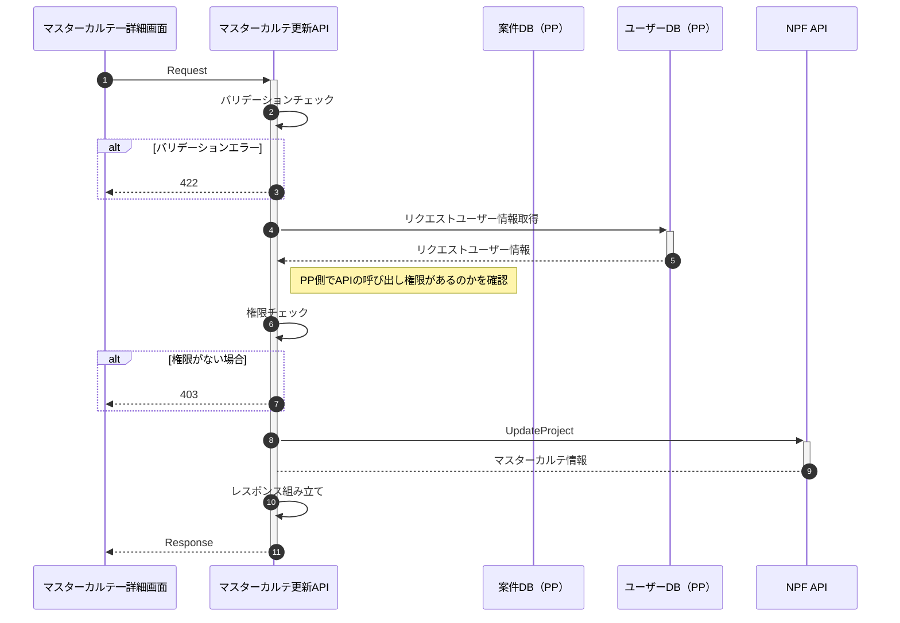

## マスターカルテ更新API

```mermaid
sequenceDiagram
	autonumber

    participant karte_detail as マスターカルテ一詳細画面
    participant pp_api as マスターカルテ更新API
    participant pp_project_db as 案件DB（PP）
    participant pp_user_db as ユーザーDB（PP）
    participant npf_api as NPF API

    karte_detail ->>+ pp_api: Request

    pp_api ->> pp_api: バリデーションチェック

    alt バリデーションエラー
        pp_api -->> karte_detail: 422
    end

    pp_api ->>+ pp_user_db: リクエストユーザー情報取得
    pp_user_db -->>- pp_api: リクエストユーザー情報
    note right of pp_api: PP側でAPIの呼び出し権限があるのかを確認
    pp_api ->> pp_api: 権限チェック

    alt 権限がない場合
        pp_api -->> karte_detail: 403
    end

    pp_api ->>+ npf_api: UpdateProject
    npf_api -->- pp_api: マスターカルテ情報

    pp_api ->> pp_api: レスポンス組み立て


    pp_api -->>- karte_detail: Response


```