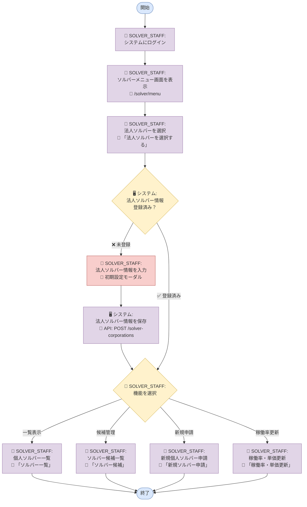
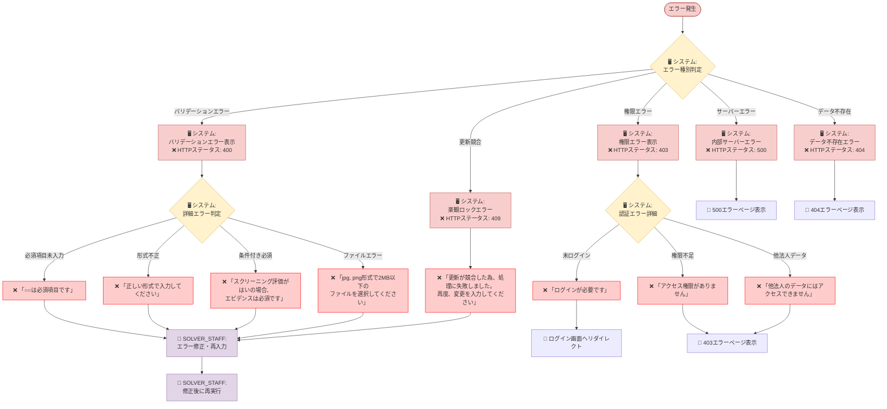
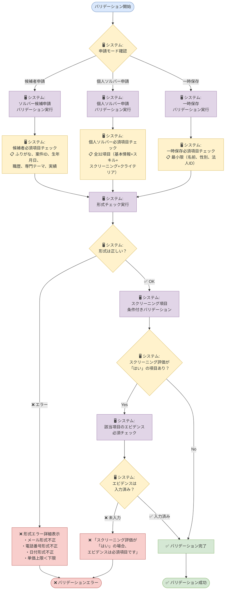

# 人材要件機能フローチャート（完全版）

## 📋 概要
人材要件機能（ソルバーソーシング機能）は、法人ソルバーが個人ソルバーの登録・管理を行うシステムです。
法人ソルバーの情報管理から、所属する個人ソルバーの申請・承認・管理まで一貫したワークフローを提供します。

### 対象ユーザー（アクター）
- **APT（管理者）**: 全機能利用可能、システム全体の監視・管理
- **SOLVER_STAFF（法人ソルバー担当者）**: 所属法人の個人ソルバー管理のみ
- **個人ソルバー候補者**: 申請情報の提供対象
- **システム**: 自動処理・通知の実行主体

### 業務上の目的
- 法人ソルバーから個人ソルバーへの人材要件登録申請
- 個人ソルバーの資格・能力審査プロセス
- 人材の稼働状況・単価管理

---

## 🔍 参考資料
- 参照したPDF: 【FY25】ソルバーソーシング機能(対応範囲のみ）.pdf
- 参照したSVG: ER図.drawio.svg、新業務フロー図.drawio.svg
- 関連ソースコード: 
  - `/ssap-partner-portal-fo-frontend/src/pages/solver/menu.vue` - ソルバーメニュー画面
  - `/ssap-partner-portal-fo-frontend/src/pages/solver/application.vue` - 新規申請画面
  - `/ssap-partner-portal-fo-frontend/src/lang/ja.json` - 日本語ラベル定義
  - `/ssap-partner-portal-fo-backend/app/routers/solver.py` - APIエンドポイント
  - `/ssap-partner-portal-fo-backend/app/schemas/solver.py` - API仕様
  - `/ssap-partner-portal-fo-backend/app/models/solver.py` - データベースモデル
  - `/ssap-partner-portal-fo-frontend/src/types/Solver.ts` - TypeScript型定義

---

## 📊 人材要件機能フローチャート

### 全体フロー


### 新規個人ソルバー申請フロー
```mermaid
flowchart TD
    Start([新規申請開始]) --> BasicInfo[👤 SOLVER_STAFF:<br/>個人ソルバー基本情報を入力<br/>📋 必須: 名前、かな、性別、生年月日、職歴]
    BasicInfo --> ScreeningItems[👤 SOLVER_STAFF:<br/>スクリーニング項目を入力<br/>📊 8項目: 評価(はい/いいえ) + エビデンス]
    ScreeningItems --> CriteriaItems[👤 SOLVER_STAFF:<br/>クライテリア項目を入力<br/>📝 8項目: エビデンス(テキスト)]
    CriteriaItems --> TempSave{👤 SOLVER_STAFF:<br/>一時保存する？}
    
    TempSave -->|✅ Yes| SaveTemp[🖥️ システム:<br/>一時保存を実行<br/>💾 「一時保存しました」]
    TempSave -->|❌ No| ConfirmScreen[🖥️ システム:<br/>確認画面を表示<br/>🎯 「確認画面に進む」]
    
    SaveTemp --> Complete1[✅ 一時保存完了]
    ConfirmScreen --> SubmitApp[👤 SOLVER_STAFF:<br/>申請を実行<br/>🎯 「申請する」]
    SubmitApp --> SystemReview[🖥️ システム:<br/>申請内容を審査<br/>🔗 API: POST /solvers]
    SystemReview --> AppComplete[🖥️ システム:<br/>申請完了通知を表示<br/>✅ 「申請が完了しました」]
    AppComplete --> Complete2[✅ 申請完了]
    
    Complete1 --> End([終了])
    Complete2 --> End
    
    style Start fill:#dae8fc,stroke:#6c8ebf
    style End fill:#dae8fc,stroke:#6c8ebf
    style BasicInfo fill:#e1d5e7,stroke:#9673a6
    style ScreeningItems fill:#e1d5e7,stroke:#9673a6
    style CriteriaItems fill:#e1d5e7,stroke:#9673a6
    style TempSave fill:#fff2cc,stroke:#d6b656
    style SaveTemp fill:#d5e8d4,stroke:#82b366
    style ConfirmScreen fill:#e1d5e7,stroke:#9673a6
    style SubmitApp fill:#e1d5e7,stroke:#9673a6
    style SystemReview fill:#e1d5e7,stroke:#9673a6
    style AppComplete fill:#d5e8d4,stroke:#82b366
    style Complete1 fill:#d5e8d4,stroke:#82b366
    style Complete2 fill:#d5e8d4,stroke:#82b366
```

### ソルバー候補管理フロー
```mermaid
flowchart TD
    Start([候補管理開始]) --> CandidateAction{👤 SOLVER_STAFF:<br/>アクションを選択}
    
    CandidateAction -->|新規申請| NewCandidate[👤 SOLVER_STAFF:<br/>新規ソルバー候補申請<br/>🎯 「新規ソルバー候補申請」]
    CandidateAction -->|詳細表示| CandidateDetail[👤 SOLVER_STAFF:<br/>ソルバー候補詳細を表示<br/>👁️ 候補者詳細表示]
    
    NewCandidate --> CandidateInfo[👤 SOLVER_STAFF:<br/>候補者情報を入力<br/>📝 基本情報 + 能力情報]
    CandidateInfo --> CandidateSubmit[🖥️ システム:<br/>候補者申請を処理<br/>🔗 API: POST /solver-candidates]
    CandidateSubmit --> CandidateList[📋 候補者一覧に追加]
    
    CandidateDetail --> PromoteCheck{👤 SOLVER_STAFF:<br/>個人ソルバーに<br/>登録する？}
    PromoteCheck -->|✅ Yes| PromoteConfirm[🖥️ システム:<br/>確認モーダル表示<br/>⚠️ 「個人ソルバーへの登録」]
    PromoteCheck -->|❌ No| CandidateList
    
    PromoteConfirm --> PromoteSolver[🖥️ システム:<br/>個人ソルバーに登録<br/>🔗 API: PATCH /solvers/{id}]
    PromoteSolver --> SolverList[📋 個人ソルバー一覧に移動]
    
    CandidateList --> End([終了])
    SolverList --> End
    
    style Start fill:#dae8fc,stroke:#6c8ebf
    style End fill:#dae8fc,stroke:#6c8ebf
    style CandidateAction fill:#fff2cc,stroke:#d6b656
    style NewCandidate fill:#e1d5e7,stroke:#9673a6
    style CandidateDetail fill:#e1d5e7,stroke:#9673a6
    style CandidateInfo fill:#e1d5e7,stroke:#9673a6
    style CandidateSubmit fill:#e1d5e7,stroke:#9673a6
    style PromoteCheck fill:#fff2cc,stroke:#d6b656
    style PromoteConfirm fill:#f8cecc,stroke:#b85450
    style PromoteSolver fill:#e1d5e7,stroke:#9673a6
    style CandidateList fill:#d5e8d4,stroke:#82b366
    style SolverList fill:#d5e8d4,stroke:#82b366
```

### 稼働率・単価更新フロー
```mermaid
flowchart TD
    Start([稼働率更新開始]) --> RateDisplay[🖥️ システム:<br/>更新対象を表示<br/>📊 所属個人ソルバー一覧]
    RateDisplay --> RateInput[👤 SOLVER_STAFF:<br/>稼働率・単価を入力<br/>📈 今月・来月稼働率<br/>💰 人月・時間単価]
    RateInput --> Validation[🖥️ システム:<br/>入力値をチェック<br/>✅ バリデーション実行]
    Validation --> ValidationResult{🖥️ システム:<br/>入力値は正しい？}
    
    ValidationResult -->|❌ エラー| ErrorDisplay[🖥️ システム:<br/>エラーメッセージ表示<br/>❌ 「正しい値を入力してください」]
    ErrorDisplay --> RateInput
    
    ValidationResult -->|✅ OK| BulkUpdate[🖥️ システム:<br/>一括更新を実行<br/>🔗 API: PUT /solvers/utilization-rate/{id}]
    BulkUpdate --> UpdateResult{🖥️ システム:<br/>更新は成功？}
    
    UpdateResult -->|❌ 失敗| UpdateError[🖥️ システム:<br/>エラーメッセージ表示<br/>❌ 「更新に失敗しました」]
    UpdateError --> RateInput
    
    UpdateResult -->|✅ 成功| UpdateComplete[🖥️ システム:<br/>更新完了通知を表示<br/>✅ 「更新が完了しました」]
    UpdateComplete --> SolverList[📋 個人ソルバー一覧に戻る]
    SolverList --> End([終了])
    
    style Start fill:#dae8fc,stroke:#6c8ebf
    style End fill:#dae8fc,stroke:#6c8ebf
    style RateDisplay fill:#e1d5e7,stroke:#9673a6
    style RateInput fill:#e1d5e7,stroke:#9673a6
    style Validation fill:#e1d5e7,stroke:#9673a6
    style ValidationResult fill:#fff2cc,stroke:#d6b656
    style ErrorDisplay fill:#f8cecc,stroke:#b85450
    style BulkUpdate fill:#e1d5e7,stroke:#9673a6
    style UpdateResult fill:#fff2cc,stroke:#d6b656
    style UpdateError fill:#f8cecc,stroke:#b85450
    style UpdateComplete fill:#d5e8d4,stroke:#82b366
    style SolverList fill:#d5e8d4,stroke:#82b366
```

### エラーハンドリングフロー


### ファイルアップロードフロー
```mermaid
flowchart TD
    FileStart([ファイル選択開始]) --> FileSelect[👤 SOLVER_STAFF:<br/>ファイルを選択<br/>📁 プロフィール画像または添付資料]
    FileSelect --> FileValidation[🖥️ システム:<br/>ファイルバリデーション実行]
    FileValidation --> FileCheck{🖥️ システム:<br/>ファイルは有効？}
    
    FileCheck -->|❌ ファイル形式不正| FormatError[❌ 「jpg, png形式のファイルを<br/>選択してください」]
    FileCheck -->|❌ サイズ超過| SizeError[❌ 「ファイルサイズが大きすぎます<br/>（2MB以下）」]
    FileCheck -->|✅ 有効| FileUpload[🖥️ システム:<br/>S3にファイルアップロード]
    
    FormatError --> FileSelect
    SizeError --> FileSelect
    
    FileUpload --> UploadResult{🖥️ システム:<br/>アップロード成功？}
    UploadResult -->|❌ 失敗| UploadError[❌ 「ファイルのアップロードに失敗しました」]
    UploadResult -->|✅ 成功| UploadSuccess[✅ ファイルアップロード完了<br/>🔗 S3キー生成]
    
    UploadError --> FileSelect
    UploadSuccess --> KeyGeneration[🖥️ システム:<br/>ファイルキーID生成<br/>📝 UUID形式]
    KeyGeneration --> PathGeneration[🖥️ システム:<br/>S3パス生成<br/>📍 {type}/{corporateId}/{fileKeyId}/{fileName}]
    PathGeneration --> FileComplete[✅ ファイル登録完了]
    
    FileComplete --> End([終了])
    
    style FileStart fill:#dae8fc,stroke:#6c8ebf
    style End fill:#dae8fc,stroke:#6c8ebf
    style FileSelect fill:#e1d5e7,stroke:#9673a6
    style FileValidation fill:#e1d5e7,stroke:#9673a6
    style FileCheck fill:#fff2cc,stroke:#d6b656
    style FormatError fill:#f8cecc,stroke:#b85450
    style SizeError fill:#f8cecc,stroke:#b85450
    style FileUpload fill:#e1d5e7,stroke:#9673a6
    style UploadResult fill:#fff2cc,stroke:#d6b656
    style UploadError fill:#f8cecc,stroke:#b85450
    style UploadSuccess fill:#d5e8d4,stroke:#82b366
    style KeyGeneration fill:#e1d5e7,stroke:#9673a6
    style PathGeneration fill:#e1d5e7,stroke:#9673a6
    style FileComplete fill:#d5e8d4,stroke:#82b366
```

### バリデーション詳細フロー


---

## 🖥️ 画面別操作詳細

### 1. ソルバーメニュー画面（URL: /solver/menu）
**ソースファイル**: `src/pages/solver/menu.vue`

#### 操作可能な要素:
| ラベル名（表示） | ソース上の名称 | 動作 | 次の遷移先 |
|----------------|--------------|------|-----------|
| 法人ソルバーを選択する | solverCorporationSelector | 法人ソルバー選択 | 各機能へ |
| 法人ソルバー情報詳細 | solverCorporationInfo | 法人情報の確認・編集 | 法人ソルバー詳細 |
| 新規ソルバー申請 | newSolverApplication | 新規個人ソルバー申請 | 申請画面 |
| ソルバー一覧 | solverList | 個人ソルバーの管理 | 個人ソルバー一覧 |
| ソルバー候補 | solverCandidate | 候補者の管理 | ソルバー候補一覧 |
| 稼働率・単価更新 | utilizationRateUpdate | 稼働率・単価の更新 | 更新画面 |

### 2. 新規個人ソルバー申請画面（URL: /solver/application）
**ソースファイル**: `src/pages/solver/application.vue`

#### 入力項目（個人ソルバー基本情報）:
| 項目名（表示） | フィールド名 | 必須/任意 | バリデーション |
|--------------|-------------|----------|--------------|
| 個人ソルバー名 | name | 必須 | 文字数制限 |
| 個人ソルバーかな | nameKana | 必須 | ひらがな |
| 性別 | gender | 必須 | 選択肢 |
| 生年月日 | dateOfBirth | 必須 | 日付形式 |
| 役職 | post | 任意 | 文字数制限 |
| 連絡先メールアドレス | mail | 任意 | メール形式 |
| 電話番号 | phoneNumber | 任意 | 電話番号形式 |
| 個人ソルバー画像 | facePhoto | 任意 | ファイル形式・サイズ |
| 学歴 | education | 任意 | テキスト |
| 職歴 | workHistory | 必須 | テキスト |
| 専門テーマ | specialTheme | 任意 | テキスト |
| 主な実績 | mainAchievements | 任意 | テキスト |
| 英語レベル | englishLevel | 任意 | 選択肢 |
| 東証33業種経験 | tse33Experience | 任意 | 複数選択 |
| 課題マップ50 | issueMap50 | 任意 | 複数選択 |
| 稼働状況 | operatingStatus | 任意 | 選択肢 |

#### スクリーニング項目（8項目）:
| 項目名（表示） | フィールド名 | 入力形式 |
|--------------|-------------|---------|
| Sony Acceleration Platformで新規事業分野における支援実績がある | sapSupportAchievement | 評価（はい/いいえ） + エビデンス |
| 大企業の新規事業分野における支援実績がある | newBizSupportAchievement | 評価（はい/いいえ） + エビデンス |
| 大企業の新規事業において同一クライアントとのリピート実績がある | repeatAchievement | 評価（はい/いいえ） + エビデンス |
| 大企業の新規事業分野において複数の実績がある | newBizAchievements | 評価（はい/いいえ） + エビデンス |
| 大企業など新規事業分野における正社員（リーダー）として自ら立ち上げ経験がある | newBizLeaderExperience | 評価（はい/いいえ） + エビデンス |
| 大企業など新規事業分野における正社員（メンバー）としての経験がある | newBizMemberExperience | 評価（はい/いいえ） + エビデンス |
| 大企業などでリーダーとしての事業化経験があり、さらに黒字化の経験がある | leaderProfitExperience | 評価（はい/いいえ） + エビデンス |
| 大企業などでメンバーとしての事業化経験があり、さらに黒字化の経験がある | memberProfitExperience | 評価（はい/いいえ） + エビデンス |

#### クライテリア項目（8項目）:
| 項目名（表示） | フィールド名 | 入力形式 |
|--------------|-------------|---------|
| 実践的なノウハウ | practicalKnowhow | エビデンス（テキスト） |
| タイムリーな実行力 | timelyExecution | エビデンス（テキスト） |
| 顧客ファースト | customerFirst | エビデンス（テキスト） |
| 高い品質と顧客からの信頼 | qualityTrust | エビデンス（テキスト） |
| 新たな事業機会や成長機会を創出する力 | growthOpportunity | エビデンス（テキスト） |
| 外部連携推進力（バウンダリースパナー） | collaborationAbility | エビデンス（テキスト） |
| ディレクション・ブランドイメージの合致 | brandAlignment | エビデンス（テキスト） |
| 長期的思考（持続可能性、自立性） | longTermVision | エビデンス（テキスト） |

#### 操作ボタン:
| ラベル名（表示） | 動作 | 条件 |
|----------------|------|------|
| 一時保存 | 入力内容の保存 | 任意の段階で実行可能 |
| 確認画面に進む | 確認画面へ遷移 | 必須項目入力済み |
| 申請する | 申請の実行 | 確認画面で実行 |
| キャンセル | 入力取消 | 編集時 |
| ソルバー一覧へ戻る | 一覧画面へ戻る | 任意 |

### 3. 個人ソルバー一覧画面（URL: /solver/list/{solverCorporationId}）
**ソースファイル**: `src/pages/solver/list/_solverCorporationId.vue`

#### 絞り込み条件:
| 項目名（表示） | フィールド名 | 選択肢 |
|--------------|-------------|--------|
| 個人ソルバー名 | name | 自由入力 |
| 性別 | gender | 全て/男性/女性/未設定 |
| 個人ソルバー登録 | certificationStatus | 全て/申請前/申請中/登録済み |
| 稼働状況 | operatingStatus | 全て/未稼働/稼働中/休止中 |

#### 一覧表示項目:
| 項目名（表示） | 表示内容 | 操作 |
|--------------|---------|------|
| 個人ソルバー名 | 名前 | 詳細画面へリンク |
| 性別 | 性別 | 表示のみ |
| 個人ソルバー登録ステータス | 登録状況 | 表示のみ |
| 稼働状況 | 稼働状況 | 表示のみ |
| 稼働率(今月) | 今月の稼働率 | 表示のみ |
| 稼働率(来月) | 来月の稼働率 | 表示のみ |
| 最終更新日時 | 更新日時 | 表示のみ |

### 4. 稼働率・単価更新画面（URL: /solver/utilization-rate）
**ソースファイル**: `src/pages/solver/utilization-rate.vue`

#### 更新対象項目:
| 項目名（表示） | フィールド名 | 入力形式 |
|--------------|-------------|---------|
| 稼働率(今月) | providedOperatingRate | 数値（0-100%） |
| 稼働率(来月) | providedOperatingRateNext | 数値（0-100%） |
| 再来月以降の稼働見込み | operationProspectsMonthAfterNext | 選択肢 |
| 人月単価(下限〜上限) | pricePerPersonMonth | 数値範囲 |
| 時間単価(下限〜上限) | hourlyRate | 数値範囲 |

---

## 🔄 処理フロー詳細（アクター別）

### STEP 1: 法人ソルバー選択・初期設定
**主体**: SOLVER_STAFF（法人ソルバー担当者）
**対象**: システム
**画面**: ソルバーメニュー画面

1. **SOLVER_STAFFがシステムに対して実行するアクション**
   - アクション: 法人ソルバーを選択
   - 場所: 画面上部のセレクトボックス
   - ラベル: 「法人ソルバーを選択する」

2. **システムがSOLVER_STAFFに対して実行するアクション**
   - 法人ソルバー情報が未登録の場合: 初期設定モーダルを表示
   - 法人ソルバー情報が登録済みの場合: メニューアイテムを有効化

3. **SOLVER_STAFFがシステムに対して実行するアクション（未登録時）**
   - モーダル対応: 「法人ソルバー情報を入力してください」
   - 必要な操作: 法人ソルバー情報の入力・保存
   - 制限: 入力完了まで個人ソルバー登録機能は利用不可

### STEP 2: 新規個人ソルバー申請
**主体**: SOLVER_STAFF（法人ソルバー担当者）
**対象**: 個人ソルバー候補者の情報をシステムに登録
**画面**: 新規個人ソルバー申請画面

1. **SOLVER_STAFFがシステムに対して実行するアクション**
   - 基本情報入力: 個人ソルバー名、個人ソルバーかな、性別、生年月日、職歴
   - スクリーニング項目入力: 8項目について「はい/いいえ」の評価 + エビデンス
   - クライテリア項目入力: 8項目についてエビデンス（テキスト）

2. **SOLVER_STAFFがシステムに対して選択するアクション**
   - 一時保存: 入力途中での保存
   - 確認画面遷移: 必須項目入力後の最終確認
   - 申請実行: 確認画面での最終申請

3. **システムがSOLVER_STAFFに対して実行するアクション**
   - バリデーション実行: 必須項目、形式チェック
   - API処理: `POST /solvers`でデータ保存
   - 結果通知: 「申請が完了しました」または エラーメッセージ表示

4. **システムが内部で実行するアクション**
   - ファイルアップロード: プロフィール画像、資料等の保存
   - 申請審査: 入力内容の自動チェック

### STEP 3: ソルバー候補管理
**主体**: SOLVER_STAFF（法人ソルバー担当者）
**対象**: ソルバー候補者をシステム上で管理
**画面**: ソルバー候補一覧画面

1. **SOLVER_STAFFがシステムに対して実行するアクション**
   - 候補者一覧表示要求: 登録済み候補者の確認
   - 新規候補申請: 新しい候補者の情報入力
   - 候補詳細表示要求: 特定候補者の詳細情報確認

2. **SOLVER_STAFFがシステムに対して決定するアクション**
   - 個人ソルバー登録判断: 候補者を個人ソルバーに昇格させるかの決定
   - 確認モーダル対応: 「個人ソルバーへの登録」の最終確認

3. **システムがSOLVER_STAFFに対して実行するアクション**
   - 注意事項表示: 「登録後はソルバー候補一覧からは削除され、個人ソルバー一覧に表示されます」
   - ステータス更新処理: 候補者 → 個人ソルバーへの変更実行
   - API処理: `PATCH /solvers/{solver_id}`

### STEP 4: 稼働率・単価更新
**主体**: SOLVER_STAFF（法人ソルバー担当者）
**対象**: 所属個人ソルバーの稼働情報をシステム上で更新
**画面**: 稼働率・単価更新画面

1. **SOLVER_STAFFがシステムに対して実行するアクション**
   - 更新対象確認: 所属個人ソルバー一覧の表示要求
   - 稼働率入力: 今月・来月の稼働率データ入力
   - 単価入力: 人月単価・時間単価データ入力
   - 一括更新実行: 入力完了後の更新処理実行

2. **システムがSOLVER_STAFFに対して実行するアクション**
   - データ表示: テーブル形式での個人ソルバー情報表示
   - バリデーション: 入力値の妥当性チェック
   - API処理: `PUT /solvers/utilization-rate/{solver_corporation_id}`
   - 結果通知: 「更新が完了しました」またはエラーメッセージ表示

3. **システムが内部で実行するアクション**
   - 一括更新処理: 複数ソルバーの情報を同時更新
   - データ整合性チェック: 更新内容の検証

---

## ⚠️ 注意事項・エラー処理（完全版）

### HTTPステータスコード別エラー一覧
| HTTPステータス | エラー種別 | 発生条件 | 表示メッセージ | 対処法 |
|---------------|-----------|---------|--------------|--------|
| 400 | バリデーションエラー | 必須項目未入力 | 「{項目名} is required.」 | 必須項目を入力 |
| 400 | バリデーションエラー | 形式不正 | 「正しい形式で入力してください」 | 形式を修正 |
| 400 | バリデーションエラー | 条件付き必須 | 「if {screening_X.evaluation} is True, {screening_X.evidence} is required.」 | エビデンスを入力 |
| 400 | バリデーションエラー | 単価関係不正 | 「pricePerPersonMonth is greater than or equal to pricePerPersonMonthLower.」 | 単価の上限・下限を修正 |
| 400 | ファイルエラー | ファイル形式不正 | 「jpg, png形式のファイルを選択してください」 | 対応形式のファイルを選択 |
| 400 | ファイルエラー | ファイルサイズ超過 | 「ファイルサイズが大きすぎます（2MB以下）」 | ファイルサイズを縮小 |
| 401 | 認証エラー | 未ログイン | 「ログインが必要です」 | ログイン画面へリダイレクト |
| 403 | 権限エラー | 権限不足 | 「アクセス権限がありません」 | 適切なロール（APT, SOLVER_STAFF）でログイン |
| 403 | 権限エラー | 他法人データアクセス | 「他法人のデータにはアクセスできません」 | 所属法人のデータのみ操作 |
| 404 | データ不存在 | 対象データなし | 「{データ名}はデータが存在しないため、更新できませんでした」 | 対象データの存在確認 |
| 409 | 更新競合 | 楽観ロック制御 | 「更新が競合した為、処理に失敗しました。再度、変更を入力してください」 | 最新データで再入力 |
| 500 | サーバーエラー | 内部処理エラー | 「システムエラーが発生しました」 | システム管理者に連絡 |

### 申請モード別バリデーション規則

#### 1. ソルバー候補申請（mode="create_candidate"）
| 項目 | 必須/任意 | バリデーション規則 | エラーメッセージ |
|-----|----------|------------------|--------------|
| name | 必須 | 文字数制限 | 「name is required.」 |
| name_kana | 必須 | ひらがな形式 | 「name_kana is required.」 |
| solver_application_id | 必須 | 文字列 | 「solver_application_id is required.」 |
| solver_application_name | 必須 | 文字列 | 「solver_application_name is required.」 |
| corporate_id | 必須 | UUID形式 | 「corporate_id is required.」 |
| sex | 必須 | 選択肢（man/woman/not_set） | 「sex is required.」 |
| birth_day | 必須 | yyyy/MM/dd形式 | 「birth_day is required.」 |
| work_history | 必須 | テキスト | 「work_history is required.」 |
| specialized_themes | 必須 | テキスト | 「specialized_themes is required.」 |
| main_achievements | 必須 | テキスト | 「main_achievements is required.」 |

#### 2. 個人ソルバー申請（mode="create_solver", registration_status="saved"）
| セクション | 項目 | 必須/任意 | バリデーション規則 |
|-----------|-----|----------|------------------|
| 基本情報 | name | 必須 | 文字数制限 |
| 基本情報 | name_kana | 必須 | ひらがな形式 |
| 基本情報 | corporate_id | 必須 | UUID形式 |
| 基本情報 | sex | 必須 | 選択肢 |
| 基本情報 | birth_day | 必須 | 日付形式 |
| 基本情報 | title | 必須 | 文字列 |
| 基本情報 | email | 任意 | メール形式 |
| 基本情報 | phone | 任意 | 電話番号形式 |
| 基本情報 | face_photo | 必須 | 画像ファイル（jpg/png, 2MB以下） |
| スキル | issue_map50 | 必須 | 配列（複数選択可） |
| スキル | operating_status | 必須 | 選択肢 |
| スキル | academic_background | 必須 | テキスト |
| スキル | work_history | 必須 | テキスト |
| スキル | specialized_themes | 必須 | テキスト |
| スキル | main_achievements | 必須 | テキスト |
| スキル | english_level | 必須 | 選択肢 |
| スキル | tsi_areas | 必須 | 配列（複数選択可） |
| 稼働・単価 | provided_operating_rate | 必須 | 数値（0-100） |
| 稼働・単価 | provided_operating_rate_next | 必須 | 数値（0-100） |
| 稼働・単価 | operation_prospects_month_after_next | 必須 | 選択肢 |
| 稼働・単価 | price_per_person_month | 必須 | 数値（正数） |
| 稼働・単価 | price_per_person_month_lower | 必須 | 数値（正数、上限以下） |
| 稼働・単価 | hourly_rate | 必須 | 数値（正数） |
| 稼働・単価 | hourly_rate_lower | 必須 | 数値（正数、上限以下） |
| クライテリア | criteria_1 ～ criteria_8 | 必須 | テキスト（各項目） |

#### 3. スクリーニング項目の条件付きバリデーション
```
if screening_X.evaluation == true:
    screening_X.evidence is required
else:
    screening_X.evidence is optional
```

#### 4. 一時保存（registration_status="temporary_saving"）
| 項目 | 必須/任意 | 備考 |
|-----|----------|------|
| name | 必須 | 最小限の必須項目 |
| corporate_id | 必須 | 法人識別用 |
| sex | 必須 | 基本情報 |
| 他の項目 | 任意 | 段階的な入力を許可 |

### ファイルアップロード制限
| ファイル種別 | 対応形式 | 最大サイズ | S3保存パス | 備考 |
|------------|---------|----------|-----------|------|
| プロフィール画像 | jpg, png | 2MB | photos/{corporateId}/{fileKeyId}/ | 個人ソルバー申請時は必須 |
| 添付資料 | pdf, doc, docx | 5MB | resumes/{corporateId}/{fileKeyId}/ | 任意 |

### 権限制御エラー
| ロール | アクセス可能データ | 制限事項 | エラー発生条件 |
|--------|----------------|---------|--------------|
| APT | 全法人のソルバーデータ | なし | - |
| SOLVER_STAFF | 所属法人のソルバーデータのみ | corporate_idが一致するデータのみ | 他法人データアクセス時 |

### 楽観ロック制御
- **DynamoDBのVersionAttribute**を使用
- 更新時にversionが一致しない場合は409エラー
- フロントエンドで最新データを再取得して再入力を促す

### Salesforce連携エラー
| エラー種別 | 発生条件 | 対処法 |
|-----------|---------|--------|
| メール送信失敗 | SES送信エラー | バックグラウンドで再試行 |
| データ形式不正 | Salesforce側での検証エラー | ログで詳細確認 |

---

## 👥 ロール別の違い
| ロール | 利用可能機能 | 制限事項 |
|--------|------------|---------|
| APT | 全機能利用可能 | なし |
| SOLVER_STAFF | 法人ソルバー機能のみ | 所属法人のデータのみ操作可能 |

---

## 📝 補足情報（完全版）

### 新人向けの説明
1. **人材要件機能（ソルバーソーシング機能）とは**
   - 法人ソルバーが個人ソルバーの登録・管理を行うシステム
   - 人材の能力評価（スクリーニング・クライテリア）を含む総合的な人材管理
   - 稼働状況・単価の動的管理機能

2. **申請プロセスの詳細フロー**
   - **STEP 1**: 法人ソルバー情報の初期設定（初回のみ）
   - **STEP 2**: ソルバー候補の申請（基本情報のみ）
   - **STEP 3**: 個人ソルバー申請（32項目の詳細情報）
   - **STEP 4**: スクリーニング8項目の評価（はい/いいえ + エビデンス）
   - **STEP 5**: クライテリア8項目の評価（エビデンス記入）
   - **STEP 6**: システム審査・承認・登録完了

3. **データ登録の段階性**
   - **一時保存**: 最小限の必須項目（名前、性別、法人ID）で保存可能
   - **候補者保存**: 基本情報+α で候補者として登録
   - **個人ソルバー保存**: 全32項目入力で正式な個人ソルバーとして登録

4. **重要なポイント**
   - バリデーションは申請モードにより動的に変更
   - スクリーニング項目は条件付き必須（評価が「はい」の場合のみエビデンス必須）
   - ファイルアップロードはS3に保存され、ファイルキーIDで管理
   - 楽観ロック制御により同時更新を防止

### 技術的な仕組み
1. **データベース設計（DynamoDB）**
   - 単一テーブル設計（SolverModel）
   - グローバルセカンダリインデックス（GSI）で高速検索
   - VersionAttributeによる楽観ロック制御

2. **API設計（FastAPI）**
   - RESTful API（GET, POST, PUT, PATCH, DELETE）
   - Pydanticによるリクエスト/レスポンス型定義
   - JWT認証による権限制御

3. **フロントエンド設計（Vue.js + Nuxt.js）**
   - TypeScriptによる型安全性
   - コンポーネント設計による再利用性
   - 多言語対応（ja.json）

4. **ファイル管理（S3）**
   - 階層的なディレクトリ構造
   - UUID形式のファイルキーID
   - プロフィール画像と添付資料の分離

### 業務上の注意点
1. **データの整合性管理**
   - 法人ソルバー情報は全ての個人ソルバー操作の前提条件
   - 稼働率・単価は月次での定期更新が必要
   - 削除されたユーザーのデータは一括更新時に除外

2. **権限管理の重要性**
   - APT: 全法人のデータにフルアクセス可能
   - SOLVER_STAFF: 所属法人（corporate_id一致）のデータのみアクセス可能
   - 権限違反は403エラーで即座にブロック

3. **申請フローの不可逆性**
   - 候補者→個人ソルバーの昇格は一方向（取り消し不可）
   - ただし、個人ソルバーの情報は編集・削除が可能
   - 削除は物理削除（データベースから完全削除）

4. **システム連携**
   - Salesforce: 新規ソルバー登録時にデータ同期メール送信
   - Master管理システム: 課題マップ50、東証33業種の選択肢取得
   - S3: ファイルストレージとして画像・資料を管理

### トラブルシューティング
1. **よくある問題と解決法**
   - 「法人ソルバー情報を入力してください」→ 初期設定モーダルから法人情報を登録
   - 「個人ソルバー登録申請には、全必須項目の入力が必要です」→ 32項目すべての必須項目を確認
   - 「更新が競合した為、処理に失敗しました」→ 最新データを再取得して再入力
   - 「ファイルサイズが大きすぎます」→ 画像は2MB以下、資料は5MB以下に縮小

2. **パフォーマンス上の注意**
   - 大量データの一括更新時は処理時間を考慮
   - ファイルアップロード時はプログレス表示でユーザビリティ向上
   - GSIを活用した効率的なデータ検索

3. **セキュリティ上の注意**
   - 個人情報（PII）の適切な取り扱い
   - S3ファイルアクセスの権限制御
   - JWT Tokenの有効期限管理

### システム運用
1. **監視ポイント**
   - API のレスポンス時間
   - DynamoDB の読み取り・書き込み容量
   - S3 のストレージ使用量
   - Salesforce 連携の成功率

2. **定期メンテナンス**
   - 不要なファイルの削除（S3）
   - インデックスの最適化（DynamoDB）
   - ログファイルのローテーション

3. **災害復旧**
   - DynamoDB のポイントインタイムリカバリ
   - S3 のクロスリージョンレプリケーション
   - 定期的なバックアップ検証