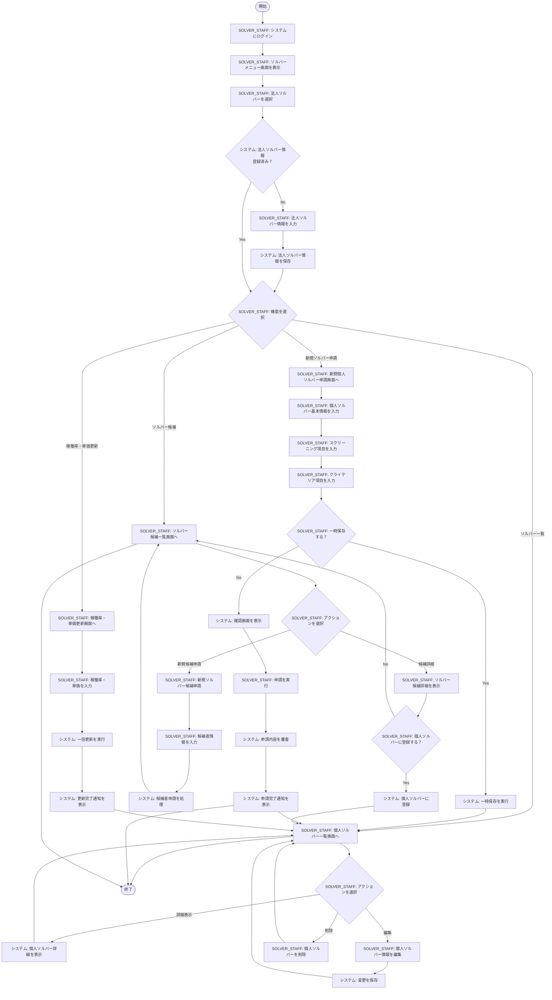

# 人材要件機能フローチャート

## 📋 概要
人材要件機能（ソルバーソーシング機能）は、法人ソルバーが個人ソルバーの登録・管理を行うシステムです。
法人ソルバーの情報管理から、所属する個人ソルバーの申請・承認・管理まで一貫したワークフローを提供します。

### 対象ユーザー（アクター）
- **APT（管理者）**: 全機能利用可能、システム全体の監視・管理
- **SOLVER_STAFF（法人ソルバー担当者）**: 所属法人の個人ソルバー管理のみ
- **個人ソルバー候補者**: 申請情報の提供対象
- **システム**: 自動処理・通知の実行主体

### 業務上の目的
- 法人ソルバーから個人ソルバーへの人材要件登録申請
- 個人ソルバーの資格・能力審査プロセス
- 人材の稼働状況・単価管理

---

## 🔍 参考資料
- 参照したPDF: 【FY25】ソルバーソーシング機能(対応範囲のみ）.pdf
- 参照したSVG: ER図.drawio.svg、新業務フロー図.drawio.svg
- 関連ソースコード: 
  - /home/sdt_op/projects/util/pg/iret/FO/ssap-partner-portal-fo-frontend/src/pages/solver/menu.vue
  - /home/sdt_op/projects/util/pg/iret/FO/ssap-partner-portal-fo-frontend/src/pages/solver/application.vue
  - /home/sdt_op/projects/util/pg/iret/FO/ssap-partner-portal-fo-frontend/src/lang/ja.json

---

## 📊 フローチャート（プレビュー用）

---

## 📁 draw.ioファイル
- **ファイル名**: `ソルバーソーシング機能フローチャート.drawio`
- **配置場所**: ルートディレクトリ
- draw.ioで開いて編集可能です

---

## 🖥️ 画面別操作詳細

### 1. ソルバーメニュー画面（URL: /solver/menu）
**ソースファイル**: `src/pages/solver/menu.vue`

#### 操作可能な要素:
| ラベル名（表示） | ソース上の名称 | 動作 | 次の遷移先 |
|----------------|--------------|------|-----------|
| 法人ソルバーを選択する | solverCorporationSelector | 法人ソルバー選択 | 各機能へ |
| 法人ソルバー情報詳細 | solverCorporationInfo | 法人情報の確認・編集 | 法人ソルバー詳細 |
| 新規ソルバー申請 | newSolverApplication | 新規個人ソルバー申請 | 申請画面 |
| ソルバー一覧 | solverList | 個人ソルバーの管理 | 個人ソルバー一覧 |
| ソルバー候補 | solverCandidate | 候補者の管理 | ソルバー候補一覧 |
| 稼働率・単価更新 | utilizationRateUpdate | 稼働率・単価の更新 | 更新画面 |

### 2. 新規個人ソルバー申請画面（URL: /solver/application）
**ソースファイル**: `src/pages/solver/application.vue`

#### 入力項目（個人ソルバー基本情報）:
| 項目名（表示） | フィールド名 | 必須/任意 | バリデーション |
|--------------|-------------|----------|--------------|
| 個人ソルバー名 | name | 必須 | 文字数制限 |
| 個人ソルバーかな | nameKana | 必須 | ひらがな |
| 性別 | gender | 必須 | 選択肢 |
| 生年月日 | dateOfBirth | 必須 | 日付形式 |
| 役職 | post | 任意 | 文字数制限 |
| 連絡先メールアドレス | mail | 任意 | メール形式 |
| 電話番号 | phoneNumber | 任意 | 電話番号形式 |
| 個人ソルバー画像 | facePhoto | 任意 | ファイル形式・サイズ |
| 学歴 | education | 任意 | テキスト |
| 職歴 | workHistory | 必須 | テキスト |
| 専門テーマ | specialTheme | 任意 | テキスト |
| 主な実績 | mainAchievements | 任意 | テキスト |
| 英語レベル | englishLevel | 任意 | 選択肢 |
| 東証33業種経験 | tse33Experience | 任意 | 複数選択 |
| 課題マップ50 | issueMap50 | 任意 | 複数選択 |
| 稼働状況 | operatingStatus | 任意 | 選択肢 |

#### スクリーニング項目（8項目）:
| 項目名（表示） | フィールド名 | 入力形式 |
|--------------|-------------|---------|
| Sony Acceleration Platformで新規事業分野における支援実績がある | sapSupportAchievement | 評価（はい/いいえ） + エビデンス |
| 大企業の新規事業分野における支援実績がある | newBizSupportAchievement | 評価（はい/いいえ） + エビデンス |
| 大企業の新規事業において同一クライアントとのリピート実績がある | repeatAchievement | 評価（はい/いいえ） + エビデンス |
| 大企業の新規事業分野において複数の実績がある | newBizAchievements | 評価（はい/いいえ） + エビデンス |
| 大企業など新規事業分野における正社員（リーダー）として自ら立ち上げ経験がある | newBizLeaderExperience | 評価（はい/いいえ） + エビデンス |
| 大企業など新規事業分野における正社員（メンバー）としての経験がある | newBizMemberExperience | 評価（はい/いいえ） + エビデンス |
| 大企業などでリーダーとしての事業化経験があり、さらに黒字化の経験がある | leaderProfitExperience | 評価（はい/いいえ） + エビデンス |
| 大企業などでメンバーとしての事業化経験があり、さらに黒字化の経験がある | memberProfitExperience | 評価（はい/いいえ） + エビデンス |

#### クライテリア項目（8項目）:
| 項目名（表示） | フィールド名 | 入力形式 |
|--------------|-------------|---------|
| 実践的なノウハウ | practicalKnowhow | エビデンス（テキスト） |
| タイムリーな実行力 | timelyExecution | エビデンス（テキスト） |
| 顧客ファースト | customerFirst | エビデンス（テキスト） |
| 高い品質と顧客からの信頼 | qualityTrust | エビデンス（テキスト） |
| 新たな事業機会や成長機会を創出する力 | growthOpportunity | エビデンス（テキスト） |
| 外部連携推進力（バウンダリースパナー） | collaborationAbility | エビデンス（テキスト） |
| ディレクション・ブランドイメージの合致 | brandAlignment | エビデンス（テキスト） |
| 長期的思考（持続可能性、自立性） | longTermVision | エビデンス（テキスト） |

#### 操作ボタン:
| ラベル名（表示） | 動作 | 条件 |
|----------------|------|------|
| 一時保存 | 入力内容の保存 | 任意の段階で実行可能 |
| 確認画面に進む | 確認画面へ遷移 | 必須項目入力済み |
| 申請する | 申請の実行 | 確認画面で実行 |
| キャンセル | 入力取消 | 編集時 |
| ソルバー一覧へ戻る | 一覧画面へ戻る | 任意 |

### 3. 個人ソルバー一覧画面（URL: /solver/list/{solverCorporationId}）
**ソースファイル**: `src/pages/solver/list/_solverCorporationId.vue`

#### 絞り込み条件:
| 項目名（表示） | フィールド名 | 選択肢 |
|--------------|-------------|--------|
| 個人ソルバー名 | name | 自由入力 |
| 性別 | gender | 全て/男性/女性/未設定 |
| 個人ソルバー登録 | certificationStatus | 全て/申請前/申請中/登録済み |
| 稼働状況 | operatingStatus | 全て/未稼働/稼働中/休止中 |

#### 一覧表示項目:
| 項目名（表示） | 表示内容 | 操作 |
|--------------|---------|------|
| 個人ソルバー名 | 名前 | 詳細画面へリンク |
| 性別 | 性別 | 表示のみ |
| 個人ソルバー登録ステータス | 登録状況 | 表示のみ |
| 稼働状況 | 稼働状況 | 表示のみ |
| 稼働率(今月) | 今月の稼働率 | 表示のみ |
| 稼働率(来月) | 来月の稼働率 | 表示のみ |
| 最終更新日時 | 更新日時 | 表示のみ |

### 4. 稼働率・単価更新画面（URL: /solver/utilization-rate）
**ソースファイル**: `src/pages/solver/utilization-rate.vue`

#### 更新対象項目:
| 項目名（表示） | フィールド名 | 入力形式 |
|--------------|-------------|---------|
| 稼働率(今月) | providedOperatingRate | 数値（0-100%） |
| 稼働率(来月) | providedOperatingRateNext | 数値（0-100%） |
| 再来月以降の稼働見込み | operationProspectsMonthAfterNext | 選択肢 |
| 人月単価(下限〜上限) | pricePerPersonMonth | 数値範囲 |
| 時間単価(下限〜上限) | hourlyRate | 数値範囲 |

---

## 🔄 処理フロー詳細（アクター別）

### STEP 1: 法人ソルバー選択・初期設定
**主体**: SOLVER_STAFF（法人ソルバー担当者）
**対象**: システム
**画面**: ソルバーメニュー画面

1. **SOLVER_STAFFがシステムに対して実行するアクション**
   - アクション: 法人ソルバーを選択
   - 場所: 画面上部のセレクトボックス
   - ラベル: 「法人ソルバーを選択する」

2. **システムがSOLVER_STAFFに対して実行するアクション**
   - 法人ソルバー情報が未登録の場合: 初期設定モーダルを表示
   - 法人ソルバー情報が登録済みの場合: メニューアイテムを有効化

3. **SOLVER_STAFFがシステムに対して実行するアクション（未登録時）**
   - モーダル対応: 「法人ソルバー情報を入力してください」
   - 必要な操作: 法人ソルバー情報の入力・保存
   - 制限: 入力完了まで個人ソルバー登録機能は利用不可

### STEP 2: 新規個人ソルバー申請
**主体**: SOLVER_STAFF（法人ソルバー担当者）
**対象**: 個人ソルバー候補者の情報をシステムに登録
**画面**: 新規個人ソルバー申請画面

1. **SOLVER_STAFFがシステムに対して実行するアクション**
   - 基本情報入力: 個人ソルバー名、個人ソルバーかな、性別、生年月日、職歴
   - スクリーニング項目入力: 8項目について「はい/いいえ」の評価 + エビデンス
   - クライテリア項目入力: 8項目についてエビデンス（テキスト）

2. **SOLVER_STAFFがシステムに対して選択するアクション**
   - 一時保存: 入力途中での保存
   - 確認画面遷移: 必須項目入力後の最終確認
   - 申請実行: 確認画面での最終申請

3. **システムがSOLVER_STAFFに対して実行するアクション**
   - バリデーション実行: 必須項目、形式チェック
   - API処理: `POST /solvers`でデータ保存
   - 結果通知: 「申請が完了しました」または エラーメッセージ表示

4. **システムが内部で実行するアクション**
   - ファイルアップロード: プロフィール画像、資料等の保存
   - 申請審査: 入力内容の自動チェック

### STEP 3: ソルバー候補管理
**主体**: SOLVER_STAFF（法人ソルバー担当者）
**対象**: ソルバー候補者をシステム上で管理
**画面**: ソルバー候補一覧画面

1. **SOLVER_STAFFがシステムに対して実行するアクション**
   - 候補者一覧表示要求: 登録済み候補者の確認
   - 新規候補申請: 新しい候補者の情報入力
   - 候補詳細表示要求: 特定候補者の詳細情報確認

2. **SOLVER_STAFFがシステムに対して決定するアクション**
   - 個人ソルバー登録判断: 候補者を個人ソルバーに昇格させるかの決定
   - 確認モーダル対応: 「個人ソルバーへの登録」の最終確認

3. **システムがSOLVER_STAFFに対して実行するアクション**
   - 注意事項表示: 「登録後はソルバー候補一覧からは削除され、個人ソルバー一覧に表示されます」
   - ステータス更新処理: 候補者 → 個人ソルバーへの変更実行
   - API処理: `PATCH /solvers/{solver_id}`

### STEP 4: 稼働率・単価更新
**主体**: SOLVER_STAFF（法人ソルバー担当者）
**対象**: 所属個人ソルバーの稼働情報をシステム上で更新
**画面**: 稼働率・単価更新画面

1. **SOLVER_STAFFがシステムに対して実行するアクション**
   - 更新対象確認: 所属個人ソルバー一覧の表示要求
   - 稼働率入力: 今月・来月の稼働率データ入力
   - 単価入力: 人月単価・時間単価データ入力
   - 一括更新実行: 入力完了後の更新処理実行

2. **システムがSOLVER_STAFFに対して実行するアクション**
   - データ表示: テーブル形式での個人ソルバー情報表示
   - バリデーション: 入力値の妥当性チェック
   - API処理: `PUT /solvers/utilization-rate/{solver_corporation_id}`
   - 結果通知: 「更新が完了しました」またはエラーメッセージ表示

3. **システムが内部で実行するアクション**
   - 一括更新処理: 複数ソルバーの情報を同時更新
   - データ整合性チェック: 更新内容の検証

---

## ⚠️ 注意事項・エラー処理

### よくあるエラーパターン
| エラー種別 | 発生条件 | 表示メッセージ | 対処法 |
|-----------|---------|--------------|--------|
| 必須項目未入力 | 必須項目が空 | 「個人ソルバー登録申請には、全必須項目の入力が必要です」 | 必須項目を入力 |
| ファイルサイズ超過 | 画像ファイルが2MB超過 | 「ファイルサイズが大きすぎます」 | ファイルサイズを縮小 |
| 認証エラー | 権限不足 | 「アクセス権限がありません」 | 適切なロールでログイン |
| 更新競合 | 同時更新が発生 | 「更新が競合した為、処理に失敗しました」 | 再度変更を入力 |
| データ不存在 | 対象データが存在しない | 「はデータが存在しないため、更新できませんでした」 | 対象データを確認 |

### バリデーション規則
| 項目 | 規則 | エラーメッセージ |
|-----|------|--------------|
| 個人ソルバー名 | 必須、文字数制限 | 「個人ソルバー名は必須です」 |
| 個人ソルバーかな | 必須、ひらがな | 「ひらがなで入力してください」 |
| メールアドレス | メール形式 | 「正しいメールアドレスを入力してください」 |
| 電話番号 | 電話番号形式 | 「正しい電話番号を入力してください」 |
| 画像ファイル | ファイル形式・サイズ | 「jpg, png形式で2MB以下のファイルを選択してください」 |

---

## 👥 ロール別の違い
| ロール | 利用可能機能 | 制限事項 |
|--------|------------|---------|
| APT | 全機能利用可能 | なし |
| SOLVER_STAFF | 法人ソルバー機能のみ | 所属法人のデータのみ操作可能 |

---

## 📝 補足情報

### 新人向けの説明
1. **ソルバーソーシング機能とは**
   - 法人ソルバーの情報管理システム
   - 個人ソルバーの申請・審査プロセス
   - 人材の稼働状況・単価管理

2. **申請プロセスの流れ**
   - 法人ソルバー情報の登録（初回のみ）
   - 個人ソルバー候補の申請
   - スクリーニング・クライテリア評価
   - 個人ソルバーへの登録

3. **重要なポイント**
   - 必須項目の入力が完了するまで申請不可
   - 一時保存機能により段階的な入力が可能
   - 候補者から個人ソルバーへの昇格は一方向

### 業務上の注意点
1. **データの整合性**
   - 法人ソルバー情報の初期設定は必須
   - 個人ソルバーの稼働率・単価は定期更新が必要

2. **権限管理**
   - SOLVER_STAFFは所属法人のデータのみ操作可能
   - APTは全データにアクセス可能

3. **申請フロー**
   - 候補者→個人ソルバーの変更は取り消し不可
   - 申請後の修正は一覧画面から再編集