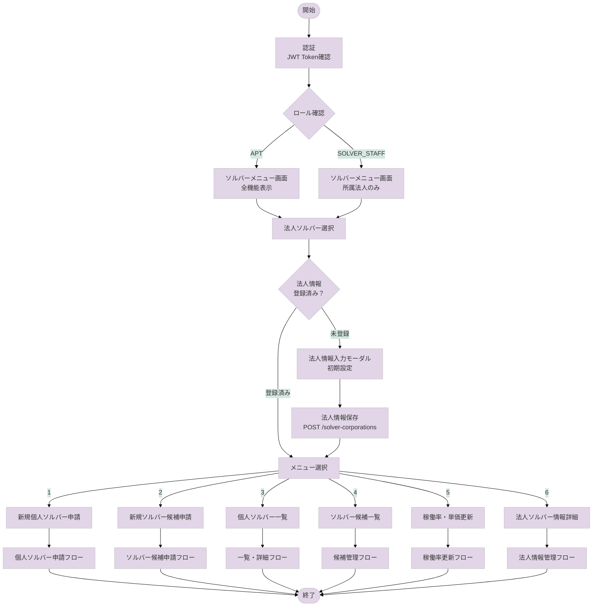

# ソルバーソーシング機能フローチャート（FY25対応版）

## 📋 概要
ソルバーソーシング機能（人材要件機能）は、法人ソルバーが個人ソルバーの登録・管理を行うシステムです。
法人ソルバーの情報管理から、所属する個人ソルバーの申請・承認・管理まで一貫したワークフローを提供します。

### 対象ユーザー（アクター）
- **APT（管理者）**: 全機能利用可能、システム全体の監視・管理
- **SOLVER_STAFF（法人ソルバー担当者）**: 所属法人の個人ソルバー管理のみ
- **個人ソルバー候補者**: 申請情報の提供対象
- **システム**: 自動処理・通知の実行主体

### 業務上の目的
- 法人ソルバーから個人ソルバーへの人材要件登録申請
- 個人ソルバーの資格・能力審査プロセス
- 人材の稼働状況・単価管理

---

## 🔍 参考資料
- 参照したPDF: 【FY25】ソルバーソーシング機能(対応範囲のみ）.pdf
- 参照したSVG: ER図.drawio.svg、新業務フロー図.drawio.svg
- 関連ソースコード: 
  - `/ssap-partner-portal-fo-frontend/src/pages/solver/` - ソルバー関連画面
  - `/ssap-partner-portal-fo-frontend/src/lang/ja.json` - 日本語ラベル定義
  - `/ssap-partner-portal-fo-backend/app/routers/solver.py` - APIエンドポイント
  - `/ssap-partner-portal-fo-backend/app/schemas/solver.py` - API仕様
  - `/ssap-partner-portal-fo-backend/app/models/solver.py` - データベースモデル

---

## 📊 メインフローチャート



---

## 🔄 A. 個人ソルバー申請フロー

```mermaid
%%{init: {'theme':'base', 'themeVariables': {'primaryColor':'#e1d5e7'}}}%%
flowchart TD
    Start([申請開始]) --> AppScreen[申請画面表示<br/>URL: /solver/application]
    AppScreen --> InputBasic[基本情報入力<br/>32項目]
    
    InputBasic --> InputDetail[詳細情報入力]
    InputDetail --> InputScreen[スクリーニング項目<br/>8項目（はい/いいえ + エビデンス）]
    InputScreen --> InputCriteria[クライテリア項目<br/>8項目（エビデンス）]
    
    InputCriteria --> SaveOption{保存方法選択}
    SaveOption -->|一時保存| TempSave[一時保存処理<br/>registration_status="temporary_saving"]
    SaveOption -->|確認画面へ| Validate[バリデーション実行]
    
    TempSave --> SaveAPI[POST /solvers<br/>mode="create_solver"]
    SaveAPI --> TempSuccess[一時保存完了]
    TempSuccess --> End([終了])
    
    Validate --> CheckValid{バリデーション<br/>成功？}
    CheckValid -->|NG| ShowError[エラー表示<br/>必須項目確認]
    ShowError --> InputBasic
    
    CheckValid -->|OK| Confirm[確認画面表示]
    Confirm --> Submit[申請実行]
    Submit --> PostAPI[POST /solvers<br/>mode="create_solver"<br/>registration_status="saved"]
    
    PostAPI --> CheckPost{API処理<br/>成功？}
    CheckPost -->|成功| Success[申請完了<br/>Salesforce連携]
    CheckPost -->|失敗| APIError[エラー処理]
    
    Success --> End
    APIError --> End
```

---

## 🔄 B. ソルバー候補申請フロー

```mermaid
%%{init: {'theme':'base', 'themeVariables': {'primaryColor':'#e1d5e7'}}}%%
flowchart TD
    Start([候補申請開始]) --> CandScreen[候補申請画面<br/>URL: /solver/candidate/application]
    CandScreen --> MultiInput[複数人同時入力<br/>基本情報のみ]
    
    MultiInput --> AddMore{追加登録？}
    AddMore -->|はい| AddPerson[人数追加<br/>フォーム複製]
    AddMore -->|いいえ| ValidateCand[バリデーション実行]
    
    AddPerson --> MultiInput
    
    ValidateCand --> CheckCand{検証OK？}
    CheckCand -->|NG| CandError[エラー表示]
    CheckCand -->|OK| SubmitCand[一括申請]
    
    CandError --> MultiInput
    
    SubmitCand --> PostCand[POST /solvers<br/>mode="create_candidate"<br/>複数人データ送信]
    PostCand --> CandSuccess[候補登録完了]
    CandSuccess --> End([終了])
```

---

## 🔄 C. ソルバー候補管理フロー

```mermaid
%%{init: {'theme':'base', 'themeVariables': {'primaryColor':'#e1d5e7'}}}%%
flowchart TD
    Start([候補管理開始]) --> CandList[候補一覧画面<br/>URL: /solver/candidate/list/{corporationId}]
    CandList --> SelectCand[候補者選択]
    SelectCand --> CandDetail[候補詳細画面<br/>URL: /solver/candidate/{solverId}]
    
    CandDetail --> Action{アクション選択}
    Action -->|編集| EditCand[候補情報編集]
    Action -->|認定| CertifyStart[個人ソルバー認定開始]
    Action -->|削除| DeleteCand[候補削除]
    
    EditCand --> UpdateCand[PUT /solvers/{solver_id}]
    UpdateCand --> CandList
    
    DeleteCand --> ConfirmDel{削除確認}
    ConfirmDel -->|はい| DelAPI[DELETE /solvers/{solver_id}]
    ConfirmDel -->|いいえ| CandDetail
    DelAPI --> CandList
    
    CertifyStart --> CertScreen[認定画面<br/>URL: /solver/candidate/certification/{solverId}]
    CertScreen --> FillDetails[詳細情報入力<br/>32項目すべて]
    FillDetails --> CertConfirm[認定確認]
    CertConfirm --> PatchAPI[PATCH /solvers/{solver_id}<br/>is_solver=true]
    PatchAPI --> CertSuccess[認定完了<br/>個人ソルバーへ移行]
    CertSuccess --> End([終了])
```

---

## 🔄 D. 稼働率・単価更新フロー

```mermaid
%%{init: {'theme':'base', 'themeVariables': {'primaryColor':'#e1d5e7'}}}%%
flowchart TD
    Start([更新開始]) --> RateScreen[稼働率更新画面<br/>URL: /solver/utilization-rate/{corporationId}]
    RateScreen --> LoadSolvers[所属ソルバー一覧取得<br/>GET /solvers]
    
    LoadSolvers --> DisplayTable[テーブル表示<br/>一括編集可能]
    DisplayTable --> EditRates[稼働率・単価編集]
    
    EditRates --> ValidateRates{入力検証}
    ValidateRates -->|NG| RateError[エラー表示<br/>・数値範囲<br/>・上限≥下限]
    ValidateRates -->|OK| SubmitRates[一括更新実行]
    
    RateError --> EditRates
    
    SubmitRates --> PutRate[PUT /solvers/utilization-rate/{corporationId}]
    PutRate --> CheckLock{楽観ロック<br/>チェック}
    
    CheckLock -->|競合あり| Conflict[更新競合エラー<br/>HTTPステータス: 409]
    CheckLock -->|OK| UpdateSuccess[更新成功]
    
    Conflict --> Reload[最新データ再取得]
    Reload --> DisplayTable
    
    UpdateSuccess --> End([終了])
```

---

## 🖥️ 画面別操作詳細

### 1. ソルバーメニュー画面（URL: /solver/menu）
**ソースファイル**: `src/pages/solver/menu.vue`

#### 操作可能な要素:
| ラベル名（表示） | ソース上の名称 | 動作 | 次の遷移先 |
|----------------|--------------|------|-----------|
| 法人ソルバーを選択する | solverCorporationSelector | 法人ソルバー選択 | 各機能へ |
| 新規個人ソルバー申請 | newSolverApplication | 新規個人ソルバー申請 | /solver/application |
| 新規ソルバー候補申請 | newCandidateApplication | 新規候補申請 | /solver/candidate/application |
| 個人ソルバー一覧 | solverList | 個人ソルバーの管理 | /solver/list/{corporationId} |
| ソルバー候補一覧 | candidateList | 候補者の管理 | /solver/candidate/list/{corporationId} |
| 個人ソルバー稼働率・単価更新 | utilizationRateUpdate | 稼働率・単価の更新 | /solver/utilization-rate/{corporationId} |
| 法人ソルバー情報詳細 | corporationDetail | 法人情報の確認・編集 | /solver/corporation/{corporationId} |

### 2. 新規個人ソルバー申請画面（URL: /solver/application）
**ソースファイル**: `src/pages/solver/application.vue`

#### 入力項目（個人ソルバー基本情報）:
| 項目名（表示） | フィールド名 | 必須/任意 | バリデーション |
|--------------|-------------|----------|--------------|
| 個人ソルバー名 | name | 必須 | 文字数制限 |
| 個人ソルバーかな | name_kana | 必須 | ひらがな |
| 性別 | sex | 必須 | 選択肢 |
| 生年月日 | birth_day | 必須 | 日付形式 |
| 役職 | title | 任意 | 文字数制限 |
| 連絡先メールアドレス | email | 任意 | メール形式 |
| 電話番号 | phone | 任意 | 電話番号形式 |
| 個人ソルバー画像 | face_photo | 任意 | ファイル形式・サイズ |
| 学歴 | academic_background | 任意 | テキスト |
| 職歴 | work_history | 必須 | テキスト |
| 専門テーマ | specialized_themes | 任意 | テキスト |
| 主な実績 | main_achievements | 任意 | テキスト |
| 英語レベル | english_level | 任意 | 選択肢 |
| 東証33業種経験 | tsi_areas | 任意 | 複数選択 |
| 課題マップ50 | issue_map50 | 任意 | 複数選択 |
| 稼働状況 | operating_status | 任意 | 選択肢 |

#### スクリーニング項目（8項目）:
| 項目名（表示） | フィールド名 | 入力形式 |
|--------------|-------------|---------|
| Sony Acceleration Platformで新規事業分野における支援実績がある | screening_1 | 評価（はい/いいえ） + エビデンス |
| 大企業の新規事業分野における支援実績がある | screening_2 | 評価（はい/いいえ） + エビデンス |
| 大企業の新規事業において同一クライアントとのリピート実績がある | screening_3 | 評価（はい/いいえ） + エビデンス |
| 大企業の新規事業分野において複数の実績がある | screening_4 | 評価（はい/いいえ） + エビデンス |
| 大企業など新規事業分野における正社員（リーダー）として自ら立ち上げ経験がある | screening_5 | 評価（はい/いいえ） + エビデンス |
| 大企業など新規事業分野における正社員（メンバー）としての経験がある | screening_6 | 評価（はい/いいえ） + エビデンス |
| 大企業などでリーダーとしての事業化経験があり、さらに黒字化の経験がある | screening_7 | 評価（はい/いいえ） + エビデンス |
| 大企業などでメンバーとしての事業化経験があり、さらに黒字化の経験がある | screening_8 | 評価（はい/いいえ） + エビデンス |

#### クライテリア項目（8項目）:
| 項目名（表示） | フィールド名 | 入力形式 |
|--------------|-------------|---------|
| 実践的なノウハウ | criteria_1 | エビデンス（テキスト） |
| タイムリーな実行力 | criteria_2 | エビデンス（テキスト） |
| 顧客ファースト | criteria_3 | エビデンス（テキスト） |
| 高い品質と顧客からの信頼 | criteria_4 | エビデンス（テキスト） |
| 新たな事業機会や成長機会を創出する力 | criteria_5 | エビデンス（テキスト） |
| 外部連携推進力（バウンダリースパナー） | criteria_6 | エビデンス（テキスト） |
| ディレクション・ブランドイメージの合致 | criteria_7 | エビデンス（テキスト） |
| 長期的思考（持続可能性、自立性） | criteria_8 | エビデンス（テキスト） |

---

## 🔄 処理フロー詳細

### STEP 1: 法人ソルバー選択・初期設定
**実行画面**: ソルバーメニュー画面
**トリガー**: 法人ソルバー選択

1. **画面操作**
   - 場所: 画面上部のセレクトボックス
   - 操作: プルダウンから法人を選択
   - ラベル: 「法人ソルバーを選択する」

2. **内部処理**
   - API呼び出し: `GET /solver-corporations/{solver_corporation_id}`
   - データチェック: 法人情報の登録状況確認

3. **結果**
   - 成功時: メニュー項目を有効化
   - 未登録時: 初期設定モーダル表示

### STEP 2: 新規個人ソルバー申請
**実行画面**: 新規個人ソルバー申請画面
**トリガー**: 「新規個人ソルバー申請」ボタンクリック

1. **画面操作**
   - 基本情報入力: 32項目の詳細情報
   - スクリーニング評価: 8項目の評価とエビデンス
   - クライテリア評価: 8項目のエビデンス

2. **内部処理**
   - リアルタイムバリデーション: 入力値の形式チェック
   - ファイルアップロード: S3への画像保存
   - API呼び出し: `POST /solvers`

3. **結果**
   - 成功時: 申請完了メッセージ表示
   - エラー時: 詳細なエラーメッセージ表示

### STEP 3: ソルバー候補管理
**実行画面**: ソルバー候補一覧画面
**トリガー**: 「ソルバー候補一覧」メニュー選択

1. **画面操作**
   - 候補者一覧の確認
   - 候補者の詳細確認
   - 個人ソルバーへの認定操作

2. **内部処理**
   - API呼び出し: `GET /solvers?solver_type=solver_candidate`
   - 認定処理: `PATCH /solvers/{solver_id}`

3. **結果**
   - 成功時: 候補者→個人ソルバーへ移行
   - エラー時: エラーメッセージ表示

### STEP 4: 稼働率・単価更新
**実行画面**: 稼働率・単価更新画面
**トリガー**: 「個人ソルバー稼働率・単価更新」ボタンクリック

1. **画面操作**
   - テーブル形式での一括編集
   - 稼働率（今月・来月）の入力
   - 単価（人月・時間）の入力

2. **内部処理**
   - バリデーション: 数値範囲、上限≥下限チェック
   - API呼び出し: `PUT /solvers/utilization-rate/{solver_corporation_id}`
   - 楽観ロック制御: Version属性による競合チェック

3. **結果**
   - 成功時: 「更新が完了しました」メッセージ
   - 競合時: 最新データ再取得を促すメッセージ

---

## ⚠️ 注意事項・エラー処理

### よくあるエラーパターン
| エラー種別 | 発生条件 | 表示メッセージ | 対処法 |
|-----------|---------|--------------|--------|
| バリデーションエラー | 必須項目未入力 | 「{項目名} is required.」 | 必須項目を入力 |
| 権限エラー | 他法人データアクセス | 「アクセス権限がありません」 | 所属法人のデータのみ操作 |
| 更新競合 | 同時更新 | 「更新が競合した為、処理に失敗しました」 | 最新データで再入力 |
| ファイルエラー | サイズ超過 | 「ファイルサイズが大きすぎます（2MB以下）」 | ファイルサイズを縮小 |

---

## 👥 ロール別の違い
| ロール | 利用可能機能 | 制限事項 |
|--------|------------|---------|
| APT | 全機能利用可能 | なし |
| SOLVER_STAFF | 所属法人のソルバー管理のみ | corporate_idが一致するデータのみ操作可能 |

---

## 📝 補足情報

### 新人向けの説明
1. **ソルバーソーシング機能とは**
   - 法人ソルバーが個人ソルバーの登録・管理を行うシステム
   - 人材の能力評価（スクリーニング・クライテリア）を含む総合的な人材管理
   - 稼働状況・単価の動的管理機能

2. **申請プロセスの段階性**
   - **ソルバー候補**: 基本情報のみで簡易登録
   - **個人ソルバー**: 32項目の詳細情報で正式登録
   - **一時保存**: 申請途中での保存が可能

3. **重要なポイント**
   - スクリーニング項目は「はい」の場合エビデンス必須
   - 楽観ロック制御により同時更新を防止
   - 候補者→個人ソルバーの昇格は不可逆

### 業務上の注意点
1. **法人ソルバー情報は必須**
   - すべての操作の前提条件
   - 初回は必ず設定が必要

2. **権限管理の徹底**
   - APT: 全法人のデータアクセス可能
   - SOLVER_STAFF: 所属法人のみ

3. **月次更新の重要性**
   - 稼働率・単価は定期的な更新が必要
   - 一括更新機能を活用