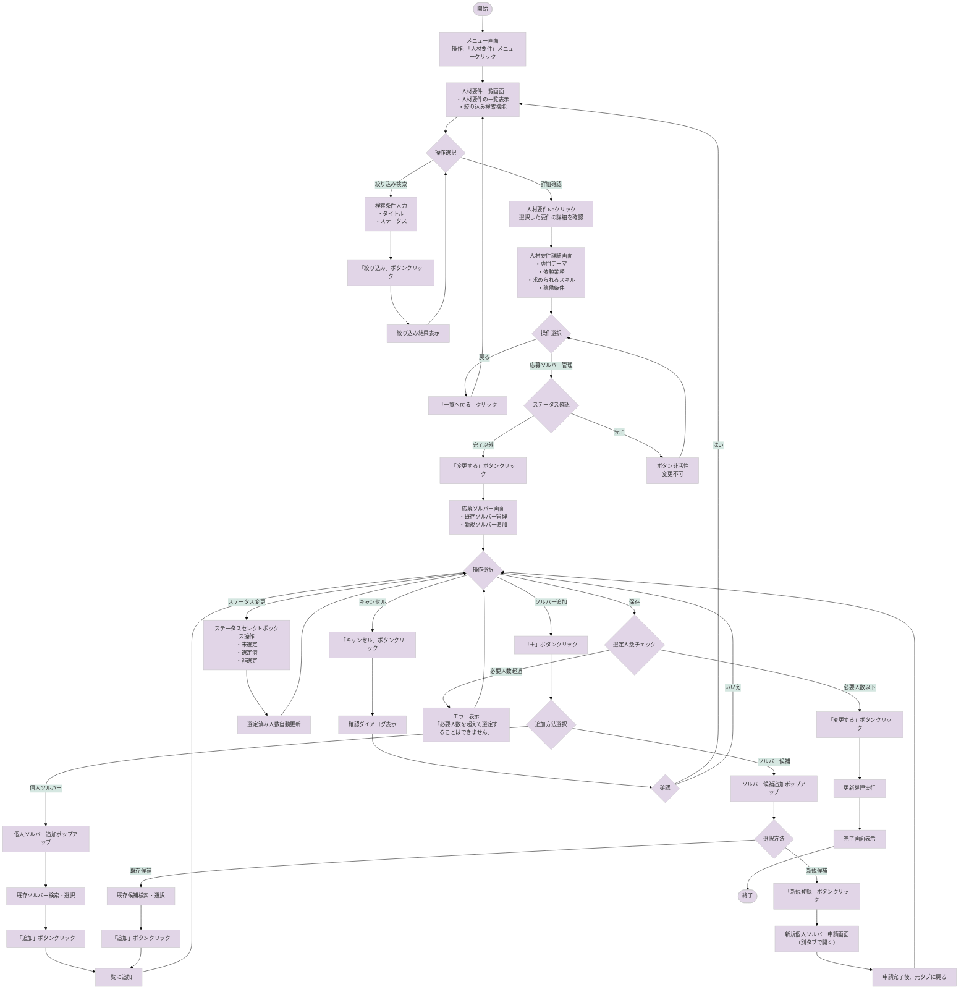

# 人材要件業務フローチャート

## 📋 概要
人材要件管理システムにおける、人材要件の登録から応募ソルバー管理までの業務フローを記載します。
このシステムは、Sony Acceleration Platform（SAP）における案件に対する人材要件と、その要件に応募するソルバー（支援者）を管理するためのものです。

---

## 🔍 参考資料
- 参照したPDF: 【FY25】ソルバーソーシング機能(対応範囲のみ）.pdf
- 参照した設計書: 人材要件一覧画面_設計書.md、人材要件詳細画面_設計書.md、応募ソルバー画面_設計書.md
- 関連ソースコード: ssap-partner-portal-fo-frontend/src/lang/ja.json（ラベル定義）

---

## 📊 フローチャート

---

## 🖥️ 画面別操作詳細

### 1. 人材要件一覧画面（URL: /project-requirements）
**ソースファイル**: `src/pages/project-requirements/list.vue`（推定）

#### 操作可能な要素:
| ラベル名（表示） | ソース上の名称 | 動作 | 次の遷移先 |
|----------------|--------------|------|-----------|
| 人材要件No | requirement_no | クリックで詳細表示 | 人材要件詳細画面 |
| 絞り込み | filter_button | 検索条件で絞り込み | 同画面（再表示） |
| リセット | reset_button | 検索条件クリア | 同画面（初期表示） |

#### 入力項目:
| 項目名（表示） | フィールド名 | 必須/任意 | バリデーション |
|--------------|-------------|----------|--------------|
| 絞り込み用タイトル | filter_title | 任意 | 最大文字数制限 |
| 絞り込み用ステータス | filter_status | 任意 | セレクトボックス |

### 2. 人材要件詳細画面（URL: /project-requirements/{requirementId}）
**ソースファイル**: `src/pages/project-requirements/_requirementId.vue`（推定）

#### 操作可能な要素:
| ラベル名（表示） | ソース上の名称 | 動作 | 次の遷移先 |
|----------------|--------------|------|-----------|
| 一覧へ戻る | back_to_list | 一覧画面へ遷移 | 人材要件一覧画面 |
| 変更する | edit_button | 応募ソルバー管理へ | 応募ソルバー画面 |
| 案件URL | project_url | 外部リンク | 案件詳細（外部） |

### 3. 応募ソルバー画面（URL: /project-requirements/{requirementId}/applied-solvers）
**ソースファイル**: `src/pages/project-requirements/applied-solvers.vue`（推定）

#### 操作可能な要素:
| ラベル名（表示） | ソース上の名称 | 動作 | 次の遷移先 |
|----------------|--------------|------|-----------|
| ＋（個人ソルバー） | add_solver | ポップアップ表示 | - |
| ＋（ソルバー候補） | add_candidate | ポップアップ表示 | - |
| 編集 | edit_solver | 詳細編集（別タブ） | ソルバー詳細 |
| 詳細 | view_candidate | 詳細表示（別タブ） | 候補者詳細 |
| 変更する | save_changes | 更新処理実行 | 完了画面 |
| キャンセル | cancel | 変更破棄 | 確認ダイアログ |

---

## 🔄 処理フロー詳細

### STEP 1: 人材要件一覧の表示
**実行画面**: 人材要件一覧画面
**トリガー**: メニューから「人材要件」選択

1. **画面操作**
   - 場所: グローバルメニュー
   - 操作: 「人材要件」メニュークリック
   - ラベル: 「人材要件」

2. **内部処理**
   - API呼び出し: `GET /api/project-requirements`
   - データ処理: 一覧データの取得・整形

3. **結果**
   - 成功時: 人材要件一覧を表示
   - エラー時: エラーメッセージを画面上部に表示

### STEP 2: 人材要件の絞り込み検索
**実行画面**: 人材要件一覧画面
**トリガー**: 「絞り込み」ボタンクリック

1. **画面操作**
   - 場所: 画面上部の検索エリア
   - 操作: 検索条件入力後、「絞り込み」ボタンクリック
   - ラベル: 「絞り込み」

2. **内部処理**
   - API呼び出し: `GET /api/project-requirements?title={title}&status={status}`
   - データ処理: 検索条件に合致するデータの取得

3. **結果**
   - 成功時: 絞り込み結果を表示
   - データなし: 「表示する情報がありません」メッセージ

### STEP 3: 応募ソルバーの管理
**実行画面**: 応募ソルバー画面
**トリガー**: 人材要件詳細画面から「変更する」ボタンクリック

1. **画面操作**
   - 場所: 人材要件詳細画面下部
   - 操作: 「変更する」ボタンクリック
   - ラベル: 「変更する」

2. **内部処理**
   - API呼び出し: `GET /api/project-requirements/{requirementId}/applied-solvers`
   - データ処理: 既存の応募ソルバー情報取得

3. **結果**
   - 成功時: 応募ソルバー画面を表示
   - エラー時: エラーメッセージ表示

### STEP 4: ソルバーの追加
**実行画面**: 応募ソルバー画面
**トリガー**: 「＋」ボタンクリック

1. **画面操作**
   - 場所: 各セクションヘッダー右側
   - 操作: 「＋」ボタンクリック
   - ラベル: 「＋」

2. **内部処理**
   - ポップアップ表示
   - 検索API呼び出し: `GET /api/solvers` または `GET /api/solver-candidates`

3. **結果**
   - 成功時: 選択したソルバーを一覧に追加
   - 重複時: 「既に追加されています」エラー

---

## ⚠️ 注意事項・エラー処理

### よくあるエラーパターン
| エラー種別 | 発生条件 | 表示メッセージ | 対処法 |
|-----------|---------|--------------|--------|
| 必要人数超過 | 選定済み人数が必要人数を超える | 必要人数を超えて選定することはできません | 選定済みを減らす |
| ステータス未選択 | 選定済みでステータス未選択 | ステータスを選択してください | ステータス選択 |
| 権限エラー | アクセス権限なし | このページを参照する権限がありません | 管理者に連絡 |
| 重複登録 | 既に登録済みのソルバー追加 | 既に追加されています | 別のソルバー選択 |

---

## 👥 ロール別の違い
| ロール | 利用可能機能 | 制限事項 |
|--------|------------|---------|
| APT | 全機能利用可能 | なし |
| 法人ソルバー | 自社関連の要件のみ参照・管理可能 | 他社の要件は表示されない |
| 個人ソルバー | アクセス不可 | 画面自体にアクセス不可 |

---

## 📝 補足情報
- **ソーシング期限**: 人材要件ごとに設定される期限。この日までに必要人数のソルバーを選定する必要がある
- **ステータスの意味**:
  - 未選定: まだ選定されていない状態
  - 選定済: この要件に選定された状態（必要人数までカウント）
  - 非選定: 選定から外れた状態
- **必要人数と選定済み人数**: 選定済みステータスのソルバー数が自動カウントされ、必要人数を超えることはできない
- **別タブでの操作**: 編集や新規登録は別タブで開くため、元の画面のデータは保持される