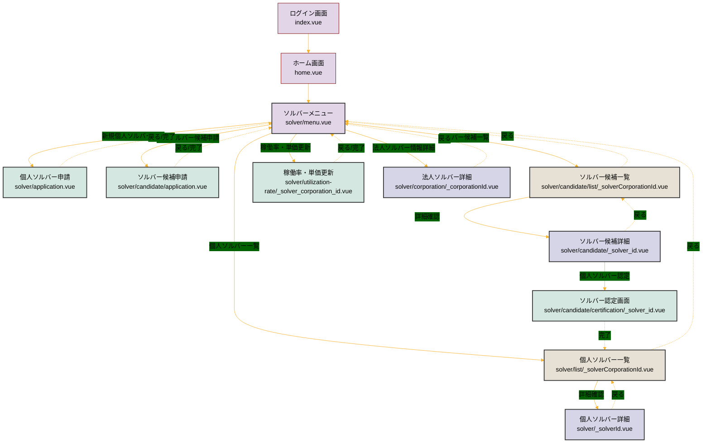
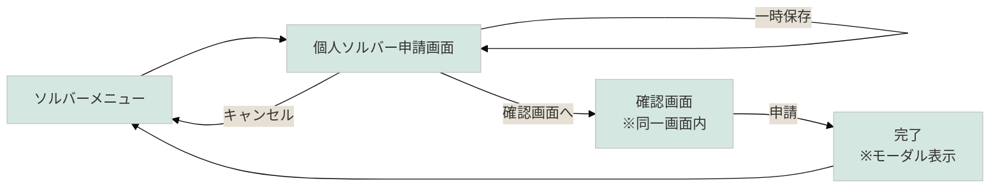
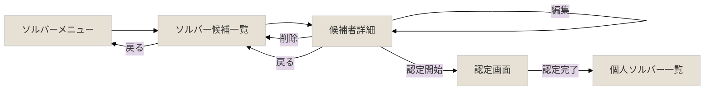
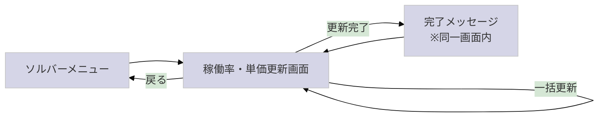
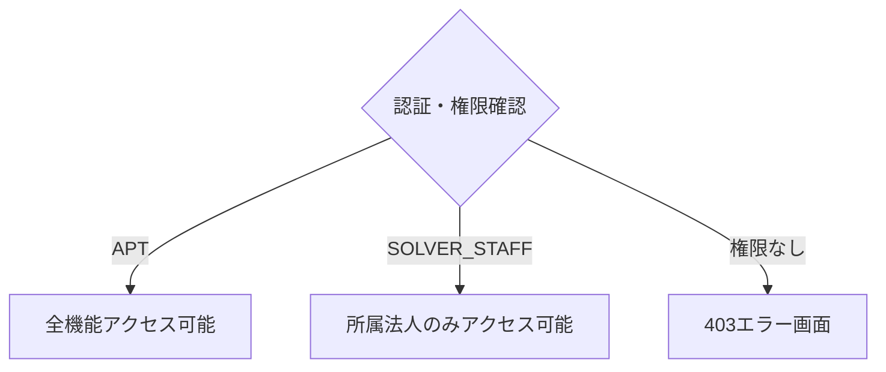
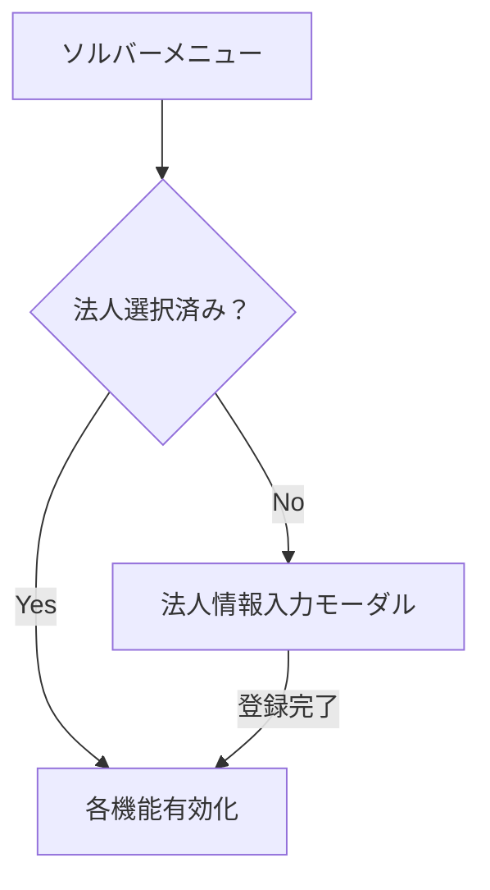

# 人材要件機能 画面遷移図

## 📋 概要
このドキュメントは、人材要件機能（ソルバーソーシング機能）の画面遷移を視覚的に表現した画面遷移図です。
各画面間の遷移関係と主要な操作フローを明確にし、システムの全体像を把握できるようにしています。

---

## 🗺️ 全体画面遷移図

---

## 🔄 主要機能別画面遷移

### 1. 個人ソルバー申請フロー

### 2. ソルバー候補管理フロー

### 3. 稼働率・単価更新フロー

---

## 📱 画面詳細情報

### メニュー画面
- **パス**: `/solver/menu`
- **ファイル**: `solver/menu.vue`
- **主要機能**: 
  - 法人ソルバー選択（必須）
  - 各機能へのナビゲーション

### 申請系画面
| 画面名 | パス | 特徴 |
|--------|------|------|
| 個人ソルバー申請 | `/solver/application` | 32項目入力、一時保存可能 |
| ソルバー候補申請 | `/solver/candidate/application` | 基本情報のみ、複数人同時申請可能 |

### 一覧系画面
| 画面名 | パス | 特徴 |
|--------|------|------|
| 個人ソルバー一覧 | `/solver/list/{corporationId}` | 絞り込み検索、ページング |
| ソルバー候補一覧 | `/solver/candidate/list/{corporationId}` | 候補者管理、認定操作 |

### 詳細・編集系画面
| 画面名 | パス | 特徴 |
|--------|------|------|
| 個人ソルバー詳細 | `/solver/{solverId}` | 閲覧・編集・削除 |
| ソルバー候補詳細 | `/solver/candidate/{solver_id}` | 閲覧・編集・認定・削除 |
| 認定画面 | `/solver/candidate/certification/{solver_id}` | 候補→個人ソルバー昇格 |
| 法人ソルバー詳細 | `/solver/corporation/{corporationId}` | 法人情報管理 |

### 更新系画面
| 画面名 | パス | 特徴 |
|--------|------|------|
| 稼働率・単価更新 | `/solver/utilization-rate/{corporationId}` | 一括更新、楽観ロック制御 |

---

## 🚦 画面遷移の制御

### 権限による制御

### 法人ソルバー選択による制御

---

## 💡 画面遷移のポイント

### 1. 状態管理
- **Vuex Store**を使用した状態管理
- 選択された法人ソルバーIDは`solver-corporation`ストアで管理
- エラー情報は`error-bar`ストアで一元管理

### 2. 遷移制御
- **middleware/roleCheck.ts**による権限チェック
- 法人未選択時は機能ボタンを無効化
- 認定完了後は自動的に個人ソルバー一覧へ遷移

### 3. ユーザビリティ
- パンくずリストによる現在位置の明示
- 「戻る」ボタンの統一的な配置
- 処理中のローディング表示

### 4. エラーハンドリング
- 403: 権限エラー → 専用エラー画面
- 409: 更新競合 → 再読み込みを促すメッセージ
- 500: サーバーエラー → エラーバーで通知

---

## 🔗 関連ドキュメント
- [ソルバーソーシング機能フローチャート.md](./ソルバーソーシング機能フローチャート.md) - 処理フローの詳細
- [人材要件機能フローチャート.md](./人材要件機能フローチャート.md) - 業務フローを含む完全版