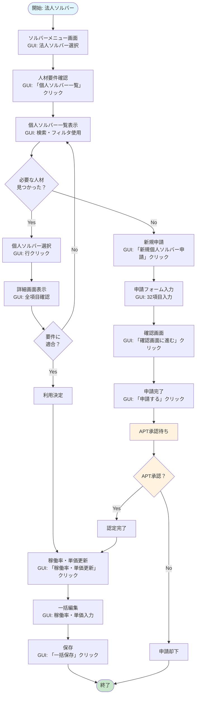

# 人材要件機能フローチャート

## 📋 概要
法人ソルバーが人材要件を確認して、個人ソルバーを申請・管理するシンプルなフローです。

---

## 📊 フローチャート

## 🔄 時系列の操作フロー

### 1. 法人ソルバー：人材要件確認
**画面**: ソルバーメニュー → 個人ソルバー一覧
**GUI操作**: 「個人ソルバー一覧」ボタンクリック

### 2. 法人ソルバー：既存人材検索
**画面**: 個人ソルバー一覧
**GUI操作**: 検索フィルタ（名前・性別・稼働状況）で絞り込み

### 3-A. 適合人材あり：選択・確認
**画面**: 個人ソルバー詳細
**GUI操作**: 対象行クリック → 詳細確認

### 3-B. 適合人材なし：新規申請
**画面**: 新規個人ソルバー申請
**GUI操作**: 「新規個人ソルバー申請」ボタンクリック → 32項目入力 → 「確認画面に進む」 → 「申請する」

### 4. APT：申請審査・承認
**画面**: 管理画面（APT専用）
**GUI操作**: 申請内容確認 → 承認/却下処理

### 5. 法人ソルバー：稼働率・単価更新
**画面**: 稼働率・単価更新
**GUI操作**: 「稼働率・単価更新」ボタンクリック → 一括編集 → 「一括保存」

---

## 📝 主要な登場人物と役割

| 誰が | 何をする | GUI操作 |
|------|---------|---------|
| 法人ソルバー | 人材要件確認 | 「個人ソルバー一覧」クリック |
| 法人ソルバー | 既存人材検索 | 検索・フィルタ使用 |
| 法人ソルバー | 新規申請 | 「新規個人ソルバー申請」→入力→「申請する」 |
| APT | 申請承認 | 管理画面で承認処理 |
| 法人ソルバー | 稼働率更新 | 「稼働率・単価更新」→編集→「一括保存」 |