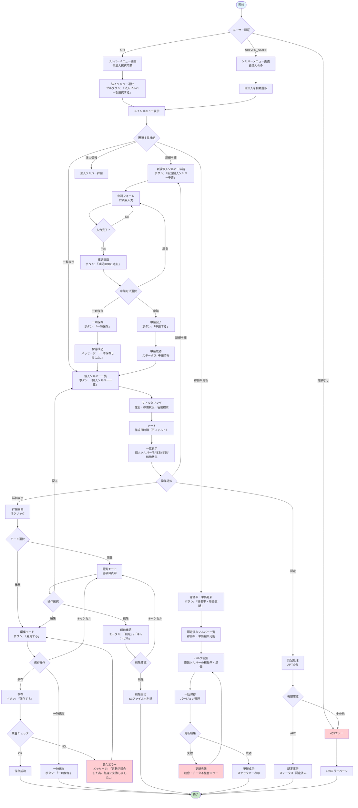

# 人材要件機能フローチャート

## 📋 概要
人材要件機能は、ソルバー（個人の専門家）の登録申請から認定、稼働管理まで一貫して管理するシステムです。法人ソルバーが所属する個人ソルバーを申請・管理し、APT（アライアンス担当）が認定・承認を行う業務フローを実現しています。

**対象ユーザー**
- APT（アライアンス担当）: 全法人の管理・認定権限
- SOLVER_STAFF（法人ソルバー）: 自法人のソルバー管理

---

## 🔍 参考資料
- 参照したSVG: 新業務フロー図.drawio.svg、ER図.drawio.svg
- 関連ソースコード: 
  - バックエンド: `app/models/solver.py`, `app/routers/solver.py`
  - フロントエンド: `src/pages/solver/`, `src/components/solver/`
- 多言語ファイル: `src/lang/ja.json`

---

## 📊 フローチャート

---

## 🖥️ 画面別操作詳細

### 1. ソルバーメニュー画面（URL: /solver/menu）
**ソースファイル**: `src/pages/solver/menu.vue`

#### 操作可能な要素:
| ラベル名（表示） | ソース上の名称 | 動作 | 次の遷移先 |
|----------------|--------------|------|-----------|
| 法人ソルバーを選択する | corporation_selector | プルダウン選択 | メニュー更新 |
| 法人ソルバー情報詳細 | corp_detail_btn | 詳細画面表示 | /solver/corporation/{id} |
| 個人ソルバー一覧 | solver_list_btn | 一覧画面表示 | /solver/list/{corporationId} |
| 新規個人ソルバー申請 | new_application_btn | 申請画面表示 | /solver/application |
| 稼働率・単価更新 | util_update_btn | 更新画面表示 | /solver/utilization-rate/{corporationId} |

#### 権限制御:
- **APT**: 全法人選択可能、プルダウン表示
- **SOLVER_STAFF**: 自法人のみアクセス、プルダウン非表示

### 2. 新規個人ソルバー申請画面（URL: /solver/application）
**ソースファイル**: `src/pages/solver/application.vue`

#### 入力項目:
| 項目名（表示） | フィールド名 | 必須/任意 | バリデーション |
|--------------|-------------|----------|--------------|
| 個人ソルバー名 | solver_name | 必須 | 文字数制限 |
| 性別 | gender | 任意 | 選択式 |
| 生年月日 | birth_date | 任意 | 日付形式 |
| メールアドレス | email | 任意 | メール形式 |
| 電話番号 | phone | 任意 | 電話番号形式 |
| 稼働状況 | operating_status | 任意 | 選択式 |
| 個人ソルバー画像 | image_file | 任意 | 2MB以内、jpg/jpeg/png |
| 学歴 | academic_background | 任意 | テキスト |
| 職歴 | work_history | 任意 | テキスト |
| 専門テーマ | specialized_themes | 任意 | テキスト |
| 提供稼働率（今月） | provided_operating_rate_this_month | 任意 | 数値（0-100） |
| 提供稼働率（来月） | provided_operating_rate_next_month | 任意 | 数値（0-100） |
| 人月単価 | price_per_person_month | 任意 | 数値 |
| 時間単価 | hourly_rate | 任意 | 数値 |
| 英語レベル | english_level | 任意 | 選択式 |

#### 操作ボタン:
| ラベル名（表示） | ソース上の名称 | 動作 | 次の遷移先 |
|----------------|--------------|------|-----------|
| 確認画面に進む | confirm_btn | 確認モード表示 | 同画面（確認モード） |
| 入力画面に戻る | back_to_input_btn | 入力モード表示 | 同画面（入力モード） |
| 一時保存 | temp_save_btn | 一時保存実行 | 一覧画面（3秒後） |
| 申請する | submit_btn | 申請完了 | 一覧画面 |

### 3. 個人ソルバー一覧画面（URL: /solver/list/{solverCorporationId}）
**ソースファイル**: `src/pages/solver/list.vue`

#### 絞り込み機能:
| 項目名（表示） | フィールド名 | 選択肢 |
|--------------|-------------|---------|
| 個人ソルバー名 | solver_name_filter | テキスト検索 |
| 性別 | gender_filter | 全て/男性/女性/未設定 |
| 稼働状況 | operating_status_filter | 全て/未稼働/稼働中/休止中 |

#### 表示項目:
- 個人ソルバー名
- 性別
- 年齢（生年月日から自動計算）
- 稼働状況
- 提供稼働率
- 人月単価
- 登録ステータス

#### 操作ボタン:
| ラベル名（表示） | ソース上の名称 | 動作 | 次の遷移先 |
|----------------|--------------|------|-----------|
| 新規個人ソルバー申請 | new_application_btn | 申請画面表示 | /solver/application |
| 稼働率・単価更新 | util_update_btn | 更新画面表示 | /solver/utilization-rate/{corporationId} |

### 4. 個人ソルバー詳細画面（URL: /solver/{solverId}）
**ソースファイル**: `src/pages/solver/_solverId.vue`

#### 閲覧モード操作:
| ラベル名（表示） | ソース上の名称 | 動作 | 次の遷移先 |
|----------------|--------------|------|-----------|
| 変更する | edit_btn | 編集モード切替 | 同画面（編集モード） |
| 一覧へ戻る | back_to_list_btn | 一覧画面表示 | 一覧画面 |
| このソルバーを削除する | delete_btn | 削除確認モーダル | 削除確認モーダル |

#### 編集モード操作:
| ラベル名（表示） | ソース上の名称 | 動作 | 次の遷移先 |
|----------------|--------------|------|-----------|
| 保存する | save_btn | 変更保存 | 同画面（閲覧モード） |
| 一時保存 | temp_save_btn | 一時保存 | 同画面（閲覧モード） |
| キャンセル | cancel_btn | 変更取消 | 同画面（閲覧モード） |

#### 削除確認モーダル:
| ラベル名（表示） | ソース上の名称 | 動作 | 次の遷移先 |
|----------------|--------------|------|-----------|
| 削除 | delete_confirm_btn | 削除実行 | 一覧画面 |
| キャンセル | delete_cancel_btn | モーダル閉じる | 同画面（閲覧モード） |

### 5. 稼働率・単価更新画面（URL: /solver/utilization-rate/{solver_corporation_id}）
**ソースファイル**: `src/pages/solver/utilization-rate.vue`

#### 表示対象:
- 認定済み個人ソルバーのみ
- 稼働率・単価更新日時順（降順）

#### 編集可能項目:
| 項目名（表示） | フィールド名 | バリデーション |
|--------------|-------------|--------------|
| 提供稼働率（今月） | provided_operating_rate_this_month | 数値（0-100） |
| 提供稼働率（来月） | provided_operating_rate_next_month | 数値（0-100） |
| 人月単価 | price_per_person_month | 数値 |
| 時間単価 | hourly_rate | 数値 |

#### 操作ボタン:
| ラベル名（表示） | ソース上の名称 | 動作 | 結果 |
|----------------|--------------|------|------|
| 一括保存 | bulk_save_btn | 全変更を保存 | 成功時: スナックバー表示 |

---

## 🔄 処理フロー詳細

### STEP 1: ログイン・権限確認
**実行画面**: 全画面共通
**トリガー**: 画面アクセス時

1. **認証処理**
   - JWT トークンによる認証
   - ユーザー権限の確認（APT / SOLVER_STAFF）

2. **権限制御**
   - **APT**: 全法人へのアクセス許可
   - **SOLVER_STAFF**: 自法人のみアクセス許可
   - **その他**: 403エラーページへリダイレクト

### STEP 2: 新規個人ソルバー申請
**実行画面**: 新規個人ソルバー申請画面
**トリガー**: 「新規個人ソルバー申請」ボタンクリック

1. **画面操作**
   - 場所: 申請フォーム
   - 操作: 32項目の入力（必須項目: 個人ソルバー名のみ）
   - 特殊項目: 
     - 画像ファイル（2MB以内、jpg/jpeg/png）
     - スクリーニング項目（8項目、はい/いいえ + エビデンス）
     - クライテリア項目（8項目、エビデンス入力）

2. **内部処理**
   - バリデーション: 入力値の形式チェック
   - ファイル処理: S3への画像アップロード
   - API呼び出し: `POST /solvers`

3. **結果**
   - 成功時: 申請完了、一覧画面へリダイレクト
   - 一時保存時: 「一時保存しました。」メッセージ、3秒後リダイレクト
   - エラー時: バリデーションエラー表示

### STEP 3: 個人ソルバー一覧表示・検索
**実行画面**: 個人ソルバー一覧画面
**トリガー**: 「個人ソルバー一覧」ボタンクリック

1. **画面操作**
   - 場所: 一覧画面ヘッダー
   - 操作: フィルタリング（名前/性別/稼働状況）
   - ソート: 作成日時順（デフォルト）、各項目での昇順/降順

2. **内部処理**
   - API呼び出し: `GET /solvers`
   - パラメータ: フィルタ条件、ソート条件、ページネーション
   - 権限フィルタ: SOLVER_STAFF は自法人のみ

3. **結果**
   - 成功時: 一覧データ表示
   - 権限エラー時: 403エラーページ表示

### STEP 4: 個人ソルバー詳細表示・編集
**実行画面**: 個人ソルバー詳細画面
**トリガー**: 一覧の各行クリック

1. **画面操作**
   - 場所: 詳細画面
   - 操作: 「変更する」ボタンクリック → 編集モード切替
   - 編集: 全項目の変更可能

2. **内部処理**
   - API呼び出し: `GET /solvers/{solver_id}` → `PUT /solvers/{solver_id}`
   - 楽観的排他制御: バージョン管理（20秒間隔制限）
   - ファイル処理: S3への画像アップロード/削除

3. **結果**
   - 成功時: 「保存しました。」メッセージ、閲覧モードへ
   - 競合時: 「更新が競合した為、処理に失敗しました。再度、変更を入力してください。」
   - 権限エラー時: 403エラーページ表示

### STEP 5: 稼働率・単価一括更新
**実行画面**: 稼働率・単価更新画面
**トリガー**: 「稼働率・単価更新」ボタンクリック

1. **画面操作**
   - 場所: 更新画面
   - 操作: 認定済みソルバーの稼働率・単価を一括編集
   - 対象: 提供稼働率（今月/来月）、人月単価、時間単価

2. **内部処理**
   - API呼び出し: `PUT /solvers/utilization-rate/{solver_corporation_id}`
   - バージョン管理: 法人ソルバーレベルでの楽観的排他制御
   - 一括更新: 複数ソルバーの同時更新

3. **結果**
   - 成功時: 「更新しました。」スナックバー表示
   - 競合時: 「更新が競合した為、処理に失敗しました。」
   - データ不整合時: 「データが存在しないため、更新できませんでした。」

---

## ⚠️ 注意事項・エラー処理

### よくあるエラーパターン
| エラー種別 | 発生条件 | 表示メッセージ | 対処法 |
|-----------|---------|--------------|--------|
| 権限エラー | 他法人データへのアクセス | 403エラーページ | 管理者に権限確認を依頼 |
| 競合エラー | 同時更新による競合 | 「更新が競合した為、処理に失敗しました。再度、変更を入力してください。」 | 最新データを確認して再入力 |
| バリデーションエラー | 入力値の形式不正 | 各項目でのエラーメッセージ | 正しい形式で再入力 |
| ファイルサイズエラー | 画像ファイルが2MB超過 | 「ファイルサイズが上限を超えています。」 | ファイルサイズを縮小して再アップロード |
| データ不存在エラー | 削除済みデータへのアクセス | 「データが存在しないため、更新できませんでした。」 | 一覧画面で最新状態を確認 |

### 一時保存機能の特徴
- **自動保存**: 編集中のデータを定期的に保存
- **復旧機能**: 「編集中データが存在します。復元しますか？」モーダル表示
- **有効期限**: 一定時間後に自動削除

---

## 👥 ロール別の違い
| ロール | 利用可能機能 | 制限事項 |
|--------|------------|---------|
| APT | 全機能・全法人アクセス | なし |
| SOLVER_STAFF | 自法人のソルバー管理 | 他法人へのアクセス不可、認定権限なし |
| その他 | アクセス不可 | 403エラー |

---

## 📝 補足情報

### 新人向けの説明
- **ソルバー**: 特定分野の専門家（個人）
- **法人ソルバー**: 複数のソルバーを管理する組織
- **認定プロセス**: APTによる専門性・能力の評価承認
- **稼働率**: 月単位での作業可能時間の割合
- **スクリーニング**: 基本的な適性評価（8項目）
- **クライテリア**: 詳細な能力評価（8項目）

### 業務上の注意点
- **楽観的排他制御**: 20秒間隔での更新制限により、短時間での連続更新は不可
- **ファイル管理**: S3への画像保存により、削除時は本体データとファイルの両方が削除される
- **権限の厳格性**: 他法人データへのアクセスは完全に遮断される
- **データ整合性**: 申請から認定までのステータス管理が重要

### システムの特徴
- **段階的申請**: ソルバー候補 → 個人ソルバー → 認定済みソルバーの段階的プロセス
- **包括的評価**: 32項目の詳細な人材評価システム
- **リアルタイム管理**: 月次での稼働率・単価の動的更新
- **セキュリティ**: JWT認証 + 権限ベースアクセス制御

---

*このフローチャートは、ソルバーソーシング機能の人材要件管理プロセスを、時系列順に「誰が」「何を」「どのように」操作するかを詳細に記載したものです。GUI操作における具体的なボタン名、画面遷移、エラー処理まで網羅しており、新人でも業務フローを理解できるよう構成されています。*