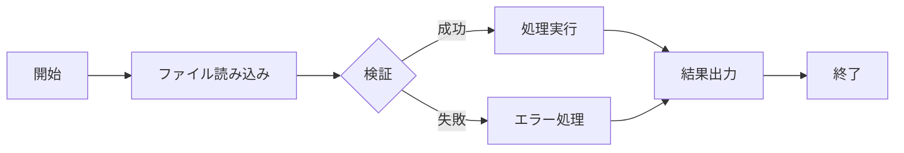

# ファイル読み取り・説明ドキュメント作成ルール

## 📋 概要

このルールは、プロジェクト内のファイルを読み取り、その内容を分析して説明ドキュメントをルートディレクトリに作成する際の標準ガイドラインです。

---

## 🎯 基本原則

### 1. **新人理解優先**
- 専門用語には必ず説明を付ける
- コードの意図と目的を明確に記載
- 具体例を多用する

### 2. **読み取り対象の優先順位**
1. 設定ファイル（.env, config, package.json等）
2. ソースコード（主要な機能から）
3. ドキュメント（README, 仕様書等）
4. リソースファイル（画像、データ等）

### 3. **ドキュメント作成ルール**
- 必ずルートディレクトリに.md形式で作成
- ファイル名は内容を表す分かりやすい名前に
- 階層構造を維持した説明

---

## 📝 説明ドキュメントテンプレート

### ファイル命名規則
```
[対象]_説明書.md
例:
- プロジェクト構成説明書.md
- API仕様説明書.md
- データベース構造説明書.md
- 環境設定説明書.md
```

### 必須セクション構成

```markdown
# [プロジェクト名/機能名] 説明書

## 📋 概要
[このドキュメントの目的、読み取ったファイルの概要]

**作成日**: [日付]
**対象バージョン**: [バージョン情報]

---

## 🗂️ 読み取り対象ファイル一覧

| ファイルパス | 種別 | 説明 |
|------------|------|------|
| /path/to/file | [種別] | [簡単な説明] |

---

## 🏗️ プロジェクト構造

```
プロジェクトルート/
├── src/               # ソースコード
│   ├── components/    # コンポーネント
│   ├── views/        # 画面
│   └── utils/        # ユーティリティ
├── config/           # 設定ファイル
└── docs/             # ドキュメント
```

---

## 🔍 主要ファイル詳細説明

### 1. [ファイル名] (`/path/to/file`)

#### 目的
[このファイルの役割と重要性]

#### 主な内容
```[言語]
// コードスニペット（重要部分の抜粋）
```

#### 重要なポイント
- **[ポイント1]**: [説明]
- **[ポイント2]**: [説明]

#### 依存関係
- [依存ファイル1]: [関係性の説明]
- [依存ファイル2]: [関係性の説明]

---

## ⚙️ 設定・環境関連

### 環境変数（.env）
| 変数名 | 説明 | デフォルト値 | 必須 |
|--------|------|-------------|------|
| [VAR_NAME] | [説明] | [デフォルト] | Yes/No |

### 設定ファイル
| ファイル | 用途 | 変更頻度 |
|---------|------|----------|
| [config.json] | [用途] | 低/中/高 |

---

## 🔄 処理フロー

### [主要機能名]の処理フロー



---

## 💡 新人向け解説

### よく使われる用語
| 用語 | 説明 | 使用例 |
|------|------|--------|
| [用語1] | [分かりやすい説明] | [具体例] |

### 開発時の注意点
1. **[注意点1]**
   - 理由: [なぜ重要か]
   - 対処法: [どうすればよいか]

---

## 🚨 トラブルシューティング

### よくある問題
| 問題 | 原因 | 解決方法 |
|------|------|----------|
| [問題1] | [原因] | [解決方法] |

---

## 📚 関連ドキュメント
- [関連ドキュメント1へのリンク]
- [関連ドキュメント2へのリンク]

---

## 🔄 更新履歴
| 日付 | 更新内容 | 更新者 |
|------|---------|--------|
| [日付] | 初版作成 | Claude |
```

---

## 🛠️ ファイル読み取り手順

### STEP 1: プロジェクト全体把握
1. ルートディレクトリの構造確認
2. README.mdやpackage.jsonの確認
3. 主要ディレクトリの特定

### STEP 2: 重要ファイルの特定
1. エントリーポイント（index.js, main.py等）
2. 設定ファイル（config, .env等）
3. 主要コンポーネント/モジュール

### STEP 3: 詳細読み取り
1. コードコメントの確認
2. 関数・クラスの役割分析
3. データフローの追跡

### STEP 4: ドキュメント作成
1. テンプレートに沿って記載
2. コード例は重要部分のみ抜粋
3. 図表を活用して視覚的に

---

## 📊 読み取り対象別ガイドライン

### ソースコード読み取り時
- **目的を先に説明**：なぜこのコードが必要か
- **処理の流れ**：入力→処理→出力を明確に
- **エラーハンドリング**：どんなエラーが起こりうるか

### 設定ファイル読み取り時
- **各設定項目の意味**
- **デフォルト値と推奨値**
- **変更時の影響範囲**

### データファイル読み取り時
- **データ形式とスキーマ**
- **データの用途**
- **更新頻度と管理方法**

---

## ⚠️ 注意事項

### やってはいけないこと
1. **ソースコードの変更** - 読み取りのみ、変更禁止
2. **機密情報の記載** - パスワード、APIキー等は伏せる
3. **推測での記載** - 不明な点は「要確認」と記載

### 必ず行うこと
1. **最新状態の確認** - 読み取り時点の状態を記録
2. **依存関係の明記** - ファイル間の関係を記載
3. **実例の提供** - 抽象的な説明には具体例を

---

## 🎯 品質チェックリスト

### ドキュメント完成時の確認項目
- [ ] 新人が読んで理解できるか
- [ ] 専門用語に説明があるか
- [ ] コード例が適切に抜粋されているか
- [ ] 図表で視覚的に説明されているか
- [ ] ファイルパスが正確か
- [ ] 更新日時が記載されているか
- [ ] 関連ファイルへの参照があるか

---

## 📝 出力例

### 良い例
```markdown
### user.controller.js (`/src/controllers/user.controller.js`)

#### 目的
ユーザー関連のAPIエンドポイントを管理するコントローラー。
新規登録、ログイン、プロフィール更新などの機能を提供。

#### 主な関数
- `createUser()`: 新規ユーザー作成（バリデーション付き）
- `authenticateUser()`: ログイン認証（JWT発行）
- `updateProfile()`: プロフィール更新（権限チェック付き）
```

### 悪い例
```markdown
### user.controller.js
ユーザーコントローラーです。
```

---

*このルールに従って、プロジェクトの全体像を新人でも理解できる形で文書化します*
*ファイルの読み取りは行いますが、変更は一切行いません*