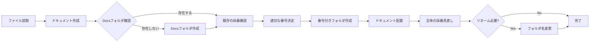

# ファイル読み取り・説明ドキュメント作成ルール（完全版）

## 📋 概要

このルールは、プロジェクト内のファイルを読み取り、その内容を分析して説明ドキュメントをDocsフォルダに整理して作成する際の標準ガイドラインです。

---

## 📁 ドキュメント出力ルール

### **出力先の構造**
```
プロジェクトルート/
└── Docs/                        # ドキュメント格納フォルダ
    ├── 01_プロジェクト概要/      # 最初に読むべき
    │   └── プロジェクト構成説明書.md
    ├── 02_環境構築/              # 次に読むべき
    │   └── 環境設定説明書.md
    ├── 03_API仕様/               # 3番目に読むべき
    │   └── API仕様説明書.md
    ├── 04_データベース/          # 4番目に読むべき
    │   └── データベース構造説明書.md
    └── 05_運用保守/              # 最後に読むべき
        └── トラブルシューティング.md
```

### **採番ルール**
1. **フォルダ名**: `[番号]_[カテゴリ名]/`
   - 番号は必ず2桁（01, 02, 03...）
   - アンダースコアで区切る
   - カテゴリ名は日本語でOK

2. **読む順番の基準**
   ```
   01 → プロジェクト全体像（概要、構成）
   02 → 環境構築（セットアップ手順）
   03 → 主要機能（API、コア機能）
   04 → データ関連（DB、ファイル構造）
   05 → 運用関連（保守、トラブル対応）
   ```

3. **採番の見直しタイミング**
   - 新しいドキュメント追加時
   - ドキュメント削除時
   - 読む順番の変更が必要な時

### **作業フロー**


---

## 🎯 基本原則

### 1. **新人理解優先**
- 専門用語には必ず説明を付ける
- コードの意図と目的を明確に記載
- 具体例を多用する

### 2. **読み取り対象の優先順位**
1. 設定ファイル（.env, config, package.json等）
2. ソースコード（主要な機能から）
3. ドキュメント（README, 仕様書等）
4. リソースファイル（画像、データ等）

### 3. **ドキュメント作成ルール**
- 必ずDocsフォルダ内の採番付きフォルダに.md形式で作成
- ファイル名は内容を表す分かりやすい名前に
- 階層構造を維持した説明

### 4. **ドキュメント整理ルール**
- 作成したMDファイルは「Docs」フォルダに格納する
- ファイル名の先頭に読む順番を示す連番（01_、02_など）を付ける
- 番号付けの基準：
  1. プロジェクト全体の概要説明書
  2. システムの現状分析書
  3. データ構造・ファイル分析書
  4. 技術的な詳細分析書
  5. 移行・実装関連文書
  6. 見積・計画書

---

## 📝 説明ドキュメントテンプレート

### ファイル命名規則
```
[連番]_[対象]_説明書.md
例:
- 01_プロジェクト構成説明書.md
- 02_システム現状分析説明書.md
- 03_データベース構造説明書.md
- 04_API仕様説明書.md

# 作成後は必ずDocsフォルダに移動すること
mv "説明書名.md" "Docs/[連番]_説明書名.md"
```

### 必須セクション構成

```markdown
# [プロジェクト名/機能名] 説明書

## 📋 概要
[このドキュメントの目的、読み取ったファイルの概要]

**作成日**: [日付]
**対象バージョン**: [バージョン情報]
**ドキュメント番号**: [採番フォルダ名]

---

## 🗂️ 読み取り対象ファイル一覧

| ファイルパス | 種別 | 説明 |
|------------|------|------|
| /path/to/file | [種別] | [簡単な説明] |

---

## 🏗️ プロジェクト構造

```
プロジェクトルート/
├── src/               # ソースコード
│   ├── components/    # コンポーネント
│   ├── views/        # 画面
│   └── utils/        # ユーティリティ
├── config/           # 設定ファイル
├── docs/             # ドキュメント
└── Docs/             # 説明書（このルールで作成）
    ├── 01_プロジェクト概要/
    ├── 02_環境構築/
    └── ...
```

---

## 🔍 主要ファイル詳細説明

### 1. [ファイル名] (`/path/to/file`)

#### 目的
[このファイルの役割と重要性]

#### 主な内容
```[言語]
// コードスニペット（重要部分の抜粋）
```

#### 重要なポイント
- **[ポイント1]**: [説明]
- **[ポイント2]**: [説明]

#### 依存関係
- [依存ファイル1]: [関係性の説明]
- [依存ファイル2]: [関係性の説明]

---

## ⚙️ 設定・環境関連

### 環境変数（.env）
| 変数名 | 説明 | デフォルト値 | 必須 |
|--------|------|-------------|------|
| [VAR_NAME] | [説明] | [デフォルト] | Yes/No |

### 設定ファイル
| ファイル | 用途 | 変更頻度 |
|---------|------|----------|
| [config.json] | [用途] | 低/中/高 |

---

## 🔄 処理フロー

### [主要機能名]の処理フロー


---

## 💡 新人向け解説

### よく使われる用語
| 用語 | 説明 | 使用例 |
|------|------|--------|
| [用語1] | [分かりやすい説明] | [具体例] |

### 開発時の注意点
1. **[注意点1]**
   - 理由: [なぜ重要か]
   - 対処法: [どうすればよいか]

---

## 🚨 トラブルシューティング

### よくある問題
| 問題 | 原因 | 解決方法 |
|------|------|----------|
| [問題1] | [原因] | [解決方法] |

---

## 📚 関連ドキュメント

### Docs内の関連ドキュメント
- [01_プロジェクト概要/プロジェクト構成説明書.md](../01_プロジェクト概要/プロジェクト構成説明書.md)
- [02_環境構築/環境設定説明書.md](../02_環境構築/環境設定説明書.md)

### 外部ドキュメント
- [公式ドキュメントへのリンク]
- [参考資料へのリンク]

---

## 🔄 更新履歴
| 日付 | 更新内容 | 更新者 |
|------|---------|--------|
| [日付] | 初版作成 | Claude |
```

---

## 🛠️ ファイル読み取り手順

### STEP 1: プロジェクト全体把握
1. ルートディレクトリの構造確認
2. README.mdやpackage.jsonの確認
3. 主要ディレクトリの特定

### STEP 2: 重要ファイルの特定
1. エントリーポイント（index.js, main.py等）
2. 設定ファイル（config, .env等）
3. 主要コンポーネント/モジュール

### STEP 3: 詳細読み取り
1. コードコメントの確認
2. 関数・クラスの役割分析
3. データフローの追跡

### STEP 4: ドキュメント作成
1. テンプレートに沿って記載
2. コード例は重要部分のみ抜粋
3. 図表を活用して視覚的に

### STEP 5: Docsフォルダへの配置
1. 適切な採番を決定
2. 採番付きフォルダを作成
3. ドキュメントを配置
4. 全体の採番を見直し

---

## 📊 読み取り対象別ガイドライン

### ソースコード読み取り時
- **目的を先に説明**：なぜこのコードが必要か
- **処理の流れ**：入力→処理→出力を明確に
- **エラーハンドリング**：どんなエラーが起こりうるか

### 設定ファイル読み取り時
- **各設定項目の意味**
- **デフォルト値と推奨値**
- **変更時の影響範囲**

### データファイル読み取り時
- **データ形式とスキーマ**
- **データの用途**
- **更新頻度と管理方法**

---

## ⚠️ 注意事項

### やってはいけないこと
1. **ソースコードの変更** - 読み取りのみ、変更禁止
2. **機密情報の記載** - パスワード、APIキー等は伏せる
3. **推測での記載** - 不明な点は「要確認」と記載

### 必ず行うこと
1. **最新状態の確認** - 読み取り時点の状態を記録
2. **依存関係の明記** - ファイル間の関係を記載
3. **実例の提供** - 抽象的な説明には具体例を
4. **採番の整合性維持** - 追加・削除時は全体を見直す

---

## 🎯 品質チェックリスト

### ドキュメント完成時の確認項目
- [ ] 新人が読んで理解できるか
- [ ] 専門用語に説明があるか
- [ ] コード例が適切に抜粋されているか
- [ ] 図表で視覚的に説明されているか
- [ ] ファイルパスが正確か
- [ ] 更新日時が記載されているか
- [ ] 関連ファイルへの参照があるか
- [ ] Docsフォルダ内の適切な採番フォルダに配置されているか
- [ ] 他のドキュメントとの採番順序が適切か

---

## 📝 出力例

### 良い例
```
Docs/
├── 01_プロジェクト概要/
│   └── プロジェクト構成説明書.md
│       → 全体像、技術スタック、ディレクトリ構造
├── 02_環境構築/
│   ├── 環境設定説明書.md
│   └── 開発環境セットアップ手順.md
└── 03_API仕様/
    ├── API仕様説明書.md
    └── エンドポイント一覧.md
```

### ドキュメント内の良い記述例
```markdown
### user.controller.js (`/src/controllers/user.controller.js`)

#### 目的
ユーザー関連のAPIエンドポイントを管理するコントローラー。
新規登録、ログイン、プロフィール更新などの機能を提供。

#### 主な関数
- `createUser()`: 新規ユーザー作成（バリデーション付き）
- `authenticateUser()`: ログイン認証（JWT発行）
- `updateProfile()`: プロフィール更新（権限チェック付き）

#### 関連ドキュメント
- [02_環境構築/環境設定説明書.md](../../02_環境構築/環境設定説明書.md) - JWT設定について
- [04_データベース/ユーザーテーブル仕様.md](../../04_データベース/ユーザーテーブル仕様.md) - DBスキーマ
```

### 悪い例
```markdown
### user.controller.js
ユーザーコントローラーです。
```

---

## 📊 採番リネームの実例

### 新規ドキュメント追加時
```bash
# 変更前
Docs/
├── 01_プロジェクト概要/
├── 02_API仕様/
└── 03_運用保守/

# 環境構築ドキュメントを追加（読む順番を考慮）
# 変更後
Docs/
├── 01_プロジェクト概要/
├── 02_環境構築/        # 新規追加
├── 03_API仕様/         # 02→03にリネーム
└── 04_運用保守/        # 03→04にリネーム
```

---

*このルールに従って、プロジェクトの全体像を新人でも理解できる形で文書化します*
*ファイルの読み取りは行いますが、変更は一切行いません*
*ドキュメントは必ずDocsフォルダに採番付きで整理して配置します*