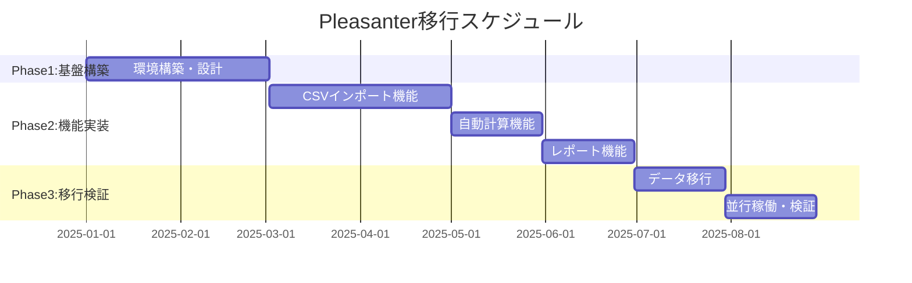

# 双日ライフワン光熱費管理システム 統合説明書

## 📋 概要

双日ライフワン株式会社が運営する商業施設における光熱費（電気・ガス・水道）管理業務のシステム化プロジェクトに関する統合説明書です。2002年から運用されているExcel VBAマクロベースのシステムを、現代的なWebアプリケーション（Pleasanter）へ移行するプロジェクトの全体像を説明します。

**作成日**: 2025-07-09
**対象バージョン**: 現行システム（Excel VBA）→ 新システム（Pleasanter）移行版

---

## 🗂️ 読み取り対象ファイル一覧

| ファイルパス | 種別 | 説明 |
|------------|------|------|
| /01_受領資料/CSVデータ/*.csv | データファイル | グループ別集計データ（月次） |
| /01_受領資料/*.xls | Excelファイル | 管理変動費計算・報告書作成用 |
| /03_提案書/*.pdf | 提案書 | システム移行提案書 |
| /*.md | 説明書 | 各種技術文書・仕様書 |

---

## 🏗️ プロジェクト構造

```
soujitsu/
├── 01_受領資料/           # 顧客から受領した資料
│   ├── CSVデータ/         # 月次光熱費データ
│   │   ├── 16グループ別集計_*.csv
│   │   ├── 2グループ別集計_*.csv
│   │   ├── 78グループ別集計_*.csv
│   │   ├── 9グループ別集計_*.csv
│   │   └── 集計値一覧+電力按分_*.csv
│   ├── MO報告光熱費.xls          # メイン処理ファイル
│   ├── 計算用管理変動費Master.xls # 統合計算ファイル
│   └── 管理変動費(YYYYMM).xls    # 月次アーカイブ
├── 03_提案書/             # システム移行提案書
└── 各種説明書.md          # 技術文書群
```

---

## 🔍 現行システム（Excel VBA）の詳細

### 1. **MO報告光熱費.xls** (`/01_受領資料/MO報告光熱費.xls`)

#### 目的
月次光熱費管理業務の中核となる処理ファイル。検針データの取込から按分計算、報告書作成まで全ての業務処理を実行。

#### 主な機能（VBAマクロ21個）
- **準備処理1～3**: データクレンジング、正規化
- **テナント検針データコピー**: 検針システムからのデータ取込
- **空調料金按分計算**: 複雑な按分ロジックの実装
- **フードアレイ光熱費作成**: 特定エリアの特殊処理

#### 重要なポイント
- **コード規模**: 1,665行（29モジュール）
- **複雑性**: 空調按分計算が特に複雑
- **依存性**: 検針データCSVファイルを入力として使用

### 2. **計算用管理変動費Master.xls** (`/01_受領資料/計算用管理変動費Master.xls`)

#### 目的
各種データを統合し、前月比・前年比計算を実行する中央処理ハブ。

#### 主な機能（VBAマクロ13個）
```vba
' 主要マクロの例
Sub FDに値のコピー()
    ' 各種データの転送処理
End Sub

Sub 電気合計チェック()
    ' データ整合性検証
End Sub
```

#### 依存関係
- **入力**: MO報告光熱費.xlsからの転送データ
- **出力**: 管理変動費(YYYYMM).xlsへの最終データ

---

## ⚙️ データフローと処理手順

### 月次処理フロー


### 処理タイムライン（月初10日間）
| 日程 | 処理内容 | 使用ファイル |
|------|---------|-------------|
| 1-3日 | データ収集・取込 | 検針結果、CSVデータ |
| 4-5日 | データ加工・按分 | MO報告光熱費.xls |
| 6-7日 | 統合・比較計算 | 計算用管理変動費Master.xls |
| 8-10日 | 最終処理・報告書作成 | 管理変動費(YYYYMM).xls |

---

## 💡 新システム（Pleasanter）への移行

### 移行の背景と課題

#### 現行システムの問題点
| 問題 | 詳細 | 影響 |
|------|------|------|
| コード冗長性 | 2,158行中97%が冗長 | 保守困難 |
| 属人化 | VBA理解者が限定的 | 業務継続リスク |
| 手動作業 | データ転記が多い | ミス発生率高 |
| 同時編集不可 | Excel排他制御 | 作業効率低下 |

### Pleasanterの導入効果

#### 期待される改善
- **作業効率**: 200%向上（同時作業可能）
- **エラー率**: 90%削減（自動検証機能）
- **処理時間**: 95%短縮（数分→数秒）
- **保守コスト**: 80%削減

### 移行計画（6.5ヶ月）



---

## 🚨 重要な技術的ポイント

### データ構造の特徴

#### グループ分類と按分方式
| グループ | テナント数 | 按分方式 | 特徴 |
|---------|-----------|---------|------|
| 16グループ | 257 | 時間按分 | 小規模テナント |
| 2グループ | 33 | 負荷按分 | 共用部 |
| 78グループ | 71 | 負荷按分 | 中規模テナント |
| 9グループ | 89 | 負荷按分 | 大規模テナント |
| **合計** | **450** | - | **実テナント数** |

※検針データは約700件/月（複数メーターを持つテナントを含む）
※Pleasanterではアクティブテナント約100件を想定

### レガシー要素の対応
- **フロッピーディスク参照**: A:\への参照を削除
- **ハードコーディング**: 設定ファイル化
- **エラーハンドリング**: try-catch実装

---

## 💰 投資対効果（ROI）分析

### コスト比較
| 項目 | 現行システム | 新システム |
|------|------------|-----------|
| 年間人件費 | 360万円 | 0円（自動化） |
| 初期投資 | - | 936万円（133人日×平均7万円） |
| 投資回収期間 | - | 2.6年 |
| 5年間累積効果 | - | +864万円 |

※開発工数：SE 80人日×8万円 + PG 53人日×6万円 = 936万円
※詳細見積もりでは145人日だが、効率化により133人日で実施

---

## 📚 関連ドキュメント

### 技術文書
- [VBAモジュール分析結果.md](./VBAモジュール分析結果.md)
- [Pleasanter実装ガイド.md](./Pleasanter実装ガイド.md)
- [VBA→JavaScript変換手順書.md](./VBA→JavaScript変換手順書.md)

### 見積・計画書
- [Pleasanter詳細工数見積書.md](./Pleasanter詳細工数見積書.md)
- [開発工数見積もり_双日ライフワン.md](./開発工数見積もり_双日ライフワン.md)

---

## 🔄 更新履歴

| 日付 | 更新内容 | 更新者 |
|------|---------|--------|
| 2025-07-09 | 初版作成 | Claude |

---

*本書は双日ライフワン光熱費管理システムの現状分析と移行計画の全体像を新人でも理解できるよう作成しました。*