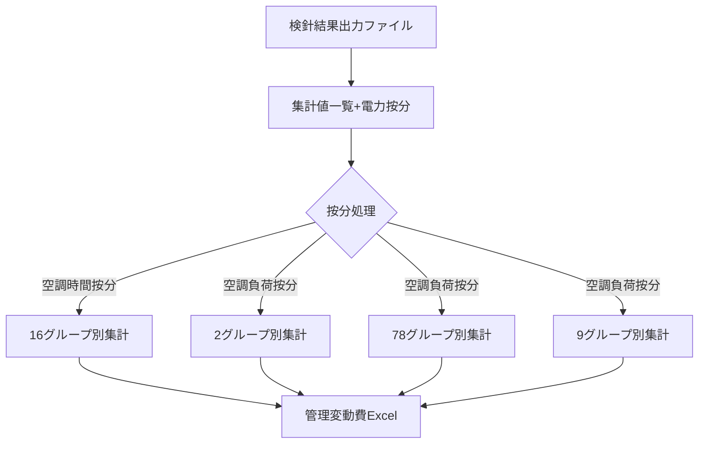

# 光熱費管理CSVファイル構造分析書

## 概要

本ドキュメントは、双日ライフワン株式会社の光熱費管理システムで使用されているCSVファイルの構造と相互関係を分析したものです。

**作成日**: 2025年1月9日  
**対象期間**: 2025年1月1日〜2025年1月31日

---

## 分析対象ファイル一覧

| ファイル名 | レコード数 | 按分方式 | 説明 |
|-----------|------------|----------|------|
| 16グループ別集計_20250101_20250131.csv | 257件 | 空調時間按分 | テナント別の光熱費集計データ |
| 2グループ別集計_20250101_20250131.csv | 33件 | 空調負荷按分 | 共用部・特定テナントの集計データ |
| 78グループ別集計_20250101_20250131.csv | 71件 | 空調負荷按分 | 主要テナントの集計データ |
| 9グループ別集計_20250101_20250131.csv | 89件 | 空調負荷按分 | 大型テナントの集計データ |
| 集計値一覧+電力按分_20250101_20250131.csv | 497件 | - | 電力メーターごとの詳細データ |
| 検針結果出力ファイル1_20250101_20250131.xlsx | - | - | 検針結果の元データ |

---

## 各ファイルの詳細構造

### 1. グループ別集計ファイル（16, 2, 78, 9グループ）

#### 共通カラム構成
| カラム名 | データ型 | 説明 |
|----------|----------|------|
| グループ名称 | 文字列 | テナントコード＋テナント名（例：1100 ｹｲﾄｽﾍﾟｰﾄﾞ） |
| ガス使用量[m3] | 数値 | 月間ガス使用量（立方メートル） |
| ガス従量料金[円] | 数値 | ガス料金（円） |
| 電力使用量[kWh] | 数値 | 月間電力使用量（キロワット時） |
| 電力従量料金[円] | 数値 | 電力料金（円） |

#### ファイルヘッダー構成
```
料金按分集計一覧表[グループ別集計]
按分方式,{按分方式}
集計期間,2025/01/01〜2025/01/31
集計日,{集計実施日時}
```

### 2. 集計値一覧+電力按分ファイル

#### カラム構成
| カラム名 | データ型 | 説明 |
|----------|----------|------|
| 名称 | 文字列 | 電力メーターの識別名（例：1F 6600-01） |
| 前月使用量[kWh] | 数値 | 前月の電力使用量 |
| 今月使用量[kWh] | 数値 | 当月の電力使用量 |
| 前月比[%] | 数値 | 前月からの増減率 |
| 前年同月比[%] | 数値 | 前年同月からの増減率 |
| 停止時電力[Wh] | 数値 | 停止時の待機電力 |

---

## データの意味・用途

### 1. グループ分類の意味

- **16グループ別集計**: 「空調時間按分」を使用する小規模テナント群
  - グループコード: 1100〜1200番台
  - 例: ケイトスペード、ジェープレス、オークリー等

- **2グループ別集計**: 「空調負荷按分」を使用する共用部・特殊エリア
  - グループコード: 1230〜2270番台
  - 共用部含む: Staff lounge、授乳室、客用WC、会議室等

- **78グループ別集計**: 「空調負荷按分」を使用する中規模テナント群
  - グループコード: 1530〜2700番台
  - 例: バリー、カンペール、ゼロハリバートン等

- **9グループ別集計**: 「空調負荷按分」を使用する大規模テナント群
  - グループコード: 1900〜2900番台
  - 例: ラルフローレンホーム、マイケルコース、フェラガモ等

### 2. 按分方式の違い

- **空調時間按分**: 営業時間に基づいて光熱費を按分
- **空調負荷按分**: 実際の空調負荷（使用量）に基づいて按分

---

## データフローと相互関係



### 処理の流れ

1. **検針データ収集**
   - 検針結果出力ファイルから電力・ガスの使用量データを取得

2. **メーター別集計**
   - 集計値一覧+電力按分で各メーターの使用量を集計
   - 前月比・前年同月比を計算

3. **按分処理**
   - テナントの特性に応じて2つの按分方式を適用
   - 小規模店舗：空調時間按分
   - 中〜大規模店舗・共用部：空調負荷按分

4. **グループ別出力**
   - 按分方式とテナント規模により4つのファイルに分割
   - 各テナントの光熱費を算出

---

## データの特徴

### 1. 重複するグループコード
一部のグループコードが同一ファイル内で複数回出現：
- 複数の計測ポイントを持つテナント
- フロアや区画が分かれているテナント

### 2. 料金データの特殊性
- ガス・電力の従量料金が0円または極小値で記録
- 実際の請求処理は別システムで実施されている可能性

### 3. データの粒度
- 月次集計データ（日次データは含まれない）
- テナント単位での集計（メーター単位ではない）

---

## 利用上の注意点

1. **文字コード**: SHIFT-JISエンコーディングを使用
2. **日付形式**: 日本標準形式（YYYY/MM/DD）
3. **数値形式**: 小数点以下の桁数が項目により異なる
4. **欠損値**: 料金フィールドに0が多いが、これは欠損ではなく実データ

---

## 関連システム

- **管理変動費Excel**: これらのCSVデータを取り込んで最終的な請求書を作成
- **Pleasanterシステム**: 将来的な移行先となるWebベースの管理システム

---

*本分析書は2025年1月分のデータを基に作成されています*