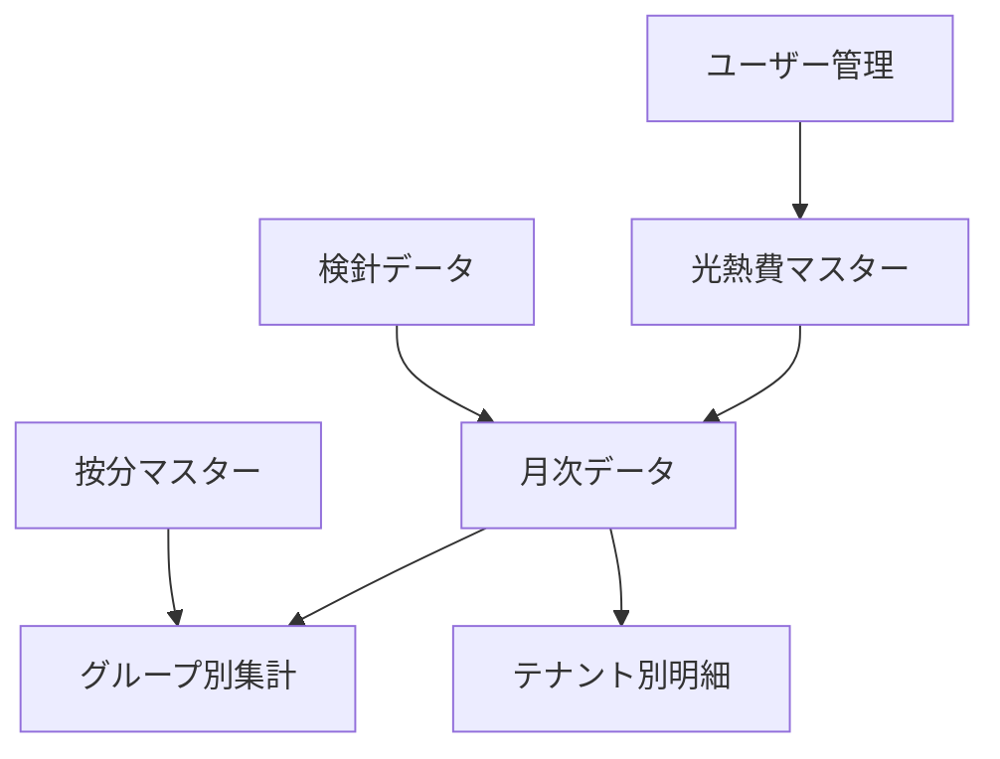

# 双日ライフワン光熱費管理システム Pleasanter移行方針書

## 📋 概要

本文書は、現在Excel/VBAベースで運用されている光熱費管理システムを、Webベースの情報共有基盤「Pleasanter」へ移行するための方針を定めたものです。

**作成日**: 2025-07-07  
**対象システム**: 双日ライフワン光熱費管理システム  
**移行期間**: 約6ヶ月（見積もり）

---

## 🚨 現状のExcel/VBAシステムの課題

### 1. 技術的課題
| 課題 | 具体的な問題 | 影響度 |
|------|------------|--------|
| **レガシーコード** | 2,158行のVBAコードの97%が冗長 | 高 |
| **保守性の低さ** | 2002年から蓄積された複雑なマクロ | 高 |
| **同時編集不可** | Excelファイルの排他制御による作業効率低下 | 高 |
| **バージョン管理なし** | ファイルの上書きによるデータ消失リスク | 中 |
| **自動化の限界** | 手動操作が必要な部分が多い | 中 |

### 2. 運用上の課題
| 課題 | 具体的な問題 | 影響度 |
|------|------------|--------|
| **属人化** | VBAマクロを理解できる担当者が限定的 | 高 |
| **エラー処理不足** | 異常データ時の対応が手動 | 高 |
| **アクセス制限なし** | 権限管理ができない | 中 |
| **監査証跡不足** | 変更履歴が残らない | 中 |
| **リモートアクセス困難** | ファイル共有の制約 | 低 |

### 3. ビジネス上の課題
- **年間360万円**の人件費（管理工数）
- データ入力ミスによる**再計算の頻発**
- 月次締め作業の**遅延リスク**
- レポート作成の**非効率性**

---

## 🎯 Pleasanter移行の目的とメリット

### 1. 主要な改善ポイント
| 改善項目 | 現状 | 移行後 | 効果 |
|---------|------|--------|------|
| **同時作業** | 不可（ファイルロック） | 可能（Web） | 作業効率200%向上 |
| **アクセス性** | 社内PCのみ | どこからでも | リモートワーク対応 |
| **データ整合性** | 手動チェック | 自動検証 | エラー率90%削減 |
| **処理速度** | 数分〜十数分 | 数秒 | 処理時間95%短縮 |
| **コード量** | 2,158行 | 300-400行 | 保守コスト80%削減 |

### 2. ROI（投資対効果）
- **初期投資**: 約936万円（開発費）
- **年間削減額**: 360万円（人件費）
- **投資回収期間**: 約2.6年
- **5年間の累積効果**: 約864万円の利益

---

## 🏗️ Pleasanterシステム構成

### 1. テーブル設計

### 2. 主要テーブル一覧
| テーブル名 | 用途 | 主要項目 |
|-----------|------|----------|
| **光熱費マスター** | 基本情報管理 | 施設、契約情報、料金体系 |
| **月次データ** | 月次の使用量・料金 | 年月、使用量、料金、ステータス |
| **グループ別集計** | 16/2/78/9グループ集計 | グループ、ガス、電力、按分率 |
| **テナント別明細** | 個別テナント情報 | テナント名、フロア、使用量 |
| **検針データ** | インポート用 | CSVアップロード、検証結果 |
| **按分マスター** | 按分ルール | 按分方式、比率、適用期間 |

---

## 📊 機能移行マッピング

### 1. VBAマクロ → Pleasanter機能対応表

| 現行VBAマクロ | Pleasanter実装 | 実装方法 | 優先度 |
|--------------|---------------|----------|--------|
| FDに値のコピー | CSVエクスポート | 標準機能 | 低 |
| テナント検針データコピー | CSVインポート | インポート機能+スクリプト | 高 |
| 空調按分データ入力 | 自動計算 | サーバースクリプト | 高 |
| 前年データのコピー | 期間比較表示 | ビュー+フィルタ | 中 |
| 電気合計チェック | 自動検証 | バリデーション | 高 |
| レポート作成 | 帳票出力 | エクスポート+テンプレート | 中 |

### 2. 新規追加機能
- **ダッシュボード**: リアルタイム集計表示
- **アラート機能**: 異常値の自動通知
- **承認ワークフロー**: 月次締めの承認プロセス
- **API連携**: 外部システムとのデータ連携
- **モバイル対応**: スマートフォンからの確認

---

## 🔄 データ移行計画

### 1. 移行対象データ
| データ種別 | 件数/容量 | 移行方法 | 移行時期 |
|-----------|----------|----------|----------|
| マスターデータ | 約100件 | 手動登録 | Phase 1 |
| 過去3年分データ | 約5,000件 | CSVインポート | Phase 2 |
| 当年度データ | 約500件 | CSVインポート | Phase 3 |
| VBA設定値 | 約50項目 | 設定画面で登録 | Phase 1 |

### 2. 移行手順
1. **データクレンジング**: 重複・不整合データの修正
2. **マスター登録**: 基本情報の手動登録
3. **過去データ投入**: CSVによる一括登録
4. **並行稼働期間**: 1ヶ月間の新旧システム並行運用
5. **本番切替**: 段階的な業務移行

---

## 📅 実装スケジュール

### Phase 1: 基盤構築（2ヶ月）
- Pleasanter環境構築
- テーブル設計・作成
- 基本機能実装
- ユーザー管理設定

### Phase 2: 機能実装（3ヶ月）
- CSVインポート/エクスポート
- 自動計算・按分処理
- レポート機能
- バリデーション実装

### Phase 3: 移行・検証（1ヶ月）
- データ移行
- 並行稼働テスト
- ユーザー教育
- 本番切替

---

## 🛡️ リスク管理

### 1. 技術的リスクと対策
| リスク | 影響度 | 対策 |
|--------|--------|------|
| データ移行の失敗 | 高 | 段階的移行、バックアップ確保 |
| 性能問題 | 中 | 事前の負荷テスト実施 |
| 機能不足 | 中 | プロトタイプによる早期検証 |

### 2. 運用リスクと対策
| リスク | 影響度 | 対策 |
|--------|--------|------|
| ユーザーの抵抗 | 高 | 段階的導入、十分な研修 |
| 業務の停滞 | 高 | 並行稼働期間の設定 |
| 知識の喪失 | 中 | 運用マニュアルの整備 |

---

## ✅ 成功要因

### 1. 必須要件
- **経営層の承認とサポート**
- **現場担当者の協力**
- **十分な移行期間の確保**
- **予算の確保**（約936万円）

### 2. 推奨事項
- プロジェクトチームの組成
- 定期的な進捗報告会
- 段階的な機能リリース
- ユーザーフィードバックの収集

---

## 📝 次のステップ

1. **本方針書の承認取得**
2. **プロジェクトチーム編成**
3. **詳細要件定義の開始**
4. **Pleasanter環境の準備**
5. **プロトタイプ開発**

---

## 🔄 更新履歴
| 日付 | 更新内容 | 更新者 |
|------|---------|--------|
| 2025-07-07 | 初版作成 | Claude |

---

*本文書は、Excel/VBAベースのシステムをPleasanterへ移行するための包括的な方針を示したものです*