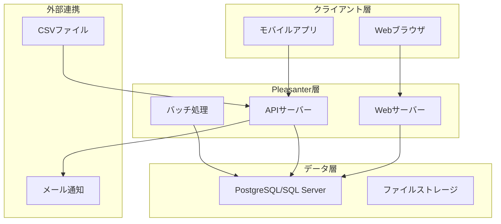

# Pleasanter実装ガイド - 双日ライフワン光熱費管理システム

## 📋 概要

本ガイドは、Excel/VBAシステムをPleasanterで実装する際の技術的な実装方法を詳細に説明します。開発者向けの実践的なガイドラインです。

**作成日**: 2025-07-07  
**対象**: 開発者・システム管理者  
**Pleasanterバージョン**: 1.3以降推奨

---

## 🏗️ システムアーキテクチャ

### 1. 全体構成図



---

## 📊 データベース設計

### 1. テーブル定義

#### 光熱費マスターテーブル (Sites)
```sql
-- Pleasanterの標準Sitesテーブルを利用
-- カスタム項目の定義
ClassA: 施設コード (text)
ClassB: 施設名 (text)
ClassC: 契約種別 (text) -- 'ガス'/'電力'/'水道'
NumA: 基本料金 (decimal)
NumB: 従量単価 (decimal)
DateA: 契約開始日 (date)
DateB: 契約終了日 (date)
```

#### 月次データテーブル (Issues)
```sql
-- 光熱費月次データ管理
ClassA: 年月 (text) -- 'YYYY-MM'
ClassB: グループコード (text) -- '16'/'2'/'78'/'9'
ClassC: 施設コード (text)
NumA: ガス使用量 (decimal) -- m3
NumB: ガス料金 (decimal) -- 円
NumC: 電力使用量 (decimal) -- kWh
NumD: 電力料金 (decimal) -- 円
NumE: 前月比 (decimal) -- %
NumF: 前年同月比 (decimal) -- %
Status: ステータス -- 100:仮登録/200:確認中/300:確定/900:承認済
```

#### 按分設定テーブル (Results)
```sql
-- 空調按分ルール管理
ClassA: グループコード (text)
ClassB: テナントコード (text)
ClassC: 按分方式 (text) -- '面積按分'/'使用時間按分'/'固定比率'
NumA: 按分率 (decimal) -- %
DateA: 適用開始日 (date)
DateB: 適用終了日 (date)
```

---

## 🔧 主要機能の実装

### 1. CSVインポート機能

#### サーバースクリプト実装
```javascript
// CSVインポート処理（サーバースクリプト）
try {
    // アップロードされたファイルの取得
    const uploadedFile = items.Get(context.Id).Attachments
        .Where(a => a.Name.EndsWith(".csv"))
        .OrderByDescending(a => a.UpdatedTime)
        .FirstOrDefault();
    
    if (!uploadedFile) {
        context.Message = "CSVファイルが見つかりません。";
        return;
    }
    
    // CSVファイルの読み込み
    const csvData = utilities.ReadCsv(uploadedFile.FilePath, "Shift-JIS");
    
    // データの検証と登録
    let successCount = 0;
    let errorCount = 0;
    
    csvData.forEach((row, index) => {
        if (index === 0) return; // ヘッダー行をスキップ
        
        try {
            // データ検証
            if (!validateData(row)) {
                errorCount++;
                return;
            }
            
            // 月次データの作成
            const monthlyData = {
                ClassA: extractYearMonth(uploadedFile.Name),
                ClassB: row[0], // グループ名称
                NumA: parseFloat(row[1]), // ガス使用量
                NumB: parseFloat(row[2]), // ガス料金
                NumC: parseFloat(row[3]), // 電力使用量
                NumD: parseFloat(row[4]), // 電力料金
                Status: 100 // 仮登録
            };
            
            // データ登録
            items.Create(context.SiteId, monthlyData);
            successCount++;
            
        } catch (e) {
            errorCount++;
            context.Log(`行${index + 1}でエラー: ${e.Message}`);
        }
    });
    
    context.Message = `インポート完了: 成功${successCount}件、エラー${errorCount}件`;
    
} catch (e) {
    context.Error = `インポート処理でエラーが発生しました: ${e.Message}`;
}

// データ検証関数
function validateData(row) {
    // 必須項目チェック
    if (!row[0] || !row[1] || !row[2] || !row[3] || !row[4]) {
        return false;
    }
    
    // 数値項目チェック
    if (isNaN(parseFloat(row[1])) || isNaN(parseFloat(row[2])) ||
        isNaN(parseFloat(row[3])) || isNaN(parseFloat(row[4]))) {
        return false;
    }
    
    return true;
}

// 年月抽出関数
function extractYearMonth(fileName) {
    const match = fileName.match(/(\d{4})(\d{2})/);
    return match ? `${match[1]}-${match[2]}` : null;
}
```

### 2. 自動按分計算

#### プロセス機能での実装
```javascript
// 空調費按分計算（プロセス実行時）
process.Execute = function() {
    const targetMonth = process.Data.ClassA; // 対象年月
    
    // 按分対象データの取得
    const targetData = items.Get(
        context.SiteId,
        view.Where("ClassA == @targetMonth", { targetMonth: targetMonth })
            .And("ClassB == '共用部'")
    );
    
    if (!targetData || targetData.Count === 0) {
        process.Message = "按分対象データが見つかりません。";
        return;
    }
    
    // 按分ルールの取得
    const rules = results.Get(
        context.SiteId,
        view.Where("DateA <= @today AND DateB >= @today", 
            { today: utilities.Today() })
    );
    
    // 按分計算と配分
    targetData.forEach(data => {
        const totalCost = data.NumB + data.NumD; // ガス料金 + 電力料金
        
        rules.forEach(rule => {
            const allocatedCost = totalCost * (rule.NumA / 100);
            
            // テナント別データの作成
            items.Create(context.SiteId, {
                ClassA: targetMonth,
                ClassB: rule.ClassB, // テナントコード
                ClassC: data.ClassC, // 施設コード
                NumA: data.NumA * (rule.NumA / 100), // 按分後ガス使用量
                NumB: data.NumB * (rule.NumA / 100), // 按分後ガス料金
                NumC: data.NumC * (rule.NumA / 100), // 按分後電力使用量
                NumD: data.NumD * (rule.NumA / 100), // 按分後電力料金
                Status: 200, // 確認中
                Body: `共用部費用を按分率${rule.NumA}%で配分`
            });
        });
    });
    
    process.Message = "按分計算が完了しました。";
};
```

### 3. 前年同月比較

#### ビュー設定
```javascript
// カスタムビューの作成
view.Filters = [
    {
        ColumnName: "ClassA",
        Value: ["@ThisMonth", "@LastYearSameMonth"]
    }
];

view.Sorters = [
    { ColumnName: "ClassB", Order: "asc" },
    { ColumnName: "ClassA", Order: "desc" }
];

// 集計機能の設定
view.Aggregations = [
    {
        AggregationType: "Sum",
        Target: "NumA", // ガス使用量合計
        GroupBy: ["ClassA", "ClassB"]
    },
    {
        AggregationType: "Sum", 
        Target: "NumC", // 電力使用量合計
        GroupBy: ["ClassA", "ClassB"]
    }
];
```

### 4. 異常値検出アラート

#### スクリプト機能での実装
```javascript
// 異常値検出スクリプト（作成・更新時）
if (model.NumE > 120) { // 前月比120%超
    // アラートメール送信
    notification.Send({
        To: settings.Get("AlertMailTo"),
        Subject: "【警告】光熱費異常値検出",
        Body: `
            ${model.ClassB}グループで前月比${model.NumE}%の異常値を検出しました。
            
            詳細：
            - 年月: ${model.ClassA}
            - ガス使用量: ${model.NumA} m3
            - 電力使用量: ${model.NumC} kWh
            
            確認URL: ${context.ApplicationUrl}/items/${model.Id}
        `
    });
    
    // ステータスを確認中に変更
    model.Status = 200;
    model.Body += "\n【異常値検出】前月比120%超のため確認が必要です。";
}
```

---

## 📝 スタイル・スクリプト設定

### 1. スタイル設定（CSS）
```css
/* 異常値の強調表示 */
.grid-row[data-id] td.num-e {
    background-color: #ffcccc;
    font-weight: bold;
}

/* ステータス別の色分け */
.status-100 { background-color: #f0f0f0; } /* 仮登録 */
.status-200 { background-color: #fff3cd; } /* 確認中 */
.status-300 { background-color: #d4edda; } /* 確定 */
.status-900 { background-color: #cce5ff; } /* 承認済 */

/* ダッシュボード用グラフエリア */
.dashboard-container {
    display: grid;
    grid-template-columns: 1fr 1fr;
    gap: 20px;
    margin: 20px 0;
}
```

### 2. クライアントスクリプト（JavaScript）
```javascript
// グラフ表示機能
$p.events.on_grid_load = function() {
    // Chart.jsを使用した使用量推移グラフ
    const ctx = document.getElementById('usageChart').getContext('2d');
    const chartData = prepareChartData();
    
    new Chart(ctx, {
        type: 'line',
        data: {
            labels: chartData.labels,
            datasets: [{
                label: 'ガス使用量',
                data: chartData.gasData,
                borderColor: 'rgb(255, 99, 132)',
                tension: 0.1
            }, {
                label: '電力使用量',
                data: chartData.powerData,
                borderColor: 'rgb(54, 162, 235)',
                tension: 0.1
            }]
        },
        options: {
            responsive: true,
            plugins: {
                title: {
                    display: true,
                    text: '光熱費使用量推移'
                }
            }
        }
    });
};

// データ準備関数
function prepareChartData() {
    const data = $p.data.Response.Data;
    return {
        labels: data.map(d => d.ClassA),
        gasData: data.map(d => d.NumA),
        powerData: data.map(d => d.NumC)
    };
}
```

---

## 🔐 セキュリティ設定

### 1. アクセス権限設定
```json
{
    "部門管理者": {
        "Create": true,
        "Read": true,
        "Update": true,
        "Delete": false,
        "Import": true,
        "Export": true
    },
    "一般ユーザー": {
        "Create": false,
        "Read": true,
        "Update": false,
        "Delete": false,
        "Import": false,
        "Export": true
    }
}
```

### 2. 項目別権限設定
```javascript
// 料金情報の閲覧制限
permissions.ColumnPermissions = {
    "NumB": ["部門管理者", "経理担当"], // ガス料金
    "NumD": ["部門管理者", "経理担当"]  // 電力料金
};
```

---

## 🚀 デプロイ手順

### 1. 初期セットアップ
```bash
# 1. Pleasanterのインストール（既存環境がない場合）
# 2. データベースの作成
# 3. サイトの作成
pleasanter site create --name "光熱費管理" --template "Issues"

# 4. カスタム項目の定義
# 管理画面から実施

# 5. スクリプトの配置
# サーバースクリプト、スタイル、プロセスの設定
```

### 2. データ移行
```bash
# 1. マスターデータの登録
# 2. 過去データのインポート（CSV）
# 3. 動作確認
# 4. 本番環境への反映
```

---

## 📚 参考資料

- [Pleasanter公式ドキュメント](https://pleasanter.org/manual)
- [開発者向けAPI仕様](https://pleasanter.org/manual/api)
- [サーバースクリプトリファレンス](https://pleasanter.org/manual/server-script)

---

## 🔄 更新履歴
| 日付 | 更新内容 | 更新者 |
|------|---------|--------|
| 2025-07-07 | 初版作成 | Claude |

---

*本ガイドは、Pleasanterでの実装に必要な技術的詳細を網羅しています*