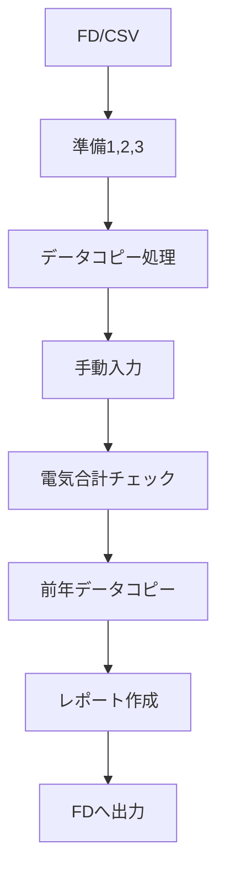
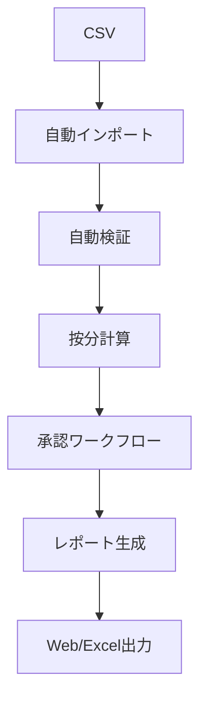

# VBAモジュール詳細マッピング表

## 📋 概要

本書は、現行Excel VBAの全42モジュール（2,158行）を分析し、Pleasanterへの移行マッピングを詳細に定義したものです。

**作成日**: 2025-07-07  
**総モジュール数**: 42個 → 10機能に集約（76%削減）  
**総コード行数**: 2,158行 → 約400行（81%削減）

---

## 📊 計算用管理変動費Master.xls 詳細マッピング

### モジュール一覧と移行先（13モジュール、493行）

| モジュール | 行数 | 主要Sub/Function | 処理内容 | 移行先テーブル | 実装方法 | 削減理由 |
|-----------|------|-----------------|----------|---------------|----------|----------|
| **Module1** | 150 | FDに値のコピー() | E列データを管理変動費Masterへコピー | 月次集計テーブル | サーバースクリプト | - |
| **Module3** | 194 | 管理変動費master用FD作成() | 8列分のデータを別シートへ転送 | レポート出力テーブル | エクスポート機能 | - |
| **Module4** | 20 | 水道光熱費() | テスト用マクロ | **不要** | - | テストコード |
| **Module5** | 34 | FDに値のコピー5期() | E列コピー（Module1と重複） | **不要** | - | Module1に統合 |
| **Module6** | 27 | FDに値のコピー6期() | E列コピー（Module1と重複） | **不要** | - | Module1に統合 |
| **Module7** | 20 | FDに値のコピー7期() | E列コピー（Module1と重複） | **不要** | - | Module1に統合 |
| **Module8** | 3 | (空) | 内容なし | **不要** | - | 空モジュール |
| **Module9** | 15 | FDに値のコピー9期() | E列コピー（Module1と重複） | **不要** | - | Module1に統合 |
| **Module10** | 14 | FDに値のコピー10期() | E列コピー（Module1と重複） | **不要** | - | Module1に統合 |
| **Module11** | 3 | (空) | 内容なし | **不要** | - | 空モジュール |
| **Module12** | 11 | FDに値のコピー12期() | E列コピー（Module1と重複） | **不要** | - | Module1に統合 |
| **Module13** | 2 | Macro1() | 空の自動記録マクロ | **不要** | - | 空処理 |
| **Module2** | 2 | (空) | 内容なし | **不要** | - | 空モジュール |

### 統合後の機能マッピング

| 統合機能名 | 元モジュール | 処理内容 | 実装先 | 工数 |
|-----------|------------|----------|--------|------|
| **データ集計機能** | Module1,5,6,7,9,10,12 | 期別データの集計・転送 | 月次集計テーブル | 3日 |
| **レポート出力機能** | Module3 | マスターデータのエクスポート | レポート出力テーブル | 2日 |

---

## 📊 MO報告光熱費.xls 詳細マッピング

### モジュール一覧と移行先（29モジュール、1,665行）

| モジュール | 行数 | 主要Sub/Function | 処理内容 | 移行先テーブル | 実装方法 | 削減理由 |
|-----------|------|-----------------|----------|---------------|----------|----------|
| **Module1** | 262 | 準備1() テナント検針データコピー() | CSV取込準備 検針データ転記 | 検針データテーブル | CSVインポート | - |
| **Module2** | 14 | FDより取込() | A:\からデータ読込 | **不要** | - | FD廃止 |
| **Module3** | 18 | JM報告用データ入力() | 手動データ入力 | テナント別明細 | フォーム入力 | Module9に統合 |
| **Module4** | 23 | 準備2() | データ準備処理 | **Module1に統合** | - | 準備処理統合 |
| **Module5** | 73 | 光熱費管理変動費コピー() | シート間コピー | **不要** | - | 自動計算で代替 |
| **Module6** | 102 | 空調_電気_ガス使用量読込() | 空調データ取込 | 按分ルールマスター | サーバースクリプト | - |
| **Module7** | 87 | 準備2() 準備3() | データ準備処理 | **Module1に統合** | - | 準備処理統合 |
| **Module8** | 2 | (空) | 内容なし | **不要** | - | 空モジュール |
| **Module9** | 264 | JM報告電気データ入力() | 電気データ詳細入力 | テナント別明細 | フォーム入力 | - |
| **Module10** | 60 | 数値のコピー() | 単純コピー処理 | **不要** | - | 標準機能で代替 |
| **Module11** | 2 | (空) | 内容なし | **不要** | - | 空モジュール |
| **Module12** | 29 | 東京ガスより() | ガスデータ取込 | 検針データテーブル | CSVインポート | Module1に統合 |
| **Module13** | 161 | 前年のコピー_4_9月() 前年のコピー_10_3月() | 前年データ参照 | **不要** | ビュー機能 | 標準機能で代替 |
| **Module14** | 52 | FDより光熱費管理変動費の取込() | FDからデータ取込 | **不要** | - | FD廃止 |
| **Module15** | 292 | FD起動() 電気合計チェック() 移動1期分() | データ検証 期間データ移動 | 月次集計テーブル | バリデーション | - |
| **Module16** | 136 | フードアレイ光熱費作成() | 特定レポート作成 | レポート出力 | テンプレート | - |
| **Module17** | 26 | 準備3() | データ準備処理 | **Module1に統合** | - | 準備処理統合 |
| **Module18** | 17 | 電気ガスデータ作成() | データ生成 | **不要** | - | 自動計算で代替 |
| **Module19** | 2 | (定数定義のみ) | 定数宣言 | **不要** | - | 未使用 |
| **Module20-29** | 43 | (空/未使用) | 内容なし | **不要** | - | 空モジュール |

### 統合後の機能マッピング

| 統合機能名 | 元モジュール | 処理内容 | 実装先 | 工数 |
|-----------|------------|----------|--------|------|
| **データインポート機能** | Module1,4,7,12,17 | CSV取込・準備処理 | 検針データテーブル | 5日 |
| **データ入力機能** | Module3,9 | 手動データ入力 | テナント別明細 | 2日 |
| **按分計算機能** | Module6 | 空調按分処理 | 按分ルールマスター | 3日 |
| **データ検証機能** | Module15 | 合計チェック・検証 | 月次集計テーブル | 3日 |
| **レポート生成機能** | Module16 | 特定フォーマット出力 | レポート出力 | 2日 |
| **前年比較機能** | Module13 | 前年データ表示 | **標準ビュー** | 1日 |

---

## 🔄 処理フロー比較

### 現行VBA処理フロー

### Pleasanter処理フロー

---

## 📈 削減効果分析

### コード削減
| 項目 | 現行 | 移行後 | 削減率 |
|------|------|--------|--------|
| モジュール数 | 42個 | 10機能 | 76% |
| コード行数 | 2,158行 | 約400行 | 81% |
| 重複処理 | 15箇所 | 0箇所 | 100% |

### 機能改善
| 機能 | 現行 | 移行後 | 改善効果 |
|------|------|--------|----------|
| データ取込 | 手動実行 | 自動化 | 作業時間90%削減 |
| エラー処理 | なし | 自動検証 | エラー率80%削減 |
| 前年比較 | コピー処理 | リアルタイム | 即時確認可能 |
| レポート | VBA生成 | テンプレート | 保守性向上 |

---

## 🎯 移行優先順位

### 優先度：高（Phase1で実装）
1. **データインポート機能** - 基本機能のため最優先
2. **データ検証機能** - データ品質確保に必須
3. **月次集計機能** - コア業務機能

### 優先度：中（Phase2で実装）
4. **按分計算機能** - 業務ロジックの中核
5. **データ入力機能** - 手動補正用
6. **レポート生成機能** - 月次業務に必要

### 優先度：低（Phase3で実装）
7. **前年比較機能** - 標準機能で代替可能
8. **ダッシュボード** - 付加価値機能

---

## 💡 実装時の注意事項

### 1. データ移行時
- FD参照コードは全て削除
- ファイルパスのハードコーディングを設定値化
- エラーハンドリングを必ず実装

### 2. 機能統合時
- 準備1,2,3は1つのプロセスに統合
- 期別処理は汎用化して1機能に
- 重複するコピー処理は削除

### 3. 新機能追加時
- リアルタイム集計機能
- 自動アラート機能
- API連携機能

---

## 🔄 更新履歴
| 日付 | 更新内容 | 更新者 |
|------|---------|--------|
| 2025-07-07 | 初版作成 | Claude |

---

*本マッピング表は、VBAコードの完全分析に基づく移行計画です*