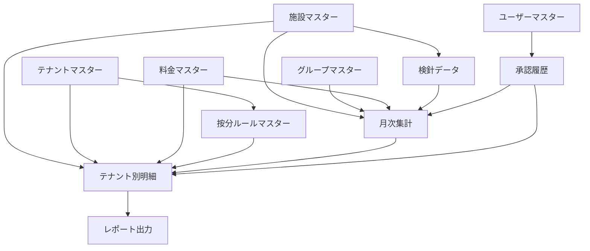

# Pleasanter光熱費管理システム テーブル設計書

## 📋 概要

双日ライフワン光熱費管理システムのPleasanter移行に必要なテーブル設計の詳細仕様書です。現行のExcel/VBAシステムの機能を完全に移行し、さらに拡張機能を実現するための15テーブルの設計を記載します。

**作成日**: 2025-07-09
**必要テーブル数**: 15テーブル
**想定総データ量**: 初期30,600件、年間増加16,000件

---

## 🗂️ テーブル構成サマリー

### テーブル分類と数量

| 分類 | テーブル数 | 主な用途 |
|------|-----------|----------|
| マスターテーブル | 6 | 基本情報・設定管理 |
| トランザクションテーブル | 6 | 日々の業務データ管理 |
| 集計・分析テーブル | 3 | レポート・分析用データ |

---

## 📊 マスターテーブル群（6テーブル）

### 1. 施設マスター（FacilityMaster）
**想定レコード数**: 約50件  
**更新頻度**: 低（年数回）

| カラム名 | 型 | 説明 | 備考 |
|---------|-----|------|------|
| SiteId | ID | サイトID | PK |
| ClassA | 分類A | 施設コード | UNIQUE |
| Title | タイトル | 施設名 | |
| ClassB | 分類B | 施設区分 | 商業施設/オフィス |
| NumA | 数値A | 総面積(㎡) | |
| NumB | 数値B | テナント数 | |
| DateA | 日付A | 開業日 | |
| DescriptionA | 説明A | 備考 | |

### 2. テナントマスター（TenantMaster）
**想定レコード数**: 約100件  
**更新頻度**: 低（月1回）

| カラム名 | 型 | 説明 | 備考 |
|---------|-----|------|------|
| SiteId | ID | サイトID | PK |
| ClassA | 分類A | テナントコード | UNIQUE |
| Title | タイトル | テナント名 | |
| ClassB | 分類B | 業種区分 | |
| ClassC | 分類C | 所属グループ | 16/2/78/9 |
| NumA | 数値A | 契約面積(㎡) | |
| NumB | 数値B | 契約電力(kW) | |
| DateA | 日付A | 契約開始日 | |
| DateB | 日付B | 契約終了日 | |
| CheckA | チェックA | 按分対象フラグ | |

### 3. グループマスター（GroupMaster）
**想定レコード数**: 4件  
**更新頻度**: 極低（年1回）

| カラム名 | 型 | 説明 | 備考 |
|---------|-----|------|------|
| SiteId | ID | サイトID | PK |
| ClassA | 分類A | グループコード | 16/2/78/9 |
| Title | タイトル | グループ名 | |
| ClassB | 分類B | 按分方式 | 時間/負荷 |
| DescriptionA | 説明A | 説明 | |

### 4. 料金マスター（RateMaster）
**想定レコード数**: 約20件  
**更新頻度**: 低（四半期）

| カラム名 | 型 | 説明 | 備考 |
|---------|-----|------|------|
| SiteId | ID | サイトID | PK |
| ClassA | 分類A | 料金区分 | 電気/ガス/水道 |
| ClassB | 分類B | 適用期間 | 2025年1月～ |
| NumA | 数値A | 基本料金単価 | 円/月 |
| NumB | 数値B | 従量料金単価 | 円/kWh等 |
| NumC | 数値C | 割引率(%) | |
| DateA | 日付A | 適用開始日 | |

### 5. 按分ルールマスター（AllocationRuleMaster）
**想定レコード数**: 約200件  
**更新頻度**: 中（月1回）

| カラム名 | 型 | 説明 | 備考 |
|---------|-----|------|------|
| SiteId | ID | サイトID | PK |
| ClassA | 分類A | テナントコード | FK:テナントマスター |
| ClassB | 分類B | 費用区分 | 空調/共用電力 |
| ClassC | 分類C | 按分方式 | 時間/負荷/面積 |
| NumA | 数値A | 按分比率(%) | |
| NumB | 数値B | 基準値 | 面積/契約電力等 |
| DateA | 日付A | 適用開始日 | |
| CheckA | チェックA | 有効フラグ | |

### 6. ユーザーマスター（UserMaster）
**想定レコード数**: 約30件  
**更新頻度**: 低（月1回）

| カラム名 | 型 | 説明 | 備考 |
|---------|-----|------|------|
| SiteId | ID | サイトID | PK |
| ClassA | 分類A | ユーザーID | |
| Title | タイトル | ユーザー名 | |
| ClassB | 分類B | 権限レベル | 管理者/編集者/閲覧者 |
| ClassC | 分類C | 所属部門 | |
| CheckA | チェックA | 有効フラグ | |

---

## 💾 トランザクションテーブル群（6テーブル）

### 7. 検針データ（MeterReadingData）
**想定レコード数**: 約500件/月（年間6,000件）  
**更新頻度**: 高（日次）

| カラム名 | 型 | 説明 | 備考 |
|---------|-----|------|------|
| SiteId | ID | サイトID | PK |
| ClassA | 分類A | 年月 | YYYYMM |
| ClassB | 分類B | メーター番号 | |
| ClassC | 分類C | 計測区分 | 電気/ガス/水道 |
| NumA | 数値A | 今月指示値 | |
| NumB | 数値B | 前月指示値 | |
| NumC | 数値C | 使用量 | NumA-NumB |
| NumD | 数値D | 金額 | |
| DateA | 日付A | 検針日 | |
| DateB | 日付B | インポート日時 | |
| Status | ステータス | 処理状態 | 未処理/処理済/エラー |
| DescriptionA | 説明A | エラー内容 | |

### 8. 月次集計（MonthlyAggregation）
**想定レコード数**: 約100件/月（年間1,200件）  
**更新頻度**: 高（日次）

| カラム名 | 型 | 説明 | 備考 |
|---------|-----|------|------|
| SiteId | ID | サイトID | PK |
| ClassA | 分類A | 年月 | YYYYMM |
| ClassB | 分類B | グループコード | 16/2/78/9 |
| ClassC | 分類C | 集計区分 | 実績/予算 |
| NumA | 数値A | ガス使用量(m3) | |
| NumB | 数値B | ガス料金(円) | |
| NumC | 数値C | 電力使用量(kWh) | |
| NumD | 数値D | 電力料金(円) | |
| NumE | 数値E | 水道使用量(m3) | |
| NumF | 数値F | 水道料金(円) | |
| NumG | 数値G | 前月比(%) | |
| NumH | 数値H | 前年同月比(%) | |
| DateA | 日付A | 集計日 | |
| Status | ステータス | 承認状態 | 未承認/承認済 |
| Owner | 管理者 | 担当者ID | |

### 9. テナント別明細（TenantDetails）
**想定レコード数**: 約300件/月（年間3,600件）  
**更新頻度**: 高（日次）

| カラム名 | 型 | 説明 | 備考 |
|---------|-----|------|------|
| SiteId | ID | サイトID | PK |
| ClassA | 分類A | 年月 | YYYYMM |
| ClassB | 分類B | テナントコード | FK:テナントマスター |
| ClassC | 分類C | 費用区分 | 直接/按分 |
| NumA | 数値A | ガス使用量(m3) | |
| NumB | 数値B | ガス料金(円) | |
| NumC | 数値C | 電力使用量(kWh) | |
| NumD | 数値D | 電力料金(円) | |
| NumE | 数値E | 水道使用量(m3) | |
| NumF | 数値F | 水道料金(円) | |
| NumG | 数値G | 空調按分額(円) | |
| NumH | 数値H | 共用部按分額(円) | |
| NumI | 数値I | 合計請求額(円) | |
| DateA | 日付A | 計算日 | |
| DateB | 日付B | 請求予定日 | |
| Status | ステータス | 請求状態 | 未請求/請求済 |
| AttachmentsA | 添付A | 請求書PDF | |

### 10. 承認履歴（ApprovalHistory）
**想定レコード数**: 約50件/月（年間600件）  
**更新頻度**: 中（週次）

| カラム名 | 型 | 説明 | 備考 |
|---------|-----|------|------|
| SiteId | ID | サイトID | PK |
| ClassA | 分類A | 承認種別 | 月次集計/請求 |
| ClassB | 分類B | 対象年月 | YYYYMM |
| ClassC | 分類C | 承認レベル | L1/L2/L3 |
| Owner | 管理者 | 申請者ID | |
| Editor | 更新者 | 承認者ID | |
| DateA | 日付A | 申請日時 | |
| DateB | 日付B | 承認日時 | |
| Status | ステータス | 承認状態 | 申請中/承認/差戻 |

### 11. エラーログ（ErrorLog）
**想定レコード数**: 変動（月100件程度）  
**更新頻度**: 高（随時）

| カラム名 | 型 | 説明 | 備考 |
|---------|-----|------|------|
| SiteId | ID | サイトID | PK |
| ClassA | 分類A | エラー種別 | インポート/計算/出力 |
| ClassB | 分類B | 重要度 | 高/中/低 |
| Title | タイトル | エラー概要 | |
| DescriptionA | 説明A | エラー詳細 | |
| DateA | 日付A | 発生日時 | |
| Owner | 管理者 | 検出ユーザー | |
| Status | ステータス | 対応状態 | 未対応/対応中/解決済 |

### 12. レポート出力（ReportOutput）
**想定レコード数**: 約20件/月（年間240件）  
**更新頻度**: 中（月次）

| カラム名 | 型 | 説明 | 備考 |
|---------|-----|------|------|
| SiteId | ID | サイトID | PK |
| ClassA | 分類A | レポート種別 | 月次/四半期/年次 |
| ClassB | 分類B | 対象年月 | YYYYMM |
| Title | タイトル | レポート名 | |
| DateA | 日付A | 出力日時 | |
| Owner | 管理者 | 出力者ID | |
| AttachmentsA | 添付A | レポートファイル | Excel/PDF |

---

## 📈 集計・分析用テーブル（3テーブル）

### 13. 前年比較データ（YearOverYearComparison）
**想定レコード数**: 約1,200件/年  
**更新頻度**: 低（月次）

| カラム名 | 型 | 説明 | 備考 |
|---------|-----|------|------|
| SiteId | ID | サイトID | PK |
| ClassA | 分類A | 比較年月 | YYYYMM |
| ClassB | 分類B | グループコード | |
| NumA | 数値A | 当年使用量 | |
| NumB | 数値B | 前年使用量 | |
| NumC | 数値C | 増減量 | |
| NumD | 数値D | 増減率(%) | |
| NumE | 数値E | 当年金額 | |
| NumF | 数値F | 前年金額 | |
| DescriptionA | 説明A | 増減要因 | |

### 14. 年間推移データ（AnnualTrendData）
**想定レコード数**: 約600件/年  
**更新頻度**: 低（月次）

| カラム名 | 型 | 説明 | 備考 |
|---------|-----|------|------|
| SiteId | ID | サイトID | PK |
| ClassA | 分類A | 年度 | YYYY |
| ClassB | 分類B | グループコード | |
| NumA～NumL | 数値A-L | 1～12月使用量 | 月別 |
| DescriptionA | 説明A | 年間傾向分析 | |

### 15. 異常値検出（AnomalyDetection）
**想定レコード数**: 変動（月50件程度）  
**更新頻度**: 中（日次）

| カラム名 | 型 | 説明 | 備考 |
|---------|-----|------|------|
| SiteId | ID | サイトID | PK |
| ClassA | 分類A | 検出年月 | YYYYMM |
| ClassB | 分類B | 異常種別 | 使用量/金額/比率 |
| ClassC | 分類C | テナントコード | |
| NumA | 数値A | 実績値 | |
| NumB | 数値B | 期待値 | |
| NumC | 数値C | 乖離率(%) | |
| Status | ステータス | 確認状態 | 未確認/確認済/誤検出 |
| DescriptionA | 説明A | 原因・対応 | |

---

## 🔗 テーブル間リレーションシップ

---

## 📊 データ量とパフォーマンス

### 初期データ投入量
| データ種別 | レコード数 |
|-----------|-----------|
| マスターデータ | 約600件 |
| 過去3年分実績 | 約30,000件 |
| **合計** | **約30,600件** |

### 年間データ増加予測
| データ種別 | レコード数/年 |
|-----------|--------------|
| トランザクション | 約13,000件 |
| ログ・履歴 | 約3,000件 |
| **合計** | **約16,000件** |

### 5年後の想定規模
- 総レコード数: 約110,000件
- データベースサイズ: 約500MB（添付ファイル除く）
- 添付ファイル込み: 約5GB

---

## 🚀 実装上の注意事項

### 1. インデックス設計
以下のカラムには必ずインデックスを設定：
- ClassA（年月、コード類）
- ClassB（グループ、区分）
- Status（ステータス）
- DateA（主要日付項目）

### 2. 大量データ処理対策
- CSVインポート: バッチ処理で500件ずつ
- 按分計算: 非同期処理で実行
- レポート生成: バックグラウンドジョブ

### 3. データ保持期間
- オンライン: 直近3年分
- アーカイブ: 3～5年分
- 外部保管: 5年超過分

### 4. 文字コード対応
- CSVインポート: SHIFT-JIS対応必須
- 内部処理: UTF-8統一

---

## 🔄 更新履歴

| 日付 | 更新内容 | 更新者 |
|------|---------|--------|
| 2025-07-09 | 初版作成 | Claude |

---

*本設計書は、Pleasanterの標準機能を最大限活用し、カスタマイズを最小限に抑えた実装を前提としています。*