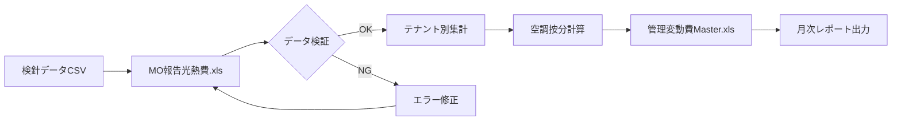

# 双日ライフワン光熱費管理システム プロジェクト構成説明書

## 📋 概要

本プロジェクトは、双日ライフワン株式会社の光熱費（電気・ガス）管理システムの分析・移行プロジェクトです。2002年から使用されているExcel VBAマクロベースのシステムを、現代的なWebアプリケーション（Pleasanter）に移行するための技術調査と実装計画を含んでいます。

**作成日**: 2025-07-07
**対象バージョン**: 2025年1月版

---

## 🗂️ 読み取り対象ファイル一覧

| ファイルパス | 種別 | 説明 |
|------------|------|------|
| /CLAUDE.md | ドキュメント | プロジェクトルールと標準ガイドライン |
| /excel_macro_analyzer.py | Pythonスクリプト | ExcelファイルのVBAマクロ分析ツール |
| /vba_code_extractor.py | Pythonスクリプト | VBAコード完全抽出ツール |
| /excel_macro_analysis_results.json | データファイル | Excel分析結果データ |
| /vba_code_complete.json | データファイル | 抽出されたVBAコード全文 |
| /01_受領資料/計算用管理変動費Master.xls | Excelマクロ | メイン計算処理ファイル（VBAマクロ含む） |
| /01_受領資料/MO報告光熱費.xls | Excelマクロ | 光熱費報告用ファイル（VBAマクロ含む） |
| /01_受領資料/CSVデータ/*.csv | データファイル | 各グループの光熱費使用量・料金データ |
| /双日ライフワン_光熱費管理プロジェクト_説明書.md | ドキュメント | プロジェクト全体説明 |
| /開発工数見積もり_双日ライフワン.md | ドキュメント | システム移行の工数見積もり |

---

## 🏗️ プロジェクト構造

```
/home/sdt_op/projects/util/pg/soujitsu/
├── 01_受領資料/               # クライアントから受領したファイル
│   ├── CSVデータ/             # 月次光熱費データ（2025年1月分）
│   │   ├── 16グループ別集計_20250101_20250131.csv
│   │   ├── 2グループ別集計_20250101_20250131.csv
│   │   ├── 78グループ別集計_20250101_20250131.csv
│   │   ├── 9グループ別集計_20250101_20250131.csv
│   │   ├── 検針結果出力ファイル1_20250101_20250131.xlsx
│   │   └── 集計値一覧+電力按分_20250101_20250131.csv
│   ├── MO報告光熱費.xls      # VBAマクロ付き報告書作成ツール
│   ├── 計算用管理変動費Master.xls  # VBAマクロ付きマスター計算ファイル
│   ├── 管理変動費(202401).xls     # 2024年1月分データ
│   ├── 管理変動費(202412).xls     # 2024年12月分データ
│   ├── 管理変動費(202501).xls     # 2025年1月分データ
│   └── 打合せ概要.docx            # プロジェクト要件資料
├── 03_提案書/                 # 提案資料
│   └── 双日ライフワン株式会社様提案書_0620.pdf
├── 分析ツール（Python）
│   ├── excel_macro_analyzer.py    # マクロ分析スクリプト
│   └── vba_code_extractor.py      # VBAコード抽出スクリプト
├── 分析結果（JSON）
│   ├── excel_macro_analysis_results.json  # 分析結果
│   └── vba_code_complete.json            # VBAコード全文
└── ドキュメント（Markdown）
    ├── CLAUDE.md                          # 開発ルール
    ├── 双日ライフワン_光熱費管理プロジェクト_説明書.md
    ├── 開発工数見積もり_双日ライフワン.md
    ├── Excelマクロ分析結果_説明書.md
    ├── VBA→JavaScript変換手順書.md
    ├── VBA冗長化原因分析.md
    └── VBA本質コード分析.md
```

---

## 🔍 主要ファイル詳細説明

### 1. excel_macro_analyzer.py (`/excel_macro_analyzer.py`)

#### 目的
Excelファイルに含まれるVBAマクロを検出・分析し、システムの複雑性を評価するツール

#### 主な内容
```python
class ExcelMacroAnalyzer:
    def analyze_file(self, file_path):
        """指定されたExcelファイルを分析"""
        # VBAマクロの検出と複雑度評価
        # ワークシート構造の分析
        # 関数・サブルーチンの抽出
```

#### 重要なポイント
- **oletoolsライブラリ使用**: VBAマクロの検出と抽出に特化
- **複雑度評価**: コード行数によってHigh/Medium/Lowで評価
- **構造分析**: シート数、データ範囲、関数一覧を収集

#### 依存関係
- oletoolsライブラリ: VBAマクロ解析
- openpyxl/xlrd: Excelファイル構造解析
- pandas: データ処理

---

### 2. vba_code_extractor.py (`/vba_code_extractor.py`)

#### 目的
マクロ付きExcelファイルから完全なVBAコードを抽出して保存

#### 主な内容
```python
def extract_full_vba_code(file_path):
    """指定ファイルの完全なVBAコードを抽出"""
    # VBAモジュールごとにコード全文を取得
    # JSON形式で保存
```

#### 重要なポイント
- **完全抽出**: VBAコードの全文を保持
- **モジュール別管理**: 各モジュールを個別に保存
- **JSON出力**: 後続処理のための構造化データ

---

### 3. 計算用管理変動費Master.xls (`/01_受領資料/計算用管理変動費Master.xls`)

#### 目的
光熱費の管理変動費を計算するマスターファイル。月次データの集計と配分を自動化

#### 主なVBAマクロ
- **FDに値のコピー**: フロッピーディスクへのデータ出力（レガシー機能）
- **管理変動費master用FD作成**: マスターデータの作成処理
- **電気合計チェック**: 電気料金の集計検証

#### 依存関係
- 管理変動費(YYYYMM).xls: 月次データソース
- CSVデータ: 検針結果の入力元

---

### 4. MO報告光熱費.xls (`/01_受領資料/MO報告光熱費.xls`)

#### 目的
光熱費の月次報告書を自動生成するツール。テナント別の検針データを集計

#### 主なVBAマクロ
- **準備1/2/3**: データ準備の段階的処理
- **テナント検針データコピー**: CSVからのデータ取り込み
- **空調按分データ入力**: 空調費用の按分計算
- **前年データのコピー**: 前年同月比較用データ取得

---

## ⚙️ 設定・環境関連

### データファイル形式

#### CSVファイルの共通フォーマット
| 列名 | 説明 | データ型 | 例 |
|------|------|----------|-----|
| グループ名称 | テナント/フロア名 | 文字列 | "1F 店舗A" |
| ガス使用量[m3] | 月間ガス使用量 | 数値 | 125.5 |
| ガス従量料金[円] | ガス料金 | 数値 | 15,600 |
| 電力使用量[kWh] | 月間電力使用量 | 数値 | 3,500 |
| 電力従量料金[円] | 電力料金 | 数値 | 85,000 |

### 文字エンコーディング
- CSVファイル: SHIFT-JIS
- Excelファイル: システムデフォルト
- JSONファイル: UTF-8

---

## 🔄 処理フロー

### 月次光熱費管理の処理フロー



---

## 💡 新人向け解説

### よく使われる用語
| 用語 | 説明 | 使用例 |
|------|------|--------|
| 管理変動費 | 使用量に応じて変動する光熱費 | "今月の管理変動費は150万円" |
| 按分（あんぶん） | 共用部分の費用を各テナントに配分 | "空調費を使用面積で按分" |
| 検針（けんしん） | メーターの数値を確認すること | "月末に検針を実施" |
| FD（フロッピーディスク） | 古い記憶媒体（現在は不使用） | "FDに値のコピー"マクロ |
| VBAマクロ | Excel自動化のプログラム | "データ転記をマクロで自動化" |

### 開発時の注意点
1. **文字コード問題**
   - 理由: CSVがSHIFT-JISのため文字化けしやすい
   - 対処法: 読み込み時にエンコーディングを明示的に指定

2. **レガシーコードの扱い**
   - 理由: 2002年から蓄積されたコードは冗長
   - 対処法: 本質的な処理のみを抽出して再実装

3. **データ整合性**
   - 理由: 手動入力部分が多く誤りが発生しやすい
   - 対処法: 自動検証機能を充実させる

---

## 🚨 トラブルシューティング

### よくある問題
| 問題 | 原因 | 解決方法 |
|------|------|----------|
| CSVの文字化け | エンコーディング不一致 | SHIFT-JISで読み込む |
| マクロが動かない | セキュリティ設定 | マクロを有効化 |
| 計算結果の不一致 | 按分ロジックの誤り | 按分基準を確認 |
| データ取り込みエラー | ファイル形式の変更 | フォーマットを統一 |

---

## 📚 関連ドキュメント
- [双日ライフワン_光熱費管理プロジェクト_説明書.md](./双日ライフワン_光熱費管理プロジェクト_説明書.md)
- [開発工数見積もり_双日ライフワン.md](./開発工数見積もり_双日ライフワン.md)
- [VBA→JavaScript変換手順書.md](./VBA→JavaScript変換手順書.md)
- [VBA本質コード分析.md](./VBA本質コード分析.md)

---

## 🔄 更新履歴
| 日付 | 更新内容 | 更新者 |
|------|---------|--------|
| 2025-07-07 | 初版作成 | Claude |

---

*このドキュメントは、プロジェクトの全体像を新人でも理解できる形で文書化したものです*
*ファイルの読み取りは行いましたが、変更は一切行っていません*