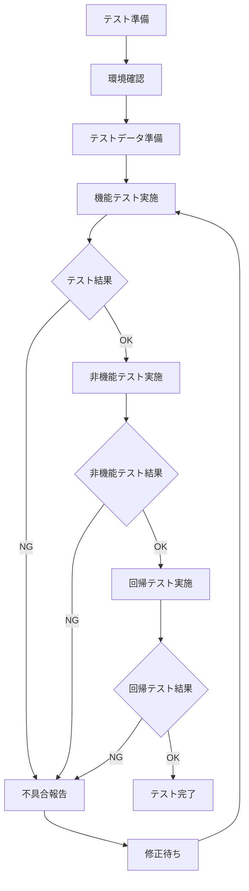

# 個人ソルバー不明データ対応機能　テスト実施手順書

## 概要

個人ソルバーの生年月日・単価の不明データ対応機能に関するテスト実施手順を定める。

## テスト実施フロー



## 1. テスト準備

### 1.1 必要な環境・ツール
- 開発環境（Development）
- テスト環境（Testing）
- ステージング環境（Staging）
- Salesforce連携確認用環境
- ブラウザ（Chrome, Firefox, Safari, Edge）
- テスト管理ツール（Jira, Azure DevOps等）

### 1.2 テスト実施者の準備
- [ ] テスト仕様書の理解
- [ ] テストアカウントの準備
- [ ] テストデータの確認
- [ ] 環境アクセス権限の確認

### 1.3 前提条件確認
- [ ] 開発完了の確認
- [ ] デプロイメント完了の確認
- [ ] 関連機能の動作確認
- [ ] Salesforce連携環境の確認

## 2. テストデータ準備

### 2.1 個人ソルバーテストデータ

#### パターン1: 既存データ（生年月日・単価あり）
```csv
ソルバーID,氏名,生年月日,人月単価,時間単価,備考
SLV001,田中太郎,1990-01-01,800000,5000,通常データ
SLV002,佐藤花子,1985-05-15,750000,4500,通常データ
```

#### パターン2: 不明データ（生年月日不明）
```csv
ソルバーID,氏名,生年月日,人月単価,時間単価,生年月日不明フラグ,備考
SLV003,山田次郎,NULL,600000,3500,TRUE,生年月日不明
SLV004,鈴木三郎,NULL,0,0,TRUE,生年月日・単価不明
```

#### パターン3: 単価不明データ
```csv
ソルバーID,氏名,生年月日,人月単価,時間単価,備考
SLV005,高橋五郎,1992-03-20,0,0,単価不明
SLV006,松本六子,1988-12-10,500000,0,時間単価のみ不明
```

### 2.2 テストデータ投入手順
1. **データベース直接投入**
   ```sql
   -- 生年月日不明データ
   INSERT INTO individual_solvers (id, name, birth_date, monthly_rate, hourly_rate, birth_date_unknown)
   VALUES ('SLV003', '山田次郎', NULL, 600000, 3500, TRUE);
   
   -- 単価不明データ
   INSERT INTO individual_solvers (id, name, birth_date, monthly_rate, hourly_rate)
   VALUES ('SLV005', '高橋五郎', '1992-03-20', 0, 0);
   ```

2. **CSVインポート機能使用**
   - 準備したCSVファイルをシステムにインポート
   - インポート結果の確認

3. **手動入力**
   - 管理画面から手動でテストデータを作成

## 3. 機能テスト実施手順

### 3.1 生年月日不明機能テスト

#### テストケース: TC-A1-001 - チェックボックス表示確認
1. **実行手順**
   ```
   1. テストアカウントでログイン
   2. 個人ソルバー管理 > 個人ソルバー一覧 にアクセス
   3. テストデータ「SLV001 田中太郎」をクリック
   4. 個人ソルバー詳細画面を表示
   5. 生年月日項目を確認
   ```

2. **確認ポイント**
   - [ ] 生年月日入力欄が表示されている
   - [ ] 生年月日入力欄の近くに「不明」チェックボックスが表示されている
   - [ ] チェックボックスのラベルが「不明」になっている
   - [ ] チェックボックスが操作可能状態である

3. **期待値**
   - 生年月日入力欄の右側または下部に「□ 不明」チェックボックスが表示される

#### テストケース: TC-A1-002 - チェックボックス操作確認
1. **実行手順**
   ```
   1. 前のテストケースから継続
   2. 「不明」チェックボックスをクリック
   3. 生年月日入力欄の状態を確認
   4. 他の項目への影響を確認
   ```

2. **確認ポイント**
   - [ ] チェックボックスにチェックが入る
   - [ ] 生年月日入力欄がグレーアウトされる
   - [ ] 生年月日入力欄が編集不可になる
   - [ ] 既存の生年月日データが維持される
   - [ ] 他の項目（単価等）は影響を受けない

3. **期待値**
   - 生年月日入力欄の背景色がグレーになり、編集不可状態になる

### 3.2 単価不明表示テスト

#### テストケース: TC-B1-001 - 人月単価0表示確認
1. **実行手順**
   ```
   1. 個人ソルバー管理 > 個人ソルバー一覧 にアクセス
   2. テストデータ「SLV005 高橋五郎」をクリック
   3. 個人ソルバー詳細画面を表示
   4. 人月単価項目を確認
   ```

2. **確認ポイント**
   - [ ] 人月単価欄に「不明」と表示されている
   - [ ] 「0」や「0円」ではなく「不明」である
   - [ ] 表示色や装飾が適切である

3. **期待値**
   - 人月単価欄に「不明」と日本語で表示される

### 3.3 Salesforce連携テスト

#### テストケース: TC-C1-001 - 生年月日不明フラグ連携
1. **事前準備**
   ```
   - Salesforce環境へのアクセス権限確認
   - 連携用APIキーの確認
   - 連携ログの確認方法準備
   ```

2. **実行手順**
   ```
   1. 個人ソルバー詳細画面で「不明」チェックボックスをチェック
   2. 「保存」ボタンをクリック
   3. 保存完了メッセージを確認
   4. Salesforce側のデータを確認
   ```

3. **確認ポイント**
   - [ ] システム内で保存が完了している
   - [ ] Salesforceに新しいフィールド「生年月日不明フラグ」が追加されている
   - [ ] フラグの値が「TRUE」または「1」になっている
   - [ ] 連携ログにエラーがない

## 4. 非機能テスト実施手順

### 4.1 パフォーマンステスト

#### 画面表示速度テスト
1. **測定手順**
   ```
   1. ブラウザの開発者ツールを開く
   2. Networkタブを選択
   3. 個人ソルバー詳細画面にアクセス
   4. 読み込み時間を記録
   ```

2. **判定基準**
   - 初回読み込み: 3秒以内
   - 2回目以降: 1秒以内

#### 大量データでのテスト
1. **テストデータ準備**
   - 1,000件の個人ソルバーデータを準備
   - うち50%を不明データに設定

2. **実行手順**
   ```
   1. 個人ソルバー一覧画面にアクセス
   2. 表示速度を測定
   3. 検索機能の動作確認
   4. ページング機能の動作確認
   ```

### 4.2 ユーザビリティテスト

#### 操作性確認
1. **確認項目**
   - [ ] チェックボックスの位置が適切
   - [ ] ラベルが分かりやすい
   - [ ] グレーアウトの視認性が良い
   - [ ] エラーメッセージが分かりやすい

2. **実施方法**
   - 複数の端末・ブラウザで確認
   - 異なるユーザーによる操作確認

## 5. 回帰テスト実施手順

### 5.1 影響範囲の確認
- [ ] 個人ソルバー検索機能
- [ ] 個人ソルバー一覧表示機能
- [ ] レポート出力機能
- [ ] データインポート・エクスポート機能
- [ ] ユーザー権限機能

### 5.2 回帰テスト項目

#### 個人ソルバー検索機能
1. **実行手順**
   ```
   1. 個人ソルバー検索画面にアクセス
   2. 生年月日での検索を実行
   3. 単価での検索を実行
   4. 複合条件での検索を実行
   ```

2. **確認ポイント**
   - [ ] 不明データが適切に除外される
   - [ ] 検索結果が正しく表示される
   - [ ] 検索条件の保存・読み込みが正常

## 6. 不具合管理

### 6.1 不具合分類

#### 重要度
- **Critical**: システム停止、データ破損
- **High**: 主要機能が使用不可
- **Medium**: 一部機能に問題
- **Low**: 軽微な表示問題

#### 優先度
- **P1**: 即座に修正必要
- **P2**: 次回リリースまでに修正
- **P3**: 将来修正

### 6.2 不具合報告テンプレート
```
【不具合タイトル】
個人ソルバー不明データ機能 - [具体的な問題]

【重要度・優先度】
重要度: [Critical/High/Medium/Low]
優先度: [P1/P2/P3]

【発生環境】
- 環境: [Development/Testing/Staging]
- ブラウザ: [Chrome/Firefox/Safari/Edge] [バージョン]
- OS: [Windows/Mac/Linux]

【再現手順】
1. 
2. 
3. 

【期待結果】
[期待される動作]

【実際の結果】
[実際に発生した動作]

【添付ファイル】
- スクリーンショット
- ログファイル
- テストデータ

【備考】
[その他の情報]
```

## 7. テスト完了基準

### 7.1 機能テスト完了基準
- [ ] 全テストケースが実行完了
- [ ] Critical/High重要度の不具合が0件
- [ ] Medium重要度の不具合修正または受け入れ判断完了
- [ ] 受け入れ基準の全項目が満たされている

### 7.2 非機能テスト完了基準
- [ ] パフォーマンス基準をクリア
- [ ] ユーザビリティ評価が合格
- [ ] セキュリティ脆弱性が検出されていない

### 7.3 回帰テスト完了基準
- [ ] 既存機能への影響がない
- [ ] 統合テストが正常完了
- [ ] エンドツーエンドテストが正常完了

## 8. テスト報告書作成

### 8.1 テスト結果サマリー
- テスト実施日時
- テスト実施者
- テストケース実行結果
- 発見不具合数・修正状況
- 残存リスク

### 8.2 推奨事項
- 運用時の注意点
- 今後の改善提案
- 追加テストの必要性

---

**作成日**: 2025-06-25  
**バージョン**: 1.0  
**作成者**: Claude Code  
**承認者**: [TBD]